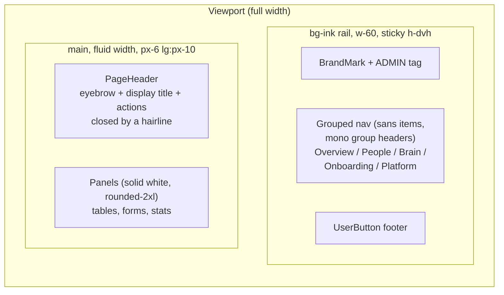

<!-- Design brief for the admin dashboard redesign. Approved by Shaun on 2026-08-31.
     Tracked in Shortcut: epic 253 "Admin: dashboard redesign"
     (https://app.shortcut.com/joice-health/epic/253), stories sc-254 to sc-259,
     one per row in section 5. Keep the decisions log (section 6) current when a
     decision changes. -->

# Admin: the full-width, high-contrast back office

Design brief (approved 2026-08-31) for a visual and UX redesign of the whole `/admin/*`
surface: a full-width shell with a dark sidebar rail, solid white panels in place of glass
cards, a real type hierarchy inside the design system's rules, one shared control kit, and
proper loading, empty, confirm and toast states. UI-only: no route, hook, or schema changes.

---

## 1. Context

**Why now.** The admin works but reads as a prototype. Content is capped at `max-w-7xl`
with a 208px sidebar inside it, so pages max out around 1000px on any monitor
([layout.tsx:22](../../apps/web/app/admin/(dashboard)/layout.tsx#L22)). The intended type
hierarchy is invisible: 30+ uses of `font-semibold`/`font-medium` render as Light because
`html { font-synthesis: none }` and only Light font cuts ship, so headings and body look the
same weight. Glass cards with a hand-rolled 60px shadow lower the effective contrast of
every text run on them; table row rules are `border-ink/5`, essentially invisible; badges
use off-system Tailwind colors; four different `<select>` idioms and two focus-ring colors
coexist; destructive actions use `window.confirm()`. The team uses this surface daily and
it needs to look and behave like a robust back office.

**What ships.** Every one of the 20 admin routes gets: a full-width layout under a sticky
dark `bg-ink` rail with grouped navigation (all onboarding sub-pages finally in the nav),
solid white panels with visible hairlines, display-face page titles and mono-label section
headers, on-system badges, one field kit with one focus ring, skeleton loading states,
toasts for mutation feedback, and a styled confirm dialog for destructive actions.

## 2. The shell

Below `lg` the rail hides; a sticky glass top bar carries the brand mark and a
`[ MENU ]` button opening a full-screen `bg-ink` drawer with the same nav. That is the
entire mobile story: the admin is desktop-first.

The server layout keeps its auth check and `AdminProviders` (which carries `brainBaseUrl`
for the eval hooks) verbatim; only the wrapper markup changes
([layout.tsx](../../apps/web/app/admin/(dashboard)/layout.tsx)).

## 3. The system, applied

All recipes live in the approved plan and land in three files:
[ui.tsx](../../apps/web/components/admin/ui.tsx) (Panel, PageHeader, Table, Badge, Toggle,
skeletons, states), a new `fields.tsx` (AdminSelect, AdminTextarea, Field, SearchInput),
and new `toast.tsx` / `confirm.tsx` / `shell.tsx`. The key moves:

| Move | From | To |
|---|---|---|
| Width | `max-w-7xl` centered | fluid, rail + `min-w-0 flex-1` |
| Surfaces | `rounded-card glass` + shadow | `rounded-2xl panel` (solid white, frameless) |
| Titles | `text-2xl font-semibold` (inert weight) | `display text-3xl` (panel headers `display text-lg`) |
| Form labels | `text-sm font-medium` (inert weight) | `mono-label` |
| Table headers | `text-xs font-semibold uppercase` | `text-xs uppercase tracking-wider text-ink` (sans) |
| Table rules | `border-ink/10` / `border-ink/5` | `border-line` / `border-line/60` |
| Badges | amber/sky/emerald/red Tailwind defaults | brand tints + `--color-danger` |
| Selects | four idioms, two rings | one AdminSelect, ring `brand-600/50` |
| Loading | grey "Loading..." line or nothing | TableSkeleton / PanelSkeleton |
| Mutation feedback | swapped button labels, ad hoc lines | toast (glass pill, bottom right) |
| Destructive confirm | `window.confirm()` | styled centered dialog, promise API |

One token is added to [theme.css](../../packages/ui/src/theme.css):
`--color-danger: oklch(0.5 0.19 29)`, the single semantic red for errors, failed states and
destructive actions (red already leaked in unofficially via `text-red-600` and
`ring-red-700/50`).

## 4. Implementation plan

Phases land in order; the app stays shippable between them.

1. **Phase 1, shell**: grouped dark-rail nav ([nav.tsx](../../apps/web/components/admin/nav.tsx)),
   new `shell.tsx` (rail, mobile drawer, toast + confirm providers), layout rewrite.
2. **Phase 2, kit**: `ui.tsx` rewrite (Card becomes Panel, a breaking rename that lands with
   the first sweep), `fields.tsx`, `toast.tsx`, `confirm.tsx`;
   [eval/form.tsx](../../apps/web/components/admin/eval/form.tsx) shrinks to `relativeTime`.
3. **Phase 3, sweeps**: every page through the ten-point checklist (Panel, PageHeader with
   eyebrow/breadcrumbs, no inert weights, ink table text, kit controls, skeletons,
   EmptyState actions, toasts, confirms, width discipline). Page-specific work: the brain
   settings page gets a `max-w-3xl` column, an `xl:` sticky anchor rail and a sticky glass
   save bar; the onboarding hub becomes an indexed hairline list now that its sub-pages are
   in the nav.
4. **Done-check**: greps that must return zero in the admin tree: inert weight classes,
   `glass` outside floating chrome, `shadow-[`, `window.confirm`, off-system palette
   colors, `rounded-card`, `ring-brand-300`, `border-ink/5`, lone "Loading..." lines.
5. **Docs**: [design/01-design-system.md](../design/01-design-system.md) admin carve-out
   amended (solid panels; frost floats only), `apps/web/CLAUDE.md` styling section, root
   `CLAUDE.md` glass phrase.

Verification: `bun run check` per phase; visual walk of all 20 routes in the Docker dev
stack with a Clerk admin session at 1440/1024/390px, exercising toast, confirm, save bar,
drawer, and the eval poll.

## 5. Phases and stories

| Story | Slice |
|---|---|
| 1.1 (sc-254) | Full-width shell: dark rail, grouped nav, mobile drawer |
| 2.1 (sc-255) | One kit: panels, badges, fields, skeletons, toast, confirm |
| 3.1 (sc-256) | People pages sweep: dashboard, waitlist, leads, users, admins |
| 3.2 (sc-257) | Platform pages sweep: flags, settings, audit |
| 3.3 (sc-258) | Brain pages: settings reorganization, eval console |
| 3.4 (sc-259) | Onboarding pages: hub list, six sub-pages, editors |

## 6. Decisions log

**Dark `bg-ink` rail (2026-08-31).** The design system sanctions `bg-ink` as the one dark
surface (the "dark band"). Used for the rail it gives nav text 7.4:1 contrast, an
unmistakable "back office" signal distinct from the cream public site, and the house
buttons already work on dark because outlines draw in `currentColor`. Nav labels become
`mono-label`, the system's stated nav idiom, which also removes the inert-weight problem.

**Solid `panel` surfaces, glass demoted to floating chrome (2026-08-31).** The system's own
rule is that frost is for things that float over content; a page-filling card grid does not
float. Dense data reads better on opaque surfaces, and 78%-white glass over cream was
costing contrast on every muted text run. The admin glass carve-out narrows to the mobile
top bar, toasts, and the brain page's sticky save bar.

**`rounded-2xl` panels, no new radius token (2026-08-31).** `--radius-card` (2rem) is
documented for large image panels and looked absurd on 11px-tall controls. The panel radius
lives in exactly one component, so a token would have a single consumer; convention wins.

**One semantic red, `--color-danger` (2026-08-31).** Red already existed unofficially in
three shades. One token at 5:1 on cream and white covers danger badges, error states and
destructive confirms; everything else stays on the brand ramp. Public-site `red-*` uses
migrate later, separately.

**No persistent desktop top bar (2026-08-31).** The per-page PageHeader is the chrome; a
second sticky bar would duplicate it and cost vertical space in a data-dense tool.

**The mono face stays out of nav items and data rows (2026-08-31).** Gaisyr Mono's slab
details read as a serif at small sizes and cost scanability, so navigation items, table
headers and cell values are the sans face (headers as tracked uppercase ink); panel headers
moved up to the display face. Mono keeps its device jobs: small labels and eyebrows, badges
and chips, buttons, code inputs, JSON and debug traces, and the nav group headers (bumped to
12px at canvas/80 for prominence). True bold is not available anywhere: only the Light cuts
are licensed and `font-synthesis: none` blocks faking it, so prominence is size, case and
color by design.
