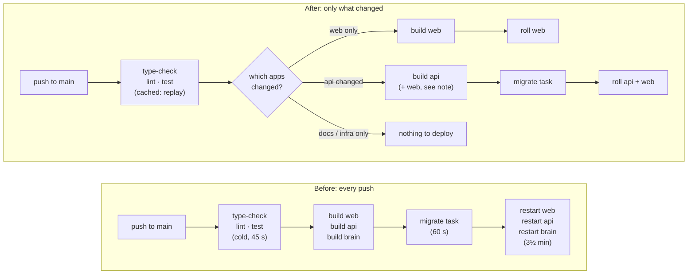
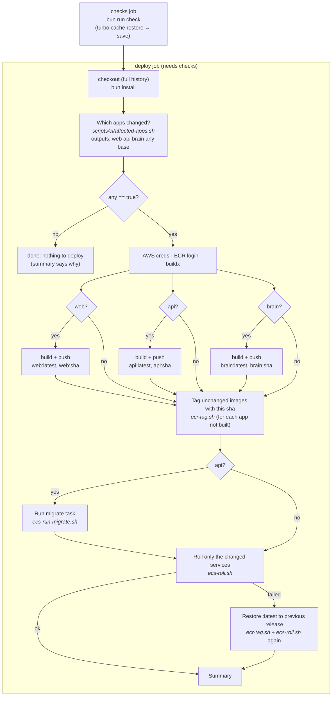
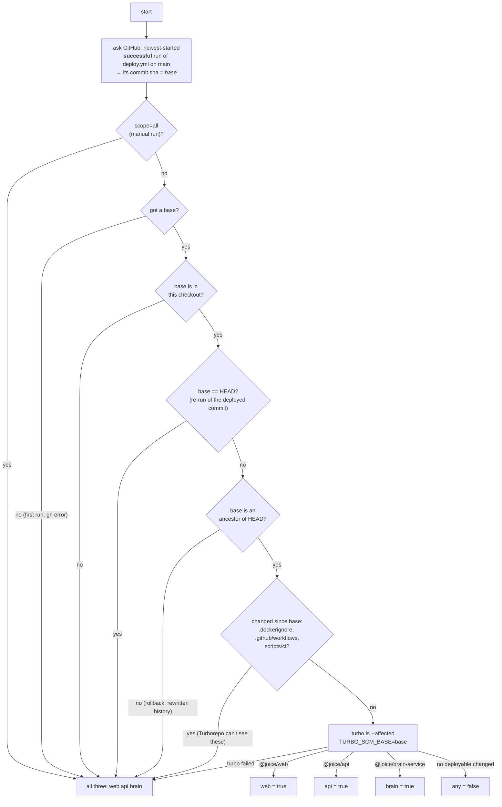
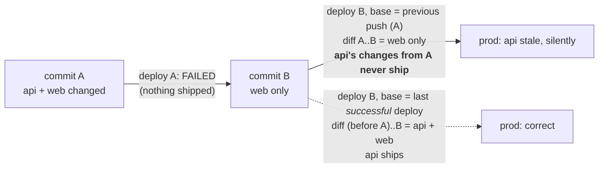
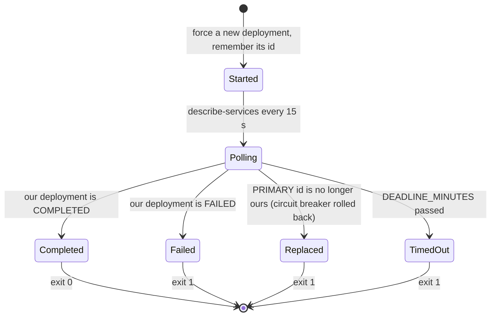
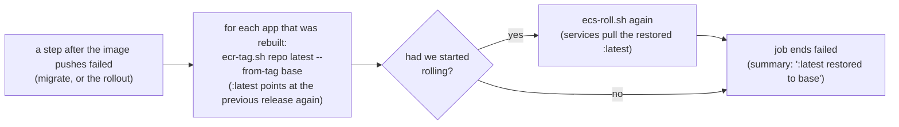
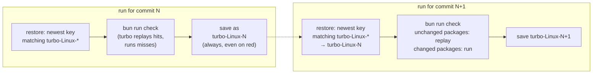

# CI/CD: how Joice deploys

What happens on every push to `main`, what each file under `scripts/ci/` is
for, where Turborepo actually does the work and where it doesn't, and which
parts are candidates for simplification. Read this before touching
`.github/workflows/deploy.yml`.

**Boundary:** CI never touches infrastructure. It builds images, pushes them to
ECR, runs the existing migrate task and updates existing ECS services. Terraform,
IAM and everything under `infra/` are run locally.

## The gist

Before: every push built all three images (web, api, brain), ran the migrate
task and force-restarted all three ECS services. A README typo cost a
six-minute deploy and three restarts. Turborepo was installed but did nothing
in CI: no cache, no change detection.

After: a push builds and rolls only the apps whose code changed, the
type-check/lint/test step replays results for packages that didn't change, and
the deploy notices when a rollout actually failed instead of reporting green.



## What Turborepo does out of the box, and what it doesn't

| Question | Who answers it | How |
|---|---|---|
| Which workspaces changed between commit X and HEAD, including dependents? | Turborepo | `turbo ls --affected --output=json` with `TURBO_SCM_BASE=X`. Reads the package graph and `git diff`. Knows that `packages/db` changing means `apps/api` changed too. |
| Skip type-check/lint/test for packages whose inputs are unchanged | Turborepo | The task cache. In CI it needs somewhere to persist between runs, so `ci.yml` stores `.turbo/cache` in the GitHub Actions cache. |
| What is "commit X"? Which commit is currently deployed? | Shell | Turborepo has no idea. On a PR it defaults to comparing with `main`. On `main` itself something has to say what to compare against. This is most of `affected-apps.sh`. |
| Map workspace names to the three deployables | Shell (3 lines) | `@joice/web` → web, `@joice/api` → api, `@joice/brain-service` → brain. |
| Build images, push to ECR, run the migrate task, roll ECS services, notice failure | Shell + Actions | Turborepo is a build tool. It never touches Docker, ECR or ECS. This was already shell in the old `deploy.yml`. |

The Turborepo-native part is small and it is used. The scripts are the glue
between "Turborepo says web changed" and "AWS is now running the new web".

## The deploy job, step by step

`deploy.yml` has two jobs: `checks` (calls `ci.yml`) and `deploy`. Most steps
in `deploy` carry an `if:` that reads the answer from the "Which apps changed?"
step. A skipped step shows grey in the run; nothing runs for an app that didn't
change.



Two things worth knowing about the shape:

- **The migrate task runs only when the api image changed.** The migration
  files live in `packages/db`, one of the api's workspaces, so any new migration
  marks api as changed. If api didn't change, the migrate task would run the same
  image it ran last time and do nothing.
- **A backend change also rebuilds web.** `packages/api-client` imports the
  api's and brain's route *types* for the typed Hono client, so Turborepo
  (correctly) says web depends on them. An api change therefore costs a web
  rebuild (about a minute with the layer cache) and a web roll. This is left
  alone on purpose: it is what makes `next build` catch a client that no longer
  matches its routes.

## Script 1: which apps changed? (`scripts/ci/affected-apps.sh`)

Answers one question and writes five outputs: `web`, `api`, `brain`
(true/false), `any`, and `base` (the commit it compared against). The
interesting part is choosing what to compare HEAD against.



Every branch that ends in "all three" is the old behaviour, so the worst case
of a wrong guess is a slower deploy, never a missing one.

### Why "last successful deploy" and not "previous push"

Deploys are queued one at a time, so it is tempting to diff against the
previous push (`github.event.before`). But a failed deploy leaves its changes
undeployed, and the next push wouldn't know:



This costs one `gh api` call and the `actions: read` permission on the
workflow token. The other guards each cost one line: "not an ancestor" catches a
re-run of an older run after a newer one succeeded (Turborepo would otherwise
report zero changes and quietly deploy nothing); "CI files changed" catches
edits to the workflow or Docker context that live outside every workspace.

Run it locally:

```bash
GH_TOKEN=$(gh auth token) GITHUB_REPOSITORY=$(gh repo view --json nameWithOwner -q .nameWithOwner) \
  bash scripts/ci/affected-apps.sh
```

## Script 2: run the migrate task (`scripts/ci/ecs-run-migrate.sh`)

The bash that used to sit inline in `deploy.yml`: start the one-off
`joice-migrate` ECS task, wait for it to stop, read the container's exit code,
fail the deploy if it isn't 0. Moved to a file so a second workflow (the staging
branch's `promote.yml`) can reuse it; one check added for "ECS refused to place
the task at all".

## Script 3: roll the services and watch (`scripts/ci/ecs-roll.sh`)

The old workflow did `aws ecs update-service --force-new-deployment` per
service and then `aws ecs wait services-stable`. This script replaces the wait
with its own poll loop.



It fixes two real properties of `wait services-stable`: it stops at 10 minutes
no matter what, and it says "stable" after a circuit-breaker rollback because
one healthy deployment is all it checks. See "Simplification candidates" for
why that matters less than it sounds here.

## Script 4: ECR tags and the restore step (`scripts/ci/ecr-tag.sh`)

`ecr-tag.sh` copies an existing image to a new tag server-side (no pull, no
push). Two steps use it.

### Tag unchanged images with the commit sha

Before, every push tagged all three images `:latest` and `:<sha>`, so "release
X" meant the same sha on all three repos. With per-app builds, an app that
wasn't rebuilt would have no `:<sha>` tag for X. The retag step gives it one,
pointing at the image it already runs.

| Push | Changed | web tags | api tags | brain tags |
|---|---|---|---|---|
| A | everything (first run) | latest, A | latest, A | latest, A |
| B | web only | latest, **B** (new image) | latest, A, **B** (same image, retagged) | latest, A, **B** (same image, retagged) |
| C | api (+ web via types) | latest, **C** | latest, **C** | latest, A, B, **C** |

Reading down any sha column tells you exactly what was live at that commit.
Two things depend on it: the future `promote.yml` on the staging branch, which
verifies `api:<sha>` exists before promoting, and the restore step below.

### Restore on a failed deploy



`base` is the sha of the last successful deploy, and its tags exist on every
repo because of the retag step above. Result: a bad image is undone in about
three minutes without a human. Expand/contract migrations (add columns
nullable, drop in a later release) are what make running the previous code
against the new schema safe.

## Caching in `ci.yml`

Turborepo caches each task's result (the log to replay, plus any declared
outputs) under `.turbo/cache`, keyed by a hash of the task's inputs. On a laptop
that folder persists. On a GitHub runner it is thrown away with the machine, so
`ci.yml` saves it into the Actions cache after every run and restores it at the
start of the next.



Supporting changes: `bun run check` is the root script
(`turbo run type-check lint test --continue`), so CI and humans run one command;
`turbo.json` tasks list `inputs` that ignore markdown, so a README edit doesn't
invalidate a package. There is deliberately no `bun install` cache: the install
measured two seconds on a cold runner, less than a cache restore would take.

## Everything else that changed

| What | Why |
|---|---|
| `.dockerignore` | Excludes `infra/`, `docs/`, `.github/`, `.claude/`, `.env*`, Terraform state/vars, and markdown (brain fixtures kept). Locally `infra/.terraform` is 1.5 GB and `terraform.tfstate` holds the DB password; both were reaching the Docker build context and, via `COPY . .`, locally built api/brain images. Context is now 4.1 MB. CI images were already clean because gitignored files never reach the checkout. |
| `provenance: false` | On all three image builds. Single-arch images for ECR don't need the attestation manifest, which shows up in ECR as an untagged image and counts against the "keep 10" lifecycle rule. |
| permissions | Least privilege per job. `ci.yml` declares `contents: read`; the deploy job asks for `id-token: write`, `contents: read`, `actions: read` (the last one is for reading its own run history). |
| `dependabot.yml` | Weekly checks for the pinned action versions only. |
| `scope=all` | The manual-run input. Needed after changing a `NEXT_PUBLIC_*` repo Variable: those are baked in at image build time and no file in git changed, so change detection would skip web. |
| `/health` sha | Now reports the commit that last *changed* that service, not the last commit deployed. The release as a whole is the `:<sha>` tag every repo carries. |

## Simplification candidates (open as of Aug 2026)

The Turborepo-native part is small and used. Around it sits deploy hardening
that an audit justified but that goes beyond "deploy only what changed":

| Piece | Assessment |
|---|---|
| `affected-apps.sh` | Keep. The base choice ("last successful deploy") is right and cheap; the guards are one line each. The summary table and long comments could be trimmed. |
| `ecs-run-migrate.sh` | Same bash as before, moved to a file for a second caller that doesn't exist on `main`. Could go back inline. |
| `ecs-roll.sh` | Solves a problem that mutable `:latest` tags prevent from occurring: with the task definitions pinned to `:latest`, ECS's own rollback re-pulls the same bad image and cannot succeed, so a bad deploy ends in `wait services-stable` timing out, which is red anyway. The script turns a generic 10-minute timeout into an earlier, clearer error. The original `update-service` + `wait services-stable` (only for changed services) is the right size until task definitions are digest-pinned, which is an infra change. |
| `ecr-tag.sh` + retag + restore | Not Turborepo and not previous plumbing: an automatic rollback. Useful when a bad image ships; also more behaviour to understand, and it exists mostly to serve itself. Cutting it means unchanged apps stop getting `:<sha>` tags, so "release X" isn't a uniform tag across the three repos; that only matters when porting to `promote.yml`, where it can be added. |

If the last three are cut, `deploy.yml` is within a screen of the original with
`if:` gates, and one small script remains.
