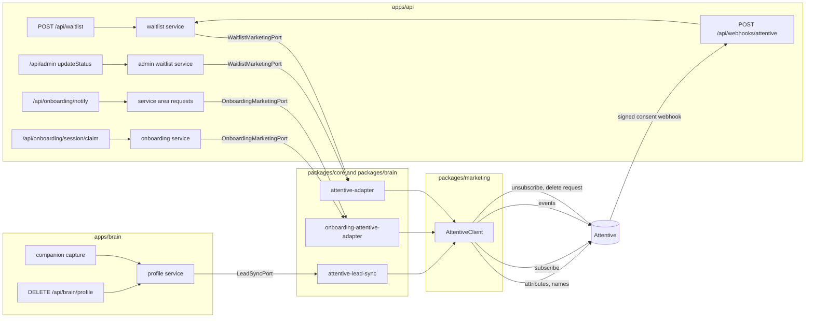

<!-- Design brief for the Attentive migration. Approved by Shaun on 2026-09-07. Tracked in
     Shortcut: epic 278 "Marketing: Attentive replaces Klaviyo"
     (https://app.shortcut.com/joice-health/epic/278), stories sc-279 to sc-283, one per row
     in section 5. Keep the decisions log (section 8) current when a decision changes. -->

# Joice marketing: Attentive replaces Klaviyo

Design brief (approved 2026-09-07) for moving the marketing platform from Klaviyo to
Attentive. Every surface that synced to Klaviyo syncs to Attentive, Klaviyo leaves the code,
the configuration and the docs, and Attentive reports consent changes back through a signed
webhook. The as-built reference for the running integration is
[01-attentive.md](01-attentive.md); this brief records the design, the plan and the
decisions behind it.

---

## 1. Context

**Why now.** Joice is dropping Klaviyo as its CRM. Attentive is SMS-first with email, and
the Terms and Privacy pages already promise a texting programme with STOP and HELP that no
code supports yet. Marketing wants one platform for journeys, segments and (later) texts;
engineering wants the swap done before launch traffic makes a migration painful.

**What exists that we build on** (verified 2026-09-07):

| Already in the repo | Where | How the migration uses it |
|---|---|---|
| A zero-dependency provider client package with retry and backoff | [packages/marketing/src/klaviyo.ts](../../packages/marketing/src/klaviyo.ts) | Becomes the Attentive client; `withRetry` survives unchanged |
| Provider-free ports per domain, injected at the app edge | [port.ts](../../packages/core/src/marketing/port.ts), [marketing-port.ts](../../packages/core/src/onboarding/marketing-port.ts), [ports/index.ts:185](../../packages/brain/src/ports/index.ts) | Zero domain code changes; only adapters and wiring move |
| Fire-and-forget sync stamping `marketing_synced_at` | [waitlist-service.ts:90](../../packages/core/src/waitlist-service.ts), [service.ts:145](../../packages/brain/src/profile/service.ts) | Provider-neutral; keeps meaning "initial sync succeeded" |
| Suppress-before-delete erasure inside a transaction | [service.ts:263](../../packages/brain/src/profile/service.ts) | Maps to unsubscribe plus a privacy delete request |
| Service-to-service route outside the typed chain with constant-time token compare | [app.ts:67](../../apps/api/src/app.ts), [internal-token.ts](../../apps/api/src/middleware/internal-token.ts) | The pattern for the signed webhook route |
| Secrets Manager plumbing in five files | [variables.tf](../../infra/variables.tf), [secrets.tf](../../infra/secrets.tf), [iam.tf](../../infra/iam.tf), [ecs.tf](../../infra/ecs.tf), [brain.tf](../../infra/brain.tf) | The three new variables follow the same path |
| Ops scripts with their own tiny env | [apps/api/scripts](../../apps/api/scripts) | The check and resync scripts |

**Constraints that shape the design:**

- No phone number exists anywhere in the database, no SMS consent trait, no consent checkbox
  on the waitlist form. The only phone collected (checkout) goes browser-direct to
  CarePortals by design ([patient.client.ts:6](../../apps/web/lib/careportals/patient.client.ts))
  and is never reused for marketing.
- Marketing data is not PHI (root `CLAUDE.md`, compliance posture); nothing health-shaped
  reaches Attentive, exactly as with Klaviyo.
- Logs carry ids and error names only, never emails: a marketing API's error body can echo
  the submitted values.
- Every change lands with its docs and CLAUDE.md in the same PR; no em dashes anywhere.

## 2. The flow

In words:

1. A visitor joins the waitlist. After the transaction commits, a detached chain upserts the
   profile (attributes, then names), subscribes the email through the API sign-up unit, and
   records `Joined Waitlist`. Success stamps `marketing_synced_at`.
2. A referral refreshes the referrer's profile (attributes only). An admin status change
   refreshes the profile and records `Waitlist Status Changed`.
3. Notify-me records the state and `Service Area Requested`; it never subscribes.
4. Intake completion records goal, segment and state, `Onboarding Completed`, and subscribes
   only when `consent_marketing` was ticked.
5. The companion keeps a lead profile current (`lead_*` attributes, never a name, never a
   subscription). Erasure unsubscribes from every channel and files a delete request before
   the local row goes.
6. Attentive posts `email.unsubscribed` / `sms.unsubscribed` / `email.subscribed` /
   `sms.subscribed` to the webhook; the waitlist row's `marketing_unsubscribed_at` is stamped
   or cleared and the admin waitlist shows it.

## 3. Attentive integration

Base `https://api.attentivemobile.com`, `Authorization: Bearer <key>`, JSON, paths versioned.
Verified against docs.attentive.com on 2026-09-07.

| Klaviyo call (before) | Attentive call (after) | Notes |
|---|---|---|
| `POST /api/profile-import/` (upsert by email, `external_id`, names, properties) | `POST /v1/attributes/custom` for properties (sync 200), then `POST /v2/user/attributes` for `firstName` / `lastName` (async 202) | Properties first: the event that follows may start a journey that renders them. Blank names are omitted so a sync never clears one. `clientUserId` replaces `external_id` and only the waitlist sends it. |
| `POST /api/profile-subscription-bulk-create-jobs/` (list + `SUBSCRIBED` + `custom_source`) | `POST /v1/subscriptions` with `signUpSourceId` | 10 requests per second. Email-only subscribes the email channel only; the same unit covers SMS once a phone is sent. No `custom_source`: the sign-up unit is the provenance Attentive records. |
| `POST /api/events/` (`metric`, `unique_id`) | `POST /v1/events/custom` (`type`, `externalEventId`, `occurredAt`) | Type names cannot contain `" ' () {} [] \ | ,`; events older than 12 hours record but start no journey, so we send the true time. |
| `POST /api/profile-suppression-bulk-create-jobs/` | `POST /v1/subscriptions/unsubscribe` (all channels, confirmation suppressed) then `POST /v1/privacy/delete-request` | Unsubscribe stops sends immediately; the delete completes within 30 days. Person-global by design. |
| (none) | `GET /v1/me` | The check script validates a key before deploy. |
| (none) | Webhook, header `x-attentive-hmac-sha256`, hex HMAC-SHA256 of the raw body | Created in the Attentive dashboard, which issues the signing key. |

Key scopes: `subscriptions:write`, `attributes:write`, `events:write`, `privacy_requests:write`.

**Custom attribute types lock on first write**, account-wide and permanently per key. Every
`*_at` is an ISO string, `referral_count` and `signup_sequence` are numbers,
`onboarding_marketing_consent` is a boolean, everything else is a string, arrays never. The
namespace policy is unchanged: the waitlist owns `referral_*`, `signup_*`, `waitlist_*`,
`joined_waitlist_at`; onboarding owns `onboarding_*`; the brain owns `lead_*`.

**Why properties through v1 and names through v2, not one v2 call.** The signup chain is
upsert, subscribe, event, and the event starts a journey whose first message may render
`referral_code`. The v1 attributes call answers 200 only once the attribute is set; v2 queues
with no documented propagation bound. Type-lock conflicts also surface as a synchronous 400
with the entry id in our logs instead of vanishing inside a job. Names are cosmetic and lag a
few seconds; that never gates a journey.

**Why no consent-source string.** Attentive records the sign-up unit on the subscription,
which is the legally meaningful provenance. Per-surface attribution already exists as the
`Joined Waitlist` and `Onboarding Completed` events (timestamped, deduplicated by
`externalEventId`); a `consent_source` attribute would be last-writer-wins across surfaces.

**SMS-ready, not SMS.** The client, the adapters and every profile type carry an optional
E.164 `phone` from day one, and the sign-up unit already covers both channels, so SMS capture
is one later story: a phone field with the TCPA disclosure, a `consent_sms` trait, a phone
column, and the `singleOptIn` decision. Nothing in this epic sends a phone.

## 4. Implementation plan (file level)

### Phase 1: the swap (stories 1.1 to 1.3, one PR)

| Concern | Files | Change |
|---|---|---|
| Client | `packages/marketing/src/attentive.ts` (from `klaviyo.ts`), `events.ts` (from `metrics.ts`), `webhook.ts` (new), `index.ts`, tests | `createAttentiveClient({ apiKey, fetchImpl?, timeoutMs? })` with `upsertProfile`, `subscribe`, `trackEvent`, `unsubscribe`, `requestDeletion`, `me`; `AttentiveRequestError`; `withRetry` unchanged; `AbortSignal.timeout` per request (default 10 s); `EVENTS` keeps the four names; `signAttentiveWebhook` / `verifyAttentiveWebhook` share the HMAC code with the api and the tests. |
| Core adapters | `packages/core/src/marketing/attentive-adapter.ts`, `onboarding-attentive-adapter.ts`, `index.ts`, tests; one optional `phone` line in `port.ts` and `onboarding/marketing-port.ts` | Same call sequences as today, mapped onto the new client (`externalEventId` = entry id, `entry:status`, `email:state`, `intake:<memberId>`; `occurredAt` = the row's own time). |
| Brain | `apps/brain/src/ports/attentive-lead-sync.ts` (new, tested), `apps/brain/src/services.ts`, `env.ts`; `packages/brain/src/ports/index.ts` comments plus `phone` | `upsertLead` sends `lead_*` only; `suppressLead` = unsubscribe then delete request, 404 tolerated so erasure never wedges. |
| Edge and env | `apps/api/src/env.ts`, `services.ts`; `turbo.json`; `.env.example`; `docker-compose.yml` | `ATTENTIVE_API_KEY` + `ATTENTIVE_SIGN_UP_SOURCE_ID` both-or-neither, `ATTENTIVE_WEBHOOK_SECRET` alone (unset = webhook 503). The brain gets the key in compose too (Klaviyo never had it there). |
| Infra | `infra/variables.tf`, `secrets.tf`, `iam.tf`, `ecs.tf`, `brain.tf`, `vpc.tf` comment | Two secrets (`joice/attentive-api-key`, `joice/attentive-webhook-secret`), one plain var, the Klaviyo secret removed. |
| Scripts | `apps/api/scripts/attentive-check.ts`, `attentive-resync.ts` | Key check via `GET /v1/me`; re-push of `marketing_synced_at IS NULL AND created_at >= SINCE` waitlist rows, sequential, ids in logs only. |
| Docs | `docs/marketing/01-attentive.md` (from `01-klaviyo.md`), `docs/README.md`, root `README.md` and `CLAUDE.md`, `packages/core/CLAUDE.md`, the onboarding, rag and shop docs that name Klaviyo | Rewrite the reference; word swaps and one historical note elsewhere. |

### Phase 2: the webhook (story 2.1, one PR)

| Concern | Files | Change |
|---|---|---|
| Schema | `packages/db/src/schema/waitlist.ts`, migration `0022_*` | Nullable `marketing_unsubscribed_at`; expand-only. |
| Core | `packages/core/src/waitlist-service.ts` | `applyMarketingConsent({ email, subscribed, at })`: unsubscribed stamps, subscribed clears unless a newer unsubscribe is recorded; never touches `updated_at`, never calls the port. |
| Route | `apps/api/src/middleware/attentive-signature.ts`, `apps/api/src/webhooks/attentive.ts`, `app.ts` | Rate limit, then HMAC over the raw body (503 unset, 401 mismatch), then a zod parse of the payload subset. The four consent events with a marketing subscription type apply; everything else signed and parseable answers 200. Outside the typed chain like `/api/internal`. |
| Admin | `apps/web/app/admin/(dashboard)/waitlist/page.tsx`, `apps/api/src/admin/routes.ts` export columns | A Marketing column showing `unsubscribed`; the CSV carries the timestamp. Two states only, because `marketing_synced_at` is also set on pre-switch rows. |

## 5. Phases and Shortcut stories

| # | Story | Slice | Surface |
|---|---|---|---|
| 1.1 | sc-279 | Client, waitlist adapter, env, infra, scripts, docs rewrite | Signups, referrals and status changes in Attentive |
| 1.2 | sc-280 | Onboarding adapter | Notify-me and completion in Attentive; opt-in subscribes |
| 1.3 | sc-281 | Brain lead sync and erasure | Companion leads in Attentive; erasure unsubscribes and deletes |
| 2.1 | sc-282 | Migration, consent method, signed webhook route, admin column | Unsubscribes visible on `/admin/waitlist` and in the export |
| 3.1 | sc-283 | Switch-over (Shaun) | Keys, sign-up unit, webhook, apply, resync |

Branches: `marketing/1-1-attentive-client` (stories 1.1 to 1.3) and
`marketing/2-1-attentive-webhook` (story 2.1), both from `main`.

## 6. Switch-over runbook

Shaun runs every infrastructure step; the PRs carry the exact commands.

1. Local: put `ATTENTIVE_API_KEY` and `ATTENTIVE_SIGN_UP_SOURCE_ID` in `.env`, remove the
   `KLAVIYO_*` lines, run `bun apps/api/scripts/attentive-check.ts` and read the company name.
2. Merge the phase 1 and phase 2 PRs. CI deploys; the sync stays disabled until the apply;
   the migrate task adds the column.
3. Attentive dashboard: create the webhook at
   `https://joicehealth.com/api/webhooks/attentive` with `email.subscribed`,
   `email.unsubscribed`, `sms.subscribed`, `sms.unsubscribed`; copy the signing key.
4. `infra/terraform.tfvars`: remove `klaviyo_*`; add `attentive_api_key`,
   `attentive_sign_up_source_id`, `attentive_webhook_secret`. `terraform plan`, then
   `terraform apply`. The Klaviyo secret is destroyed in the same apply (no recovery window):
   copy the key out first if it should survive. A secret left empty is fine: it gets no
   version and the tasks do not reference it (decisions log).
5. `bun apps/api/scripts/attentive-resync.ts --since <merge time>` against production (the
   same pattern as the retention script) to push the signups from the gap.
6. Attentive dashboard: "Send test event" on the webhook and expect a 200 in its delivery log.

## 7. Verification

- `bun run check` green; both `db-boundary.test.ts` files confirm the webhook and the scripts
  import no foreign tables.
- Real keys locally: boot lines say enabled; a waitlist signup shows in Attentive with the
  email subscription sourced from the API sign-up unit, the five waitlist attributes, names
  (may lag), and the `Joined Waitlist` event; an admin status change updates
  `waitlist_status` and adds `Waitlist Status Changed`.
- Local webhook: a body signed with `openssl dgst -sha256 -hmac <secret>` answers 200 and
  stamps the row; a tampered byte answers 401; an unknown event answers 200 with
  `applied: false`; an unset secret answers 503.
- Production after the apply: CloudWatch shows the three `enabled` boot lines; an unsigned
  `POST https://joicehealth.com/api/webhooks/attentive` answers 401, never 403 or 405.

## 8. Decisions log

| Date | Decision | Why |
|---|---|---|
| 2026-09-07 | One API sign-up unit covering SMS and email, one `ATTENTIVE_SIGN_UP_SOURCE_ID` | Shaun's unit is configured for both; email-only calls subscribe email only, and SMS joins the same unit once a phone is sent. |
| 2026-09-07 | Email parity now, SMS-ready types, no phone capture in this epic | The TCPA disclosure copy is not approved; the client and ports carry `phone` so SMS is one later story. |
| 2026-09-07 | No backfill of pre-switch subscribers | Shaun's call. `marketing_synced_at` keeps meaning "initial sync succeeded on the platform of the day". The resync script only covers rows after a given time. |
| 2026-09-07 | Build the inbound consent webhook now, stamping only `waitlist_entries` | Admin visibility of unsubscribes; onboarding members and companion leads keep Attentive as their consent source of truth. |
| 2026-09-07 | Properties through `/v1/attributes/custom`, names through `/v2/user/attributes` | Synchronous attributes before the journey-starting event; synchronous 400s for type-lock conflicts; names are the only thing v2 is needed for. |
| 2026-09-07 | No consent-source attribute | The sign-up unit is the provenance Attentive records; the checkpoint events carry per-surface attribution without last-writer-wins. |
| 2026-09-07 | Erasure = unsubscribe (all channels, no confirmation) then privacy delete request, 404 tolerated | Sends stop immediately, deletion completes within 30 days, and a lead Attentive never received cannot wedge its own erasure. |
| 2026-09-07 | 10 s per-request timeout on the client | A stalled socket held a fire-and-forget chain open indefinitely and, on the brain's erasure path, a row lock. |
| 2026-09-07 | An empty secret variable creates no Secrets Manager version and no task reference | Secrets Manager refuses an empty string and ECS cannot start a task whose secret has no value: the first switch-over apply failed on the two unset secrets after pointing both services at task definitions they could not launch (PR 83). "Empty disables it" now holds in Terraform too. |
| 2026-09-07 | No resync at the switch-over | Shaun's call: no signups landed between the deploy and the apply (no users yet). The script and its Terraform output stay for outages. |
