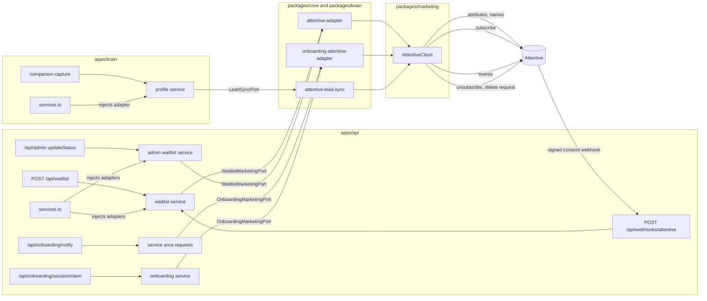

# Attentive: Marketing Sync

Every waitlist signup becomes an Attentive subscriber, opted in through the API sign-up
unit, with a `Joined Waitlist` event recorded against it; admin status changes
(invited/converted) re-sync the profile and emit their own event. The intake's notify-me
and completion checkpoints, and the companion's lead capture, flow through the same client
behind their own ports. That gives marketing a live audience (welcome journeys, invite
waves) and segmentation on the referral loop (top referrers by `referral_count`) without
anyone exporting CSVs.

This doc is the as-built reference: the architecture, the sync flows, exactly what data
leaves our database, every knob, and what to do when it breaks. The design brief and the
decisions behind the move from Klaviyo are in [00-plan.md](00-plan.md).

## Why this shape



Three layers, each replaceable on its own:

- **`@joice/marketing`** (`packages/marketing`): the Attentive HTTP client
  ([attentive.ts](../../packages/marketing/src/attentive.ts)). Domain-agnostic on purpose: it
  knows profiles, subscriptions, events and erasure, and nothing about waitlists. It
  retries 429/5xx and transport failures with backoff (honouring `Retry-After` when
  Attentive sends one), bounds every request with a 10 s timeout, and owns **`EVENTS`**
  ([events.ts](../../packages/marketing/src/events.ts)): every event type name in one
  place, because Attentive creates event types on first use and a casing typo in one
  adapter would silently fork an event and break the journeys built on it. The webhook
  signer and verifier ([webhook.ts](../../packages/marketing/src/webhook.ts)) live here too.
- **The ports**: `WaitlistMarketingPort`
  ([port.ts](../../packages/core/src/marketing/port.ts)), `OnboardingMarketingPort`
  ([marketing-port.ts](../../packages/core/src/onboarding/marketing-port.ts)) and the brain's
  `LeadSyncPort` ([ports/index.ts:185](../../packages/brain/src/ports/index.ts)). Each
  describes the question its domain asks, not the provider behind it. Core and the brain
  read no env; tests inject a fake; absent means "not configured".
- **The adapters**: one thin file per port mapping it onto the client
  ([attentive-adapter.ts](../../packages/core/src/marketing/attentive-adapter.ts),
  [onboarding-attentive-adapter.ts](../../packages/core/src/marketing/onboarding-attentive-adapter.ts),
  [attentive-lead-sync.ts](../../apps/brain/src/ports/attentive-lead-sync.ts)), wired in
  [apps/api/src/services.ts](../../apps/api/src/services.ts) and
  [apps/brain/src/services.ts](../../apps/brain/src/services.ts) only when the
  `ATTENTIVE_*` env vars are set. The row-to-profile mapping lives once in
  [profile.ts](../../packages/core/src/marketing/profile.ts) and is shared by every service
  that syncs; field drift between two copies would silently diverge Attentive from the
  database.

**Why one sign-up unit plus events, not a list per stage.** In Attentive, consent lives on
the subscriber and is recorded against the sign-up unit that collected it; there are no
lists to manage. So one API sign-up unit (`ATTENTIVE_SIGN_UP_SOURCE_ID`, configured for SMS
and email) is the consent moment for every surface, and what carries the waitlist-ness is
the *data*: the `Joined Waitlist` and `Waitlist Status Changed` events, the `waitlist_*`
attributes. Stages and checkpoints are custom events, which is what journeys and segments
actually trigger on. New checkpoint = new event name, never a new unit.

## The sync flows

**Signup**: `join()` in [waitlist-service.ts](../../packages/core/src/waitlist-service.ts):

1. The signup transaction commits (insert + referrer's `referral_count` bump).
2. **Fire-and-forget** (deliberately not awaited: an Attentive outage must never fail or
   slow a signup):
   1. Profile upsert: custom attributes (`POST /v1/attributes/custom`, synchronous), then
      first and last name (`POST /v2/user/attributes`, asynchronous on Attentive's side).
   2. Subscribe through the API sign-up unit (`POST /v1/subscriptions`). Email only today,
      so only the email channel is created; Attentive records the unit as the consent
      provenance.
   3. `Joined Waitlist` event, `externalEventId` = entry UUID and `occurredAt` = the row's
      `created_at`, so a retried or re-pushed sync can never double-fire a journey and a
      late re-push never starts a stale welcome.
   4. On success, stamp `waitlist_entries.marketing_synced_at`.
3. A **separate** fire-and-forget chain refreshes a referrer's profile (fresh
   `referral_count`, read post-commit). It does **not** stamp the referrer's
   `marketing_synced_at`: that column means "initial consent-subscribe succeeded", and a
   consent-free profile refresh must not fake it.
4. Failures are logged with the **entry id, never the email** (no PII in logs); the two
   chains log independently so a referrer-refresh failure is never misattributed to the
   new signup.

**Admin status change**: `updateStatus()` in
[admin/waitlist-service.ts](../../packages/core/src/admin/waitlist-service.ts): after the
transaction, a fire-and-forget `statusChanged` re-upserts the profile (fresh
`waitlist_status` for segments) and emits `Waitlist Status Changed` (`externalEventId` =
`entryId:status`, so re-pushing the same transition is a no-op). This is what keeps the
synced attribute truthful; without it, every segment on `waitlist_status` would silently
lie after the first invite wave.

**Notify-me** ("tell me when my state opens"):
[service-area-request-service.ts](../../packages/core/src/onboarding/service-area-request-service.ts)
upserts `onboarding_state` and `onboarding_state_requested_at` and records
`Service Area Requested` (`externalEventId` = `email:STATE`). It **never subscribes**: this
is a serviceability signal, not marketing consent. Stamps
`service_area_requests.marketing_synced_at`.

**Intake completion** (the claim):
[onboarding-service.ts:461](../../packages/core/src/onboarding/onboarding-service.ts)
upserts `onboarding_goal`, `onboarding_segment`, `onboarding_state`,
`onboarding_completed_at`, `onboarding_marketing_consent`, subscribes **only when the person
ticked `consent_marketing`**, and records `Onboarding Completed` (`externalEventId` =
`intake:<memberId>`).

**Companion lead capture**: `syncLead` in
[profile/service.ts:145](../../packages/brain/src/profile/service.ts) runs on every persist
once an email exists, serialized through one promise chain so a retried early sync can
never regress a newer state. It upserts `lead_source`, `lead_status`, `lead_goal`, never a
name and never a subscription. Errors log the lead id and the error name only. Stamps
`brain_profiles.marketing_synced_at` without touching `updated_at`, so
`marketing_synced_at IS NULL OR marketing_synced_at < updated_at` finds stale rows.

**Erasure**: `deleteForRequester` in
[profile/service.ts:263](../../packages/brain/src/profile/service.ts) locks the rows, calls
`suppressLead` **inside the transaction before the delete**, then deletes. The adapter
unsubscribes the email from every channel (confirmation suppressed) and files a privacy
delete request; a 404 from either means Attentive never had the person and is tolerated,
anything else rolls the transaction back so erasure stays retryable.

Guarantees and accepted trade-offs:

- **Idempotent with signups.** A duplicate email re-submit takes the existing early-return
  path and never re-fires the sync.
- **`marketing_synced_at` semantics**: NULL = the initial consent-subscribe never
  succeeded. `SELECT id FROM waitlist_entries WHERE marketing_synced_at IS NULL;` finds
  exactly the people Attentive doesn't (fully) have. Every call is safe to re-push
  (attributes upsert, a repeat subscribe answers `PREVIOUSLY_CREATED`, events dedupe on
  `externalEventId`); [attentive-resync.ts](../../apps/api/scripts/attentive-resync.ts)
  does it for you. Rows synced before 2026-09 went to Klaviyo and were deliberately not
  backfilled, so a stamped pre-switch row is not in Attentive.
- **No automatic retry beyond the in-request backoff.** A failed sync stays failed until
  something re-pushes it.
- **Not atomic across the calls.** The subscriber can exist with attributes but no
  subscription if the subscribe call fails; `marketing_synced_at` stays NULL and a re-push
  heals it.
- **Unbounded fire-and-forget chains.** Each signup spawns a detached chain (up to five
  attempts with backoff, each bounded by the 10 s timeout); a signup burst during an
  Attentive outage accumulates them with no concurrency cap. The subscribe endpoint allows
  ten requests per second; above that the 429s go through the same backoff. Accepted at
  waitlist volume; add a small semaphore before high-traffic surfaces adopt the pattern.
- **Referrer `referral_count` is last-write-wins.** Two concurrent referred signups can
  leave Attentive one bump behind; it self-heals on the next referral. Accepted.
- **Names are asynchronous.** `POST /v2/user/attributes` answers 202 and applies within
  seconds; a journey's first message can render an empty first name. Use the template
  fallback.

## Identifier and attribute namespace policy

These are the cross-domain rules that prevent a data-merge mess when several surfaces
upsert the same emails:

- **`clientUserId` belongs to the waitlist entry UUID** until a platform-wide person id
  exists. Other domains upsert **by email only** and never send one (Attentive treats it
  as an identity; two services fighting over it is at best last-writer-wins).
- **Custom attributes are prefix-namespaced per domain**: the waitlist owns `referral_*`,
  `signup_*`, `waitlist_*`, `joined_waitlist_at`; the brain owns `lead_*`; onboarding owns
  `onboarding_*`. Attentive merges attributes key by key (omitted keys are preserved), so
  partial upserts are safe, but only distinct names keep them collision-free.
- **A key's type locks on first write**, account-wide and permanently. Every `*_at` is an
  ISO 8601 string, `referral_count` and `signup_sequence` are numbers,
  `onboarding_marketing_consent` is a boolean, everything else is a string, and arrays are
  never sent (Attentive rejects them). Changing a key's type later is a permanent 400 on
  that key; the fix is a new key name.
- **Names are shared and last-writer-wins.** `firstName`/`lastName` are set by whoever
  upserts last; the client skips blank values so a sync can never *clear* a name, but
  domains with lower-quality name data should leave them unset. The companion follows
  this: it **never writes a name**; the chat-collected name stays on the lead row and in
  `/admin/leads`.
- **Erasure is person-global by design.** The unsubscribe covers every channel and the
  delete request removes the whole subscriber, not just the erasing domain's attributes.
  The brain's erasure path uses it deliberately: over-suppression is the intended behavior
  for someone who asked to be forgotten.

## What we send (and what we never send)

Marketing data is explicitly **not PHI** (see the compliance posture in the root
`CLAUDE.md` and `docs/rag/07-compliance.md`); that is what makes a third-party marketing
platform acceptable here.

| Attentive field | Source | Why |
|---|---|---|
| `email` | `email` | identity + consent key |
| `firstName` / `lastName` | `first_name` / `last_name` | personalization (via `/v2/user/attributes`) |
| `externalIdentifiers.clientUserId` | `id` (entry UUID) | stable cross-system join key |
| `referral_code` (attribute) | `referral_code` | build share links in messages |
| `referral_count` (attribute, number) | `referral_count` | "top referrers" segments |
| `signup_sequence` (attribute, number) | `sequence` | stable "you're early" ordering |
| `waitlist_status` (attribute) | `status` | invited/converted segments (kept fresh by the admin status sync) |
| `joined_waitlist_at` (attribute, ISO) | `created_at` | Attentive's own created date is the sync date, not the signup date |

Deliberately excluded: **`ip_hash`** (never leaves the database), raw `referred_by_code`
(unresolved codes are noise; `was_referred` on the event covers it), the derived
`position` (a moving count, not a stored fact), and `metadata`. **No phone is sent by any
surface yet**: the client and the ports carry an optional E.164 `phone` so SMS capture is
one later story (a phone field with the TCPA disclosure, a `consent_sms` trait, a column),
and the sign-up unit already covers both channels.

### Onboarding (the intake flow)

| Checkpoint | Event | Attributes | Subscription |
|---|---|---|---|
| "Tell me when my state opens" (a notify gate) | `Service Area Requested` | `onboarding_state`, `onboarding_state_requested_at`, `onboarding_goal` when known | **never**: this is not marketing consent |
| Intake finished and the account exists (claim) | `Onboarding Completed` | `onboarding_goal`, `onboarding_segment`, `onboarding_state`, `onboarding_completed_at`, `onboarding_marketing_consent` | only when the person ticked the marketing opt-in on the consent step (`consent_marketing`) |

Both events carry an `externalEventId` (`email:STATE`, `intake:<memberId>`) and their own
`occurredAt`. Nothing health-shaped is ever sent: the intake asks marketing and personal
traits only until the PHI keys are on, and the adapter sends goal, segment and state,
never answers. Notify-me requests live in their own table (`service_area_requests`); they
are not the referral waitlist and carry no brain lineage, so Attentive remains the only
place the funnels meet.

### The companion

`lead_source` (`"companion"`), `lead_status` (capturing, exploring, ready, converted),
`lead_goal` when given. No name, no `clientUserId`, no subscription.

## The inbound webhook

Attentive posts consent changes to `POST /api/webhooks/attentive`
([webhooks/attentive.ts](../../apps/api/src/webhooks/attentive.ts)), mounted outside the
typed RPC chain like `/api/internal` ([app.ts](../../apps/api/src/app.ts)): not a browser
API. Every delivery carries `x-attentive-hmac-sha256`, the hex HMAC-SHA256 of the raw body
under the webhook's signing key, and
[attentive-signature.ts](../../apps/api/src/middleware/attentive-signature.ts) verifies it
over the raw text before anything parses it (503 with the secret unset, 401 on a mismatch,
the header never logged), behind a rate limit so a flood never buys hashing work.

What it does: `email.unsubscribed` and `sms.unsubscribed` on a marketing subscription
stamp `waitlist_entries.marketing_unsubscribed_at` for the matching email (normalised the
way signups store it); `email.subscribed` and `sms.subscribed` clear it, unless a newer
unsubscribe is already on record. That is `applyMarketingConsent` in
[waitlist-service.ts](../../packages/core/src/waitlist-service.ts): bookkeeping only, it
never touches `updated_at`, never re-syncs and never calls the port. Every other event, a
delivery without an email, and transactional subscriptions answer 200 with
`applied: false`; Attentive's retry policy on non-2xx is undocumented, so nothing signed
and parseable is refused. Payloads carry no event id; the timestamp makes re-deliveries
idempotent. `/admin/waitlist` shows `unsubscribed` on the row and the CSV export carries
the column. Two states only: `marketing_synced_at` is also set on pre-switch rows that
went to Klaviyo, so a "subscribed" badge would lie.

What it deliberately does not touch: onboarding members and companion leads. For them
Attentive stays the consent source of truth (their opt-in lives on the intake's
`consent_marketing` observation, and the brain never subscribes anyone), and nothing in the
app reads their subscription status.

To try it locally with `ATTENTIVE_WEBHOOK_SECRET=devsecret` on the api:

```
BODY='{"type":"email.unsubscribed","timestamp":1788800000000,"subscriber":{"email":"Someone@Example.com"},"subscription":{"type":"MARKETING"}}'
SIG=$(printf '%s' "$BODY" | openssl dgst -sha256 -hmac devsecret | awk '{print $2}')
curl -i -X POST http://localhost:4000/api/webhooks/attentive \
  -H 'content-type: application/json' -H "x-attentive-hmac-sha256: $SIG" --data-binary "$BODY"
```

## Configuration

| Var | Where | What |
|---|---|---|
| `ATTENTIVE_API_KEY` | secret: Secrets Manager (`joice/attentive-api-key`) on the api **and** brain tasks, `.env` locally | the private app's API key |
| `ATTENTIVE_SIGN_UP_SOURCE_ID` | plain env: `var.attentive_sign_up_source_id` on the api task, `.env` locally | the API sign-up unit's id (Sign-up Units tab, ID column) |
| `ATTENTIVE_WEBHOOK_SECRET` | secret: Secrets Manager (`joice/attentive-webhook-secret`) on the api task, `.env` locally | the signing key Attentive issued for the consent webhook |

Key and source id both empty (the default everywhere) disables the sync entirely: signups
work, nothing syncs, nothing is stamped. Setting only one of the two **fails the api at
boot** ([env.ts](../../apps/api/src/env.ts)); half-configured would otherwise silently
sync nothing. The brain takes the key alone ([env.ts](../../apps/brain/src/env.ts)): it
never subscribes anyone. Both services log one line at boot stating whether the sync is
enabled. Terraform pieces: [variables.tf](../../infra/variables.tf),
[secrets.tf](../../infra/secrets.tf), the `read-app-secrets` policy in
[iam.tf](../../infra/iam.tf), and the task definitions in [ecs.tf](../../infra/ecs.tf) and
[brain.tf](../../infra/brain.tf). Real values live in the gitignored
`infra/terraform.tfvars`; changing them is a `terraform apply` (runtime env, no image
rebuild).

### One-time Attentive dashboard setup

1. **Create a private app** (Marketplace, custom app management) and copy its API key.
   The app needs the subscribers, custom attributes, custom events and privacy-request
   permissions; a key missing any of them fails the corresponding calls with 403.
2. **Create an API sign-up unit** covering **SMS and Email** (Sign-up Units) and copy its
   id from the ID column. Email-only calls subscribe email only; the same unit takes SMS
   once a phone is sent. The unit's legal language is what the person agreed to at the
   point of collection; keep the form copy and the unit in step.
3. **Create the webhook** (Marketplace, the custom app's Webhooks tab) at
   `https://joicehealth.com/api/webhooks/attentive` with `email.subscribed`,
   `email.unsubscribed`, `sms.subscribed`, `sms.unsubscribed`, and copy the signing key
   into `terraform.tfvars`. "Send test event" should show a 200 once the apply has run.

### Scripts

- `ATTENTIVE_API_KEY=... bun apps/api/scripts/attentive-check.ts` calls `GET /v1/me` and
  prints the company the key belongs to (never the key). Run it before a deploy.
- `bun apps/api/scripts/attentive-resync.ts --since <ISO date>` re-pushes waitlist rows with
  `marketing_synced_at IS NULL` created after that time, sequentially, stamping each
  success and logging ids only. `--since` is required: pre-switch rows are Klaviyo's and
  are not backfilled.

## Extending to new checkpoints

For a domain that already syncs, a new checkpoint is genuinely: one port method, one
`trackEvent` (plus `upsertProfile` if it carries profile fields), the event name added to
`EVENTS`, and the journey built in Attentive.

The **first** checkpoint in a new app also pays one-time wiring: its own narrow port and
noop next to the domain, env in that app's `env.ts`, adapter construction in its
`services.ts`, the secret on its ECS task definition (the IAM grant already covers it), and
docker-compose env. Bounded, pay-once.

Two rules when you do: follow the
[identifier and namespace policy](#identifier-and-attribute-namespace-policy), and
remember `trackEvent` and `upsertProfile` alone create a subscriber record with **no
marketing consent**. Anyone who should receive marketing must also go through a
`subscribe` moment somewhere (for waitlist signups that is signup itself; for members it is
the consent step of the intake).

## Swapping Attentive out

The domain layer is fully protected: the ports, `waitlist-service.ts`, the admin service,
the onboarding and brain services, and their tests change **zero lines**. What does
change: the client package internals, the thin per-domain adapters (they import the
`AttentiveClient` type), and the edge wiring/env/infra names. That churn is inherent to
any provider swap; the point of the seam is that no domain logic rides along. The Klaviyo
to Attentive move (2026-09) was exactly that list.

## Troubleshooting

| Symptom | Cause | Fix |
|---|---|---|
| API won't boot, env validation error naming ATTENTIVE | Only one of key and source id set | Set both or neither |
| Attentive's webhook log shows 503 | `ATTENTIVE_WEBHOOK_SECRET` unset on the api task | Put the signing key in `terraform.tfvars`, `terraform apply` |
| Attentive's webhook log shows 401 | Signing key mismatch, or the body was altered in transit | Re-copy the key from the webhook's settings; the signature is hex over the raw body |
| Unsubscribed in Attentive but `/admin/waitlist` shows nothing | The email is not a waitlist entry (a member or a companion lead), or the webhook was not created with the consent events | Expected for non-waitlist addresses; check the events on the webhook |
| Signups work but nobody appears in Attentive | Vars empty, sync disabled (check the boot log line) | Set both, restart the api task (`terraform apply` in prod) |
| Sync failures logged with 403 | The private app lacks a permission (subscribers, attributes, events, privacy) | Fix the app's permissions in the dashboard and re-push |
| Subscriber exists with attributes but no subscription | The subscribe call failed after the upsert, or the sign-up unit does not cover the channel sent | `marketing_synced_at` is NULL: fix the cause, then `attentive-resync.ts` |
| Sync failures logged with 400 on `/v1/attributes/custom` | A key's value type conflicts with the type locked at its first write | Never change a key's type; introduce a new key name |
| Sync failures logged with 429 | A signup burst hit the 10 rps subscribe limit | Backoff handles it; if persistent, add the semaphore noted above |
| A journey did not start for a re-pushed row | `occurredAt` older than twelve hours | Expected: re-pushes record the event without starting a stale journey |
| Names missing on a fresh subscriber | `/v2/user/attributes` is asynchronous | Wait a few seconds; use the template fallback |
| `waitlist_status` segments look stale | Status changed outside `updateStatus` (e.g. direct SQL) | Only the admin service keeps the attribute fresh; use it |
| `[waitlist] marketing sync failed for entry <id>` with 401 | Bad or revoked API key | Rotate the key in `terraform.tfvars`, `terraform apply` |
| api or brain task fails to start after adding a secret | New secret ARN missing from `read-app-secrets` in `infra/iam.tf`, or the task launched before the policy landed | It's in the same PR as the secret; ECS retries the launch |
| Rows with `marketing_synced_at IS NULL` piling up | Sustained Attentive failures (check api logs for the entry ids) | Fix the cause; `attentive-resync.ts --since` is safe any time |
| A person keeps getting messages after erasure | The delete request is asynchronous (up to thirty days) | The unsubscribe in the same call stops sends immediately; check the subscriber's status |
| Erasure endpoint answers 500 | Attentive answered something other than 2xx or 404 during `suppressLead` | The delete rolled back on purpose; retry once Attentive recovers |
