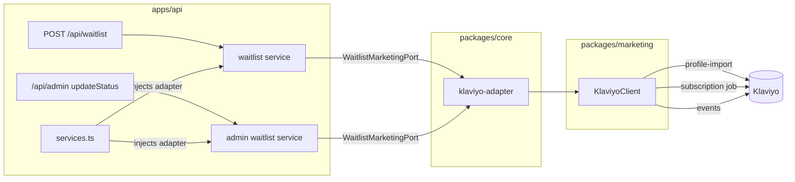

# Klaviyo — Waitlist Marketing Sync

Every waitlist signup becomes a Klaviyo profile, subscribed to the master
consent list, with a `Joined Waitlist` event recorded against it; admin status
changes (invited/converted) re-sync the profile and emit their own event. That
gives marketing a live audience (welcome flows, invite waves) and segmentation
on the referral loop (top referrers by `referral_count`) without anyone
exporting CSVs.

This doc covers the architecture, the sync flow, exactly what data leaves our
database, every knob, and what to do when it breaks.

## Why this shape

Three layers, each replaceable on its own:

- **`@joice/marketing`** (`packages/marketing`) — the Klaviyo HTTP client.
  Domain-agnostic on purpose: it knows profiles, list subscriptions, and
  events, and nothing about waitlists. It pins the Klaviyo API `revision`
  header to one constant, retries 429/5xx with backoff (honoring
  `Retry-After`), and owns **`METRICS`** — every metric name, in one place,
  because Klaviyo creates metrics on first use and a casing typo in one
  adapter would silently fork a metric and break the flows built on it.
- **`WaitlistMarketingPort`** (`packages/core/src/marketing/port.ts`) — the
  waitlist domain's narrow interface, mirroring the brain's ports discipline:
  it describes the question asked, not the provider behind it. Deliberately
  waitlist-named: other domains (the brain's lead capture, future orders)
  declare their own ports over the same client rather than growing this one.
  Core reads no env; tests inject a fake; absent means "not configured".
- **The adapter** (`packages/core/src/marketing/klaviyo-adapter.ts`) — one
  thin file mapping the port onto the client, wired in
  `apps/api/src/services.ts` only when the `KLAVIYO_*` env vars are set.
  The row→profile mapping lives once in
  `packages/core/src/marketing/profile.ts` and is shared by every service
  that syncs — field drift between two copies would silently diverge Klaviyo
  from the database.

**Why one list + events, not a list per stage.** Klaviyo's recommended
structure is a single master consent list per channel, with **segments** (on
properties/metrics) carrying audience stages — because consent lives on the
*profile*, not the list, and Klaviyo's default unsubscribe is global. So the
list is generic on purpose — name it for what it is ("Joice Subscribers"),
not for the first surface that feeds it. The waitlist is merely the first
consent-capturing moment; every future surface subscribes people to this same
`KLAVIYO_LIST_ID`. What carries the waitlist-ness is the *data*, not the
list: the `Joined Waitlist` / `Waitlist Status Changed` metrics, the
`waitlist_*` properties, and the per-subscription `custom_source` ("Joice
waitlist signup") recording how each person's consent was collected. Stages
and checkpoints are metrics — which is what flows and segments actually
trigger on. New checkpoint = new metric name, never a new list.

## The sync flows

**Signup** — `join()` in `packages/core/src/waitlist-service.ts`:

1. The signup transaction commits (insert + referrer's `referral_count` bump).
2. **Fire-and-forget** (deliberately not awaited — a Klaviyo outage must never
   fail or slow a signup):
   1. Profile upsert (`POST /api/profile-import/` — idempotent by email).
   2. List subscribe with `SUBSCRIBED` email consent (`custom_source` records
      "Joice waitlist signup" as consent provenance).
   3. `Joined Waitlist` event, `unique_id` = entry UUID, so a retried or
      re-pushed sync can never double-fire a flow.
   4. On success, stamp `waitlist_entries.marketing_synced_at`.
3. A **separate** fire-and-forget chain refreshes a referrer's profile
   (fresh `referral_count`, read post-commit). It does **not** stamp the
   referrer's `marketing_synced_at` — that column means "initial
   consent-subscribe succeeded", and a consent-free profile refresh must not
   fake it.
4. Failures are logged with the **entry id, never the email** (no PII in
   logs); the two chains log independently so a referrer-refresh failure is
   never misattributed to the new signup.

**Admin status change** — `updateStatus()` in
`packages/core/src/admin/waitlist-service.ts`: after the transaction, a
fire-and-forget `statusChanged` re-upserts the profile (fresh
`waitlist_status` for segments) and emits `Waitlist Status Changed`
(`unique_id` = `entryId:status`, so re-pushing the same transition is a
no-op). This is what keeps the synced property truthful — without it, every
segment on `waitlist_status` would silently lie after the first invite wave.

Guarantees and accepted trade-offs:

- **Idempotent with signups.** A duplicate email re-submit takes the existing
  early-return path and never re-fires the sync.
- **`marketing_synced_at` semantics**: NULL = the initial consent-subscribe
  never succeeded. `SELECT id FROM waitlist_entries WHERE marketing_synced_at
  IS NULL;` finds exactly the people Klaviyo doesn't (fully) have. All three
  Klaviyo calls are safe to re-push (profile import and the subscription job
  are idempotent; events are deduplicated by `unique_id`).
- **No automatic retry beyond the in-request backoff.** A failed sync stays
  failed until something re-pushes it.
- **Not atomic across the three calls.** The profile can exist unsubscribed if
  the subscription job fails; `marketing_synced_at` stays NULL and a re-push
  heals it.
- **Unbounded fire-and-forget chains.** Each signup spawns a detached chain
  (up to ~5 retries with backoff); a signup burst during a Klaviyo outage
  accumulates them with no concurrency cap. Accepted at waitlist volume —
  revisit before high-traffic surfaces adopt the pattern.
- **Referrer `referral_count` is last-write-wins.** Two concurrent referred
  signups can leave Klaviyo one bump behind; it self-heals on the next
  referral. Accepted.

## Identifier & property namespace policy

These are the cross-domain rules that prevent a data-merge mess when the next
surface (the companion's lead capture) starts upserting the same emails:

- **`external_id` belongs to the waitlist entry UUID** until a platform-wide
  person id exists. Other domains upsert **by email only** and never send an
  `external_id` (Klaviyo treats it as an identifier — two services fighting
  over it is at best last-writer-wins).
- **Custom properties are prefix-namespaced per domain**: the waitlist owns
  `referral_*`, `signup_*`, `waitlist_*`, `joined_waitlist_at`; the brain owns
  `lead_*` — the companion's lead sync (`apps/brain/src/services.ts`) writes
  `lead_source` (`"companion"`), `lead_status`, and `lead_goal` — onboarding
  gets `onboarding_*`, and so on. Klaviyo's profile-import merges properties
  key-by-key (omitted keys are preserved), so partial upserts are safe — but
  only distinct names keep them collision-free.
- **Top-level name fields are shared.** `first_name`/`last_name` are set by
  whoever upserts last; the client skips empty values so a sync can never
  *clear* a name, but domains with lower-quality name data (a chat-collected
  single "name" field) should prefer leaving them unset. The companion follows
  this: it **never writes `first_name`** — the chat-collected name stays on
  the lead row and in `/admin/leads`.
- **`suppressProfile` (the erasure primitive) is profile-global by design** —
  suppressing an email stops *all* marketing to that person, not just the
  suppressing domain's. The brain's erasure path uses it deliberately:
  over-suppression is the intended behavior for someone who asked to be
  forgotten.

## What we send (and what we never send)

Phase 0 waitlist data is marketing-only and explicitly **not PHI** (see the
compliance posture in the root `CLAUDE.md` and `docs/rag/07-compliance.md`) —
that is what makes a third-party marketing platform acceptable here.

| Klaviyo field | Source | Why |
|---|---|---|
| `email` | `email` | identity + consent key |
| `first_name` / `last_name` | `first_name` / `last_name` | personalization |
| `external_id` | `id` (entry UUID) | stable cross-system join key |
| `referral_code` (property) | `referral_code` | build share links in emails |
| `referral_count` (property) | `referral_count` | "top referrers" segments |
| `signup_sequence` (property) | `sequence` | stable "you're early" ordering |
| `waitlist_status` (property) | `status` | invited/converted segments (kept fresh by the admin status sync) |
| `joined_waitlist_at` (property) | `created_at` | Klaviyo's own `created` is the sync date, not the signup date |

Deliberately excluded: **`ip_hash`** (never leaves the database), raw
`referred_by_code` (unresolved codes are noise; `was_referred` on the event
covers it), the derived `position` (a moving count, not a stored fact), and
`metadata`.

## Configuration

| Var | Where | What |
|---|---|---|
| `KLAVIYO_API_KEY` | secret — Secrets Manager (`joice/klaviyo-api-key`) in prod, `.env` locally | private key (`pk_...`) |
| `KLAVIYO_LIST_ID` | plain env — `var.klaviyo_list_id` in prod, `.env` locally | 6-char code from the list URL |

Both empty (the default everywhere) disables the sync entirely — signups work,
nothing syncs, nothing is stamped. Setting only one of the two **fails the API
at boot** (validated in `apps/api/src/env.ts`) — half-configured would
otherwise silently sync nothing. The api logs one line at boot stating whether
the sync is enabled. Terraform pieces: `infra/variables.tf`,
`infra/secrets.tf`, the `read-app-secrets` policy in `infra/iam.tf`, and the
api task definition in `infra/ecs.tf`. Real values live in the gitignored
`infra/terraform.tfvars`; changing them is a `terraform apply` (runtime env —
no image rebuild).

### One-time Klaviyo dashboard setup

1. Create the list: Audience → Lists & Segments → **Create List** → name it
   generically, e.g. **"Joice Subscribers"** — it's the master consent list
   for everyone who opts into email, not a waitlist bucket (see above). The
   List ID is the 6-char code in the list's URL. (Renaming a list later never
   changes its ID, so a name fix is always safe — but start generic.)
2. **Set the list to single opt-in** (list settings → consent). New lists
   inherit the account default, which is double opt-in on new accounts —
   that would hold every signup at "pending" until they click a confirmation
   email. (Alternatively flip the account default once.)
3. Create a **Private API Key** (Settings → Account → API Keys) with scopes:
   Profiles **Full**, Subscriptions **Full**, Lists **Full**, Events
   **Full**. The subscription job *writes* to the list (Lists Read is not
   enough) and the checkpoint events need the Events scope — a key missing
   either fails every sync with 403.

## Extending to new checkpoints

For a domain that already syncs, a new checkpoint is genuinely: one port
method → one `trackEvent` (+ `importProfile` if it carries profile fields) →
add the metric name to `METRICS` → build the flow in Klaviyo.

The **first** checkpoint in a new app (e.g. the brain's lead capture) also
pays one-time wiring: its own narrow port + noop in `packages/brain/src/ports`
(the brain may depend on `@joice/marketing` — it's a utility package like the
AWS SDK, not another domain), env vars in that app's `env.ts`, adapter
construction in its `services.ts`, the secret on its ECS task definition
(`infra/brain.tf` — the IAM grant already covers it), and docker-compose env.
Bounded, pay-once.

Two rules when you do: follow the
[identifier & namespace policy](#identifier--property-namespace-policy), and
remember `trackEvent` alone creates a bare profile with **no marketing
consent** — anyone who should receive marketing email must also go through a
`subscribeToList` moment somewhere (for waitlist signups that's signup itself;
for future members it's an account-creation decision that hasn't been made
yet).

## Swapping Klaviyo out

The domain layer is fully protected: the ports, `waitlist-service.ts`, the
admin service, and their tests change **zero lines**. What does change: the
client package internals, the thin per-domain adapters (they import the
`KlaviyoClient` type), and the edge wiring/env/infra names. That churn is
inherent to any provider swap; the point of the seam is that no domain logic
rides along.

## Troubleshooting

| Symptom | Cause | Fix |
|---|---|---|
| API won't boot, env validation error naming KLAVIYO | Only one of the two vars set | Set both or neither |
| Signups work but no profiles appear in Klaviyo | Vars empty → sync disabled (check the boot log line) | Set both, restart the api task (`terraform apply` in prod) |
| Profile exists but not subscribed/in the list right after signup | The subscription job is async on Klaviyo's side — 202 means queued, and processing can lag by minutes | Wait a few minutes before diagnosing; also confirm you're watching the list `KLAVIYO_LIST_ID` actually points to (`GET /api/lists/{id}/` shows its name) |
| Sync failures logged with 403 | Key missing Lists Full or Events Full scope | Recreate the key with all four scopes (see setup) |
| Profiles appear but "Never subscribed" / pending | List is double opt-in, or the key lacks the Subscriptions scope | Switch the list to single opt-in; check key scopes |
| `waitlist_status` segments look stale | Status changed outside `updateStatus` (e.g. direct SQL) | Only the admin service keeps the property fresh — use it |
| `[waitlist] marketing sync failed for entry <id>` with 401/403 | Bad/revoked API key | Rotate the key in `terraform.tfvars` → `terraform apply` |
| api task fails to start after adding the secret | New secret ARN missing from `read-app-secrets` in `infra/iam.tf` | It's in the same PR as the secret — make sure both applied |
| Rows with `marketing_synced_at IS NULL` piling up | Sustained Klaviyo failures (check api logs for the entry ids) | Fix the cause; re-push is safe any time (idempotent + event dedupe) |
| Someone was "cleaned" off the list and stopped getting email | List removal ≠ consent change, but **global unsubscribe is** — an unsubscribe from any send suppresses account-wide | Don't manage consent via list membership; check the profile's suppression status |
| Klaviyo rejects requests after a revision bump | Payload shape changed between API revisions | The `revision` is one pinned constant in `packages/marketing/src/klaviyo.ts` — read the Klaviyo changelog before bumping |
