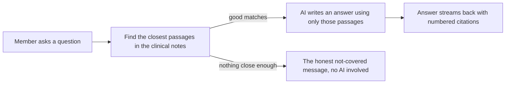

# Ask Joice chatbot

## What it is / Who it's for

Ask Joice is the member chat for peptide questions. Answers come strictly from the clinical
team's own reference notes, and every claim shows a numbered source you can open. When the
notes do not cover a question, Joice says so instead of guessing; that honesty is a design
requirement for a health product. For members once we launch; the whole team can try it today
behind the team login.

## How to use it

1. Log in at joicehealth.com/team with the team password (this gate disappears at launch).
2. Open the Ask page and type a peptide question the way a member would.
3. The answer streams in with small numbered chips underneath; click a chip to see exactly
   which note the claim came from.
4. Ask a question our notes do not cover (try something off-topic) and you will get the
   honest "not covered" message rather than an invented answer.
5. Answers can also be spoken aloud; use the voice control on the chat.

Admins shape how Joice behaves at joicehealth.com/admin/brain: its name and tone, whether
citations show, how strict the matching is, which AI model runs, and the speaking voice.
Changes go live within about thirty seconds, every save lands in the audit log, and the
safety rules shown at the bottom of that page cannot be changed from there at all. Before
switching on the "tool calling" mode anywhere real, run the eval console first (it has its
own page here).

## How it works

## Links

- Engineering docs: https://github.com/Joice-Health/Joice/tree/main/docs/rag
- Admin tuning guide: https://github.com/Joice-Health/Joice/blob/main/docs/rag/09-admin-brain.md

## Changelog

| Date | What changed |
|---|---|
| 2026-08-27 | Initial page, documenting the chatbot as it stands today |
