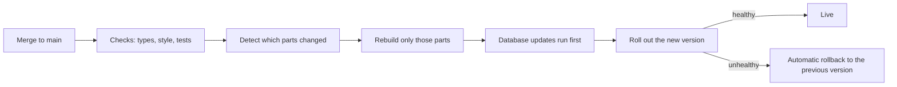

# How the site deploys

## What it is / Who it's for

What happens between "the code is merged" and "it is live on joicehealth.com", in plain
words, so anyone can answer "is my change live yet?". For the whole team.

## How to use it

1. When a change merges to the main branch, deployment starts automatically. Nothing manual.
2. First every check must pass (types, style rules, tests). A red check means nothing
   deploys.
3. Only the parts of the site the change actually touched are rebuilt and rolled out, so
   most deploys take minutes.
4. If a rollout fails health checks, the previous version is put back automatically.
5. "Is it live?" Ask in engineering or check the deploy run on GitHub; the site also
   reports which version each service is running.
6. One quirk worth knowing: a settings-only change (nothing in the code) will not trigger a
   deploy on its own; engineering runs a manual full deploy for those.

## How it works

## Links

- Engineering docs: https://github.com/Joice-Health/Joice/blob/main/docs/ci-cd/README.md

## Changelog

| Date | What changed |
|---|---|
| 2026-08-27 | Initial page |
