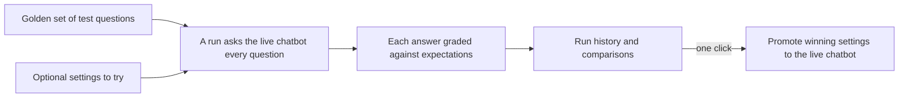

# Chatbot eval console

## What it is / Who it's for

A scorecard for Ask Joice. It runs our "golden set" of test questions against the live
chatbot, grades every answer (right sources cited, refused what it should refuse, and so on),
keeps the history of every run, and can promote a winning experiment's settings to the live
chatbot in one click. For admins tuning the chatbot; it turns "did that change make answers
worse?" into a thirty-second check.

## How to use it

1. Open joicehealth.com/admin/eval with an admin account. You will see past runs with their
   scores, speed, and cost.
2. Click to start a run. Choose the quick check (does it find the right notes?) or the full
   check (real answers, graded). You can try different settings for just this run without
   touching the live chatbot, and a cost hint shows before anything starts.
3. Watch results land question by question while the run executes.
4. Open a finished run to see each question's pass or fail with the actual answer, and an
   automatic comparison against the previous run: what got fixed, what regressed.
5. Happy with an experiment? "Apply these settings" makes them live (and records who did it
   in the audit log).
6. The golden set itself is editable here too: add, edit, tag, enable, or disable test
   questions as the product grows.

One run at a time by design; a second start attempt politely refuses until the current run
finishes.

## How it works

## Links

- Shortcut epic: https://app.shortcut.com/joice-health/epic/200
- Engineering docs: https://github.com/Joice-Health/Joice/blob/main/docs/rag/12-eval-console.md

## Changelog

| Date | What changed |
|---|---|
| 2026-08-27 | Console shipped and this page written |
