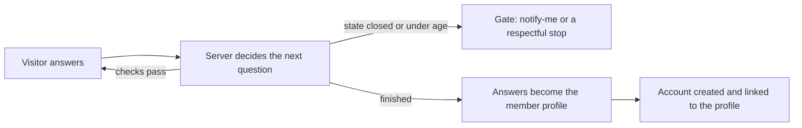

# Get Started intake

## What it is / Who it's for

The guided questionnaire at joicehealth.com/get-started. A visitor answers a short set of
questions (where they live, their age, their goals), the flow adapts to their answers, and it
ends with creating a member account; everything they told us becomes their member profile,
in the shape our future protocols will match on. Admins can change the questions, wording,
and branching from the admin console without a deploy. For visitors becoming members, and
for the admins and content team who shape the questions.

## How to use it (as a visitor)

1. Pre-launch you need the team login first (joicehealth.com/team), and the intake must be
   switched on with at least one state open; ask engineering if it is not.
2. Open Get Started and answer the questions. The flow only ever shows what applies to you.
3. If we are not in your state yet, you can leave your email and we will tell you when we
   arrive. If you are under the minimum age, the flow stops and everything you entered is
   deleted.
4. Close the tab mid-way and come back: it resumes where you left off.
5. At the end, create your account. Your welcome page shows a summary of what you told us.

## How to use it (as an admin)

1. Open joicehealth.com/admin/onboarding.
2. **Flow**: edit wording, add or remove questions, and set "show when" rules in a draft.
   Saving shows a report of anything wrong; publishing refuses until the report is clean.
3. **Simulator**: run made-up personas (a 17-year-old, a New Yorker) through your draft and
   see exactly what they would be asked and why, before anyone real sees it.
4. **Versions**: every publish is kept; roll back in one click.
5. **Service areas**: open or close states and set the minimum age.
6. **Funnel**: see where visitors drop off, question by question.

The full walkthrough lives in the admin guide linked below; it was written for non-engineers.

## How it works

The server decides every next step, so the safety checks (state, age) cannot be skipped with
browser tricks, and questions about sensitive health topics stay locked until our compliance
prerequisites are met.

## Links

- Shortcut epic: https://app.shortcut.com/joice-health/epic/127
- Engineering docs: https://github.com/Joice-Health/Joice/tree/main/docs/onboarding
- Admin guide: https://github.com/Joice-Health/Joice/blob/main/docs/onboarding/05-admin-guide.md

## Changelog

| Date | What changed |
|---|---|
| 2026-08-19 | Built through registration and the admin console (epic phases 0 to 4) |
| 2026-08-27 | Initial page |
