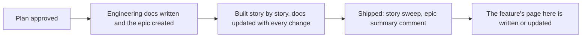

# How work stays visible

## What it is / Who it's for

Every feature at Joice lives on three surfaces, each written for a different reader. This
page tells you which one to open. For everyone.

| You want | Go to |
|---|---|
| What a feature is and how to use it | This Notion space (one page per feature) |
| What is being built, by whom, and how far along | Shortcut (the Engineering team's epics) |
| The deep technical detail | The GitHub docs linked from every page here |

## How to use it

1. **Following progress**: open the feature's epic in Shortcut. The epic description says
   what and why in plain language; stories move on their own as the code moves (started, in
   review with a link to the change, done), and status comments summarize each milestone in
   plain words.
2. **Learning a shipped feature**: open its page in this space. Each has "how to use it"
   steps and a changelog of what has changed since.
3. **Digging deeper**: every page here and every epic links to the engineering docs on
   GitHub, where the diagrams and technical decisions live.

## How it works

The same facts appear on all three surfaces in three voices; the workflow updates them as
part of the work itself, so none of them is a stale copy.

## Links

- Engineering docs: https://github.com/Joice-Health/Joice/blob/main/docs/workflow/01-team-visibility.md

## Changelog

| Date | What changed |
|---|---|
| 2026-08-27 | Initial page |
