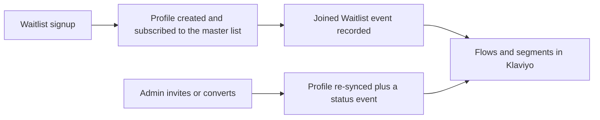

# Waitlist marketing sync

## What it is / Who it's for

Every waitlist signup automatically becomes a Klaviyo profile, subscribed to our master
list, with a "Joined Waitlist" event on it; when an admin invites or converts someone, that
change syncs too and fires its own event. Marketing gets a live audience for welcome flows,
invite waves, and referral segmentation without anyone exporting a CSV. For the marketing
team.

## How to use it

1. In Klaviyo, build flows triggered on the **Joined Waitlist** event (welcome series) and
   **Waitlist Status Changed** (invite wave follow-ups).
2. Build segments on the waitlist properties that ride each profile, including the referral
   count: "top referrers" is a segment on that number, refreshed as people refer.
3. There is one master list on purpose. Audience stages (waiting, invited, converted) are
   events and properties, not separate lists, because consent lives on the person and
   Klaviyo unsubscribes are global. Do not create stage lists.
4. If a signup seems missing in Klaviyo, tell engineering; the sync retries on its own, and
   the troubleshooting guide below covers the rest.

## How it works

## Links

- Engineering docs: https://github.com/Joice-Health/Joice/blob/main/docs/marketing/01-klaviyo.md

## Changelog

| Date | What changed |
|---|---|
| 2026-08-27 | Initial page, documenting the sync as it stands today |
