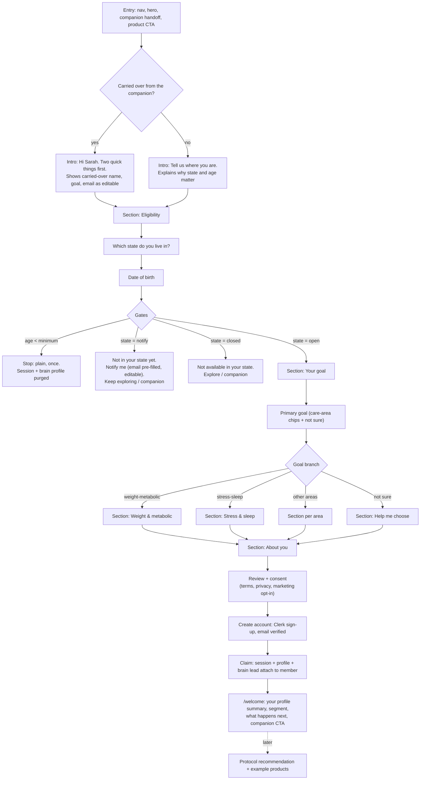
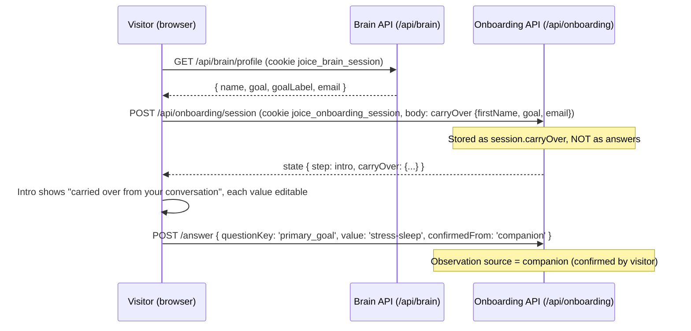
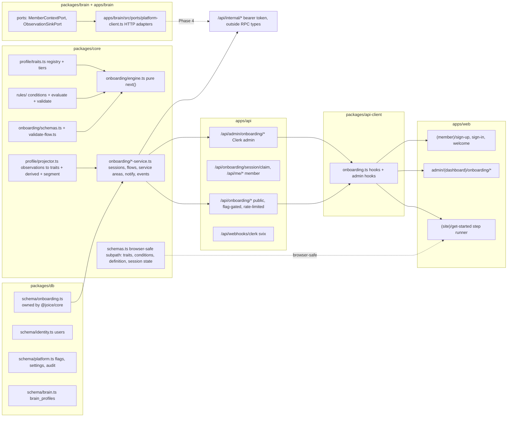
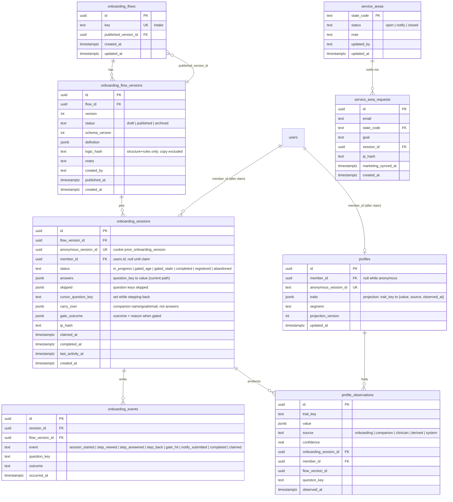
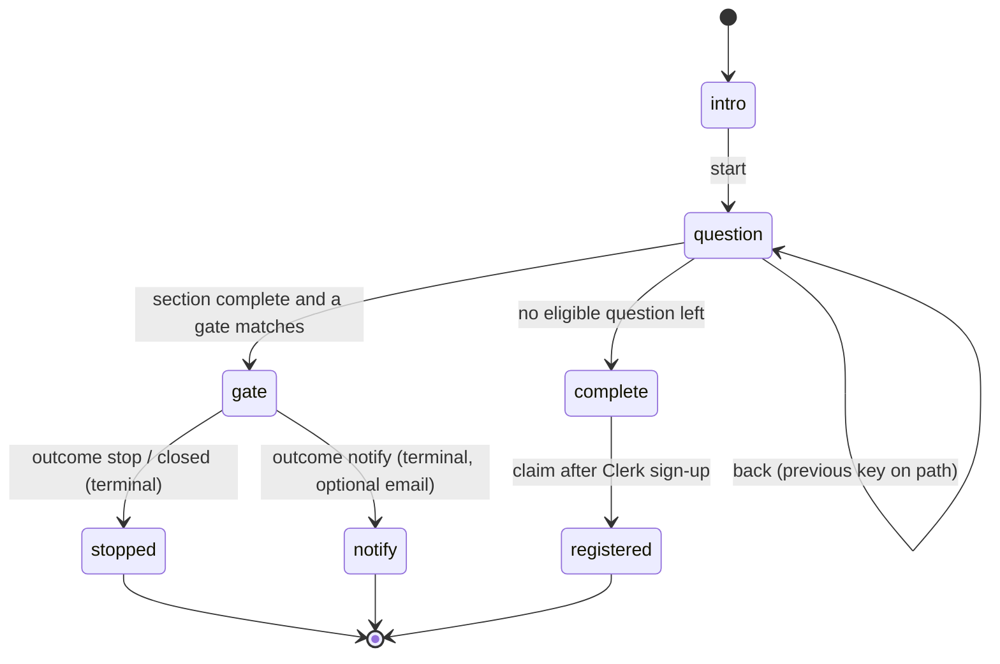
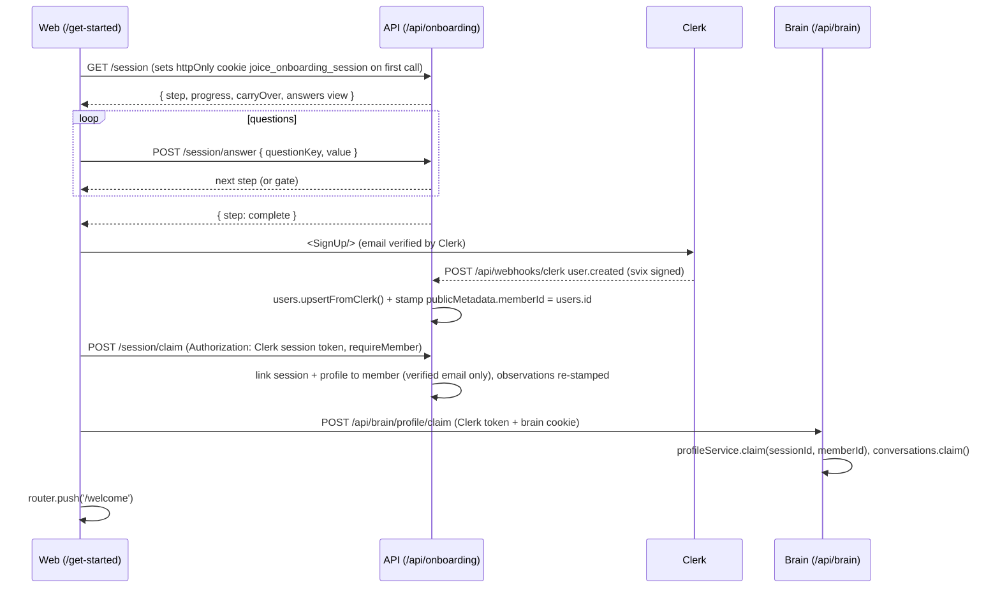
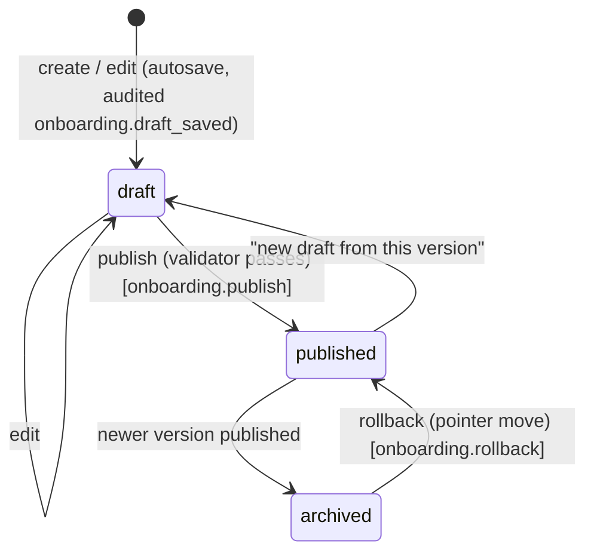
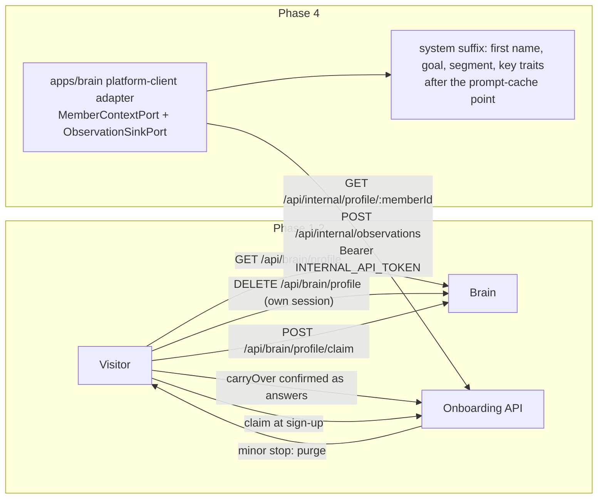
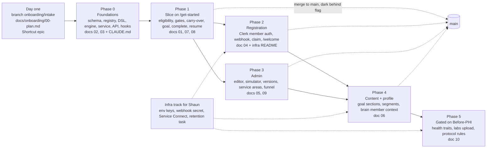

<!-- Design brief for the intake flow. Approved by Shaun on 2026-08-19. Tracked in Shortcut:
     epic 127 "Onboarding: intake logic tree" (https://app.shortcut.com/joice-health/epic/127),
     stories sc-128 to sc-181, one per row in section 5. Keep the decisions log (section 9)
     and the appendix current when a decision changes. -->

# Joice onboarding: the intake logic tree

Design brief (approved 2026-08-19) for turning `/get-started` from a placeholder into an admin-configurable, server-driven
intake flow that builds a member profile, ends in registration, and leaves the data in the
shape protocols will need. Written as the product + engineering brief for a Shortcut epic.

---

## 0. Context

**Why now.** The companion (the brain) already captures a visitor's name, goal and email and
hands them to `/get-started`, which today only confirms the lead
([page.tsx](../../apps/web/app/(site)/get-started/page.tsx),
[lead-summary.tsx](../../apps/web/components/get-started/lead-summary.tsx)). Three places in the
repo call the intake decision tree "a separate downstream workstream". Nothing downstream
(protocols, clinical review, commerce) can start until a profile exists.

**What exists that we build on** (verified in this session):

| Already in the repo | Where | How onboarding uses it |
|---|---|---|
| Deterministic server-side capture machine: `nextStep` is a pure function of the stored row; `POST` returns the next state | `packages/brain/src/profile/{schemas,service}.ts`, `apps/brain/src/app.ts:435-470` | The engine shape we copy (and generalise) |
| `users` table keyed by Clerk id, `upsertFromClerk()` waiting for a webhook | `packages/db/src/schema/identity.ts`, `packages/core/src/admin/user-service.ts:66-90` | Registration target |
| Admin-configurable, audited, cached config (one `app_settings` row, zod-validated, safeParse + defaults) | `packages/brain/src/config/service.ts`, `/api/admin/brain` | Pattern for every admin-editable object here |
| Feature flags seeded by migration, `requireFlag` gate, `flagEnabled()` / `usePublicFlags()` | `packages/core/src/admin/feature-flag-service.ts`, `apps/api/src/middleware/feature-gate.ts`, `apps/web/lib/flags.ts` | `onboarding` flag opens the door |
| Audit log service | `packages/core/src/admin/audit-service.ts` | Every publish / gate edit |
| Typed RPC: `AppType` chain → `hc<AppType>` hooks | `apps/api/src/app.ts`, `packages/api-client` | No hand-written DTOs |
| Brain ports (`MemberContextPort` stub) and the `claim(sessionId, memberId)` seam | `packages/brain/src/ports/index.ts`, `profile/service.ts:250` | Profile → brain, anonymous → member |
| Care-area vocabulary | `packages/brain/src/profile/schemas.ts:24-37` (+ `apps/web/lib/site-content.ts`) | The `primary_goal` trait values |
| Klaviyo namespace policy: onboarding owns `onboarding_*` | `docs/marketing/01-klaviyo.md:133-139` | Notify-me and completion events |
| Compliance posture + Before-PHI checklist | root `CLAUDE.md`, `infra/README.md:122-136`, `docs/rag/07-compliance.md` | Sensitivity tiers and the publish lock |
| Design system (hairlines, dotted pills, brackets, `display`/`mono-label`) | `packages/ui`, `docs/design/01-design-system.md` | The step UI |

**Constraints that shape the design** (from CLAUDE.md and memory):

- The brain never imports another domain's tables; ports + injected adapters only.
- A service writes only the tables in its own `packages/db/src/schema/*.ts` file.
- The public referral waitlist never touches the brain (hard product rule).
- Phase 0 stores marketing data only; the Before-PHI checklist is open.
- Never store raw IPs; GTM events carry no PII; no em dashes in any copy.
- Shaun runs infra commands; CI never touches infrastructure.

**Council.** The core decisions were pressure-tested with a five-advisor council and peer
review (verdict in Appendix A). The plan below follows the verdict except where noted with
"(deliberate departure)".

**How the work is run.** On its own branch (`onboarding/intake`, story branches merged by
PR, phases merged to `main` dark behind the `onboarding` flag; §8), documented as it is built
(a new `docs/onboarding/` set, every affected `CLAUDE.md`, the READMEs and `.env.example`
updated in the same PR as the code; §7), and tracked as a Shortcut epic with the stories in
§5 (epic 127, created 2026-08-19).

---

## 1. Principles

1. **The durable asset is the profile, not the quiz.** A typed trait registry plus observations
   with provenance. The quiz is the first input adapter; the companion is the second; a
   clinician form will be the third. Protocols match on traits and never see a question id.
2. **One condition language** for branching, gates, segment derivation and (later) protocol
   eligibility. One evaluator, one validator, one simulator.
3. **Server-authoritative engine**, pure and table-tested, mirroring the brain capture machine.
   The client renders what the server says is next. Gates cannot be bypassed from the browser.
4. **Immutable published versions**, sessions pinned, rollback is a pointer move. Definitions
   carry a `schemaVersion` so a rolled-back image refuses a definition it cannot read.
5. **Admins own copy, questions, options, ordering and branching. Engineers own traits.**
   New traits are typed code with a sensitivity tier; questions bind to them. Admins can also
   create `custom.*` marketing-tier traits without a deploy.
6. **Compliance is a data-flow property.** Sensitivity tiers on traits, a publish validator
   that refuses `health` traits until an engineering-held key is turned, minors purged on the
   hard stop, anonymous sessions expire, notice at the point of collection.
7. **The brain is optional.** Most visitors arrive cold. Carry-over is explicit, shown, and
   confirmed by the visitor; never silently applied.
8. **Notify-me is its own thing.** Not `waitlist_entries`, no brain lineage, Klaviyo-synced
   under `onboarding_*`.
9. **Documented as it is built, on its own branch.** `docs/onboarding/*` plus every affected
   `CLAUDE.md` and README change in the same PR as the code (§7); all work lands on
   `onboarding/intake` and reaches `main` per phase, dark behind the flag (§8).

---

## 2. Product design

### 2.1 The visitor's journey



**Resume.** Closing the tab at question 6 and returning shows question 7 (cookie session).
Signing in later shows the claimed answers. A gated session is terminal: a visitor who was
stopped or told "not yet" and comes back starts fresh (and may now be served, if the state
opened).

**Tone rules** (from the council's Outsider): explain *why* state and age are asked; never
dead-end the "not in your state" screen; say the under-18 stop plainly, once, without a
notify-me that pretends they might qualify; at the end say what happens next and when, so
the sign-up does not read as a data grab.

### 2.2 Gate semantics

| Gate | Evaluated on | Source of truth | Outcome | Data kept |
|---|---|---|---|---|
| Minimum age | `age` derived from `date_of_birth` | `onboarding` settings row (`minimumAge`, default 18), edited on the service-areas surface, audited separately | `stop` terminal screen | Session marked `gated_age`; **date of birth not persisted**; answers purged; brain lead erased through the brain's own route |
| State not served yet | `state_status` derived from `us_state` via `service_areas` | `service_areas` table, edited in admin, audited separately | `notify` screen with email capture | Session `gated_state`, `service_area_requests` row if they opt in |
| State closed | same | same | `closed` screen | Session `gated_state` |
| Later in the flow (age- or state-specific questions/products) | any trait | `showIf` conditions on sections/questions | question shown or hidden | n/a |

Self-reported state is a courtesy filter, not a control: enforcement happens again at
prescribing and at the shipping address. The plan says so in the admin UI.

### 2.3 Using what the companion already knows (carry-over)



Rules: the platform never reads brain tables for this; the visitor carries the data over and
confirms it (consent at the point of collection, and no shared-laptop leak of one person's
data into another's answers). If the brain is off, down, or there is no cookie, the flow is
identical minus the greeting. Identity is only ever linked on a verified email at sign-up.

### 2.4 The user type (segment) and why protocols care

A **segment** is a derived trait computed from other traits by rules in the same condition
language, for example:

| Segment | Rule (sketch) |
|---|---|
| `weight-newcomer` | `primary_goal = weight-metabolic` and `peptide_experience = none` |
| `weight-experienced` | `primary_goal = weight-metabolic` and `peptide_experience in (some, regular)` |
| `recovery-athlete` | `primary_goal = body-comp-recovery` and `activity_level in (high, athlete)` |
| `sleep-first` | `primary_goal = stress-sleep` |
| `explorer` | `primary_goal = not-sure` |

Protocols (later) will be `protocol_rules`: conditions over traits and segment → protocol id,
evaluated by the same evaluator, previewed in the same simulator. Nothing in protocols needs
to know which question produced a trait.

### 2.5 What admins can change vs what needs an engineer

| Admins (no deploy) | Engineers (deploy) |
|---|---|
| Add/edit/remove questions, options, copy, help text, placeholders | New trait keys with types and sensitivity tiers (registry) |
| Order sections and questions; add a section with a "show when" rule | New question input types (a new renderer) |
| Branching: "show when" conditions on sections and questions (field / operator / value rows) | New condition operators |
| Gate copy; `service_areas` statuses; minimum age (separate surface, separate audit) | The `PHI_READY` key (Terraform) |
| Publish, roll back, simulate, read the funnel | Derived-trait code (age, bmi, state_status); segment rule *editor* is v2 |
| `custom.*` marketing-tier traits for ad-hoc questions | Anything health-tier |

---

## 3. Architecture

### 3.1 Where it lives



The onboarding domain is a platform concern (it ends in registration and owns the profile),
so it lives in `packages/core` and `apps/api`, exactly like the waitlist and admin services.
`apps/brain` stays a consumer through ports.

### 3.2 Data model



Notes:
- All of this is one new file `packages/db/src/schema/onboarding.ts`, written only by the api
  service through `@joice/core`. The brain never touches these tables; it reaches the profile
  over HTTP (`/api/internal/*`, §3.8), and its observations are written by the api service.
- `onboarding_sessions.answers` is the current answer set (the brain_profiles pattern: the row
  *is* the state); `profile_observations` is the append-only history with provenance, question
  key and flow version (audit, re-ask, "what did they say before"); `profiles.traits` is the
  fold (recomputed on write, cheap). No bus, no projector service.
- Member identity across services is `users.id` (what `brain_profiles.member_id` already
  expects), stamped into Clerk `publicMetadata.memberId` at webhook/claim time so every
  service reads it from the session-token `metadata` claim that is already configured.
- `date_of_birth` for a visitor under the minimum age is never written; only the gate outcome.
- `onboarding_events` holds no answer values, only keys and outcomes (funnel).
- `service_areas` is platform-owned and will be reused by pharmacy/shipping; it is not a key
  inside the flow definition.

### 3.3 The flow definition (what admins edit, what gets versioned)

```jsonc
{
  "schemaVersion": 1,
  "key": "intake",
  "sections": [
    {
      "key": "eligibility", "locked": true,
      "title": "Two quick things first",
      "questions": [
        { "key": "us_state", "trait": "us_state", "type": "us_state", "required": true,
          "label": "Which state do you live in?",
          "help": "We can only work with licensed clinicians and pharmacies in the states we serve." },
        { "key": "date_of_birth", "trait": "date_of_birth", "type": "date", "required": true,
          "label": "When were you born?", "help": "You need to be 18 or older." }
      ],
      "gates": [
        { "key": "min_age", "when": { "trait": "age", "op": "lt", "value": { "setting": "onboarding.minAge" } },
          "outcome": "stop", "copyKey": "gate.under_age" },
        { "key": "state_notify", "when": { "trait": "state_status", "op": "eq", "value": "notify" },
          "outcome": "notify", "copyKey": "gate.state_notify" },
        { "key": "state_closed", "when": { "trait": "state_status", "op": "eq", "value": "closed" },
          "outcome": "closed", "copyKey": "gate.state_closed" }
      ]
    },
    {
      "key": "goal", "title": "What brings you here?",
      "questions": [
        { "key": "primary_goal", "trait": "primary_goal", "type": "single_select", "required": true,
          "label": "What would you change first?",
          "options": [
            { "value": "weight-metabolic", "label": "Weight & metabolic" },
            { "value": "body-comp-recovery", "label": "Body comp / recovery" },
            { "value": "beauty-skin", "label": "Beauty / skin" },
            { "value": "energy", "label": "Energy" },
            { "value": "stress-sleep", "label": "Stress & sleep" },
            { "value": "not-sure", "label": "Not sure yet" }
          ] }
      ]
    },
    {
      "key": "weight", "title": "Weight & metabolic",
      "showIf": { "trait": "primary_goal", "op": "eq", "value": "weight-metabolic" },
      "questions": [
        { "key": "weight_tried", "trait": "weight_approaches_tried", "type": "multi_select", "label": "What have you tried?",
          "options": [ { "value": "diet", "label": "Diet changes" }, { "value": "training", "label": "Training" },
                       { "value": "coaching", "label": "Coaching" }, { "value": "none", "label": "Nothing yet" } ] },
        { "key": "weight_timeline", "trait": "goal_timeline", "type": "single_select", "label": "Your timeline?",
          "options": [ { "value": "3mo", "label": "Next 3 months" }, { "value": "6mo", "label": "6 months" }, { "value": "12mo", "label": "A year" } ] }
      ]
    },
    { "key": "about", "title": "About you",
      "questions": [
        { "key": "peptide_experience", "trait": "peptide_experience", "type": "single_select", "required": true, "label": "Peptides so far?",
          "options": [ { "value": "none", "label": "New to them" }, { "value": "some", "label": "Tried some" }, { "value": "regular", "label": "Use them regularly" } ] },
        { "key": "first_name", "trait": "first_name", "type": "text", "required": true, "label": "What should we call you?" }
      ] },
    { "key": "consent", "locked": true, "title": "Before you create your account",
      "questions": [
        { "key": "consent_terms", "trait": "consent_terms", "type": "boolean", "required": true, "label": "I agree to the Terms and Privacy Policy" },
        { "key": "consent_marketing", "trait": "consent_marketing", "type": "boolean", "required": false, "label": "Email me about Joice" }
      ] }
  ],
  "copy": {
    "intro.title": "Tell us where you are.",
    "intro.carried": "Hi {first_name}. Two quick things first.",
    "gate.under_age": "Joice is for adults 18 and over. Thanks for your interest.",
    "gate.state_notify": "We are not in {state_name} yet. Leave your email and we will tell you the day we are.",
    "gate.state_closed": "We cannot serve {state_name} right now.",
    "complete.title": "That is everything we need for now."
  }
}
```

The sample above is the v1 launch content: marketing and personal tiers only. Health-tier
questions (height/weight, GLP-1 history, medications, conditions) exist in the editor as
locked rows until the PHI key is turned (see 3.9). Counsel confirms tier assignments for
lifestyle questions before publish.

### 3.4 The condition language

```jsonc
// leaf
{ "trait": "primary_goal", "op": "eq", "value": "weight-metabolic" }
// composite
{ "all": [ { "trait": "age", "op": "gte", "value": 18 }, { "any": [ {...}, {...} ] } ] }
{ "not": { "trait": "state_status", "op": "eq", "value": "open" } }
// value can reference a setting (age minimum), resolved before evaluation
{ "trait": "age", "op": "lt", "value": { "setting": "onboarding.minAge" } }
```

Ops: `eq neq in nin gt gte lt lte between contains exists`. Typed per trait (the validator
rejects `gt` on an enum, `contains` on a number). `evaluate(cond, traits) → { result, trace }`
where the trace lists every leaf with its resolved value and outcome, shown in the simulator
and the admin "why" panel. Pure, in `packages/core/src/rules/conditions.ts`, exported from the
browser-safe `@joice/core/schemas` subpath so the admin builder renders and validates the same
shapes the server evaluates.

*(Deliberate departure from the council: the chairman leaned to a zod-constrained JSONLogic
subset. We own a ~100-line typed DSL instead because registry validation, the "why" trace and
the builder round-trip all need the explicit `{trait, op, value}` shape; constraining JSONLogic
would cost more than writing the evaluator. Same operator set, same reuse for protocol rules.)*

### 3.5 The engine



`next(definition, answers, context) → Step` in `packages/core/src/onboarding/engine.ts`:

1. Project traits: answers on the *current valid path* + carry-over confirmations + derived
   (age, age_band, state_status, segment).
2. Walk sections in order; skip a section whose `showIf` is false; within it, skip questions
   whose `showIf` is false; the first required-and-unanswered (or optional-and-never-visited)
   question is the step.
3. When a section has no remaining step, evaluate its `gates` in order; the first match is a
   terminal `gate` step.
4. No section left: `complete`.
5. Progress = answered eligible / currently-eligible total (recomputed each call).

Re-answering an earlier question re-runs eligibility downstream: answers to questions a rule
now hides are pruned from the session (and returned as `pruned`, so the service can record
the event); the append-only observations keep the history. Back is a cursor over the current
path, so the session needs no presented-order log. Same function serves `GET /session`,
`POST /answer`, `POST /back` and the admin simulator; the test is a table of (answers) →
(expected step).

### 3.6 Sessions, identity and registration



- Cookie `joice_onboarding_session`: opaque UUID, httpOnly, `SameSite=Lax` (prod) / `None;
  Secure` (dev, cross-origin :3000 → :4000), one year like the brain cookie, issued by the api
  (same pattern as the brain's `identifyRequester`). Separate from the brain cookie on purpose:
  platform identity is not brain identity. Retention is enforced on the row, not the cookie.
- `requireMember` middleware: `clerkMiddleware` + `getAuth(c).userId` present (no admin claim
  needed); resolves `memberId` (`users.id`) from the token's `metadata.memberId`, else the
  `users` row, else a lazy `upsertFromClerk` + metadata stamp (covers the webhook-arrives-late
  race); exposes `memberId`, `memberClerkUserId`, `memberEmail`.
- Claim links only when the Clerk email is verified; an unverified sign-up is told to verify.
- Anonymous sessions: idle 30 days → `abandoned`; unclaimed 90 days → answers and observations
  purged, by a scheduled task like `apps/brain/scripts/retention.ts` (`ONBOARDING_SESSION_TTL_DAYS`).

### 3.7 Versioning and publishing



Publish validator (server-side, also run live in the editor):

| Check | Why |
|---|---|
| zod schema + `schemaVersion` ≤ engine's supported | A rolled-back image must refuse what it cannot read |
| Every `trait` exists in the registry or is `custom.*`; question `type` fits the trait type | Typed profile |
| Every condition references known traits with valid ops for their types | Evaluator safety |
| Sections `eligibility` and `consent` present, locked content intact | Gates and consent cannot be edited away |
| No `health`-tier trait referenced unless `PHI_READY=true` **and** flag `onboarding_health` on | The PHI lock |
| Every referenced `copyKey` exists; no unreachable question (no condition can ever be true) | Editor hygiene, reported as warnings |
| Definition differs from the published version | No no-op versions |

Sessions pin `flow_version_id`. A publish that changes only copy produces a version with the
same `logic_hash`; on the next request an in-progress session on an older version with the
same hash is moved forward silently (typo fixes reach live sessions; logic changes do not).

### 3.8 Brain and onboarding exchange



- **Pre-registration**: client-composed carry-over (§2.3). The platform never reads brain
  tables; the brain never reads platform tables.
- **Minor stop purge**: the onboarding API wipes the session's answers; the web then calls the
  brain's own erasure path for its session (`deleteForRequester`, which also suppresses the
  Klaviyo profile). New brain route `DELETE /api/brain/profile` (requester-scoped) exposes it.
- **Post-registration (Phase 4)**: the brain's `MemberContextPort` and a new
  `ObservationSinkPort` get one HTTP adapter (`apps/brain/src/ports/platform-client.ts`) that
  calls `/api/internal/*` on the api service with a bearer `INTERNAL_API_TOKEN` (timing-safe
  compare, 503 when unset, high rate limit, registered on the app outside the typed RPC chain).
  This matches what `docs/rag/10-architecture.md` promised ("the stubs become HTTP clients to
  the api service") and keeps `@joice/core` out of the brain entirely. Today the only route
  between tasks is the public canonical URL (the web already uses `API_URL_INTERNAL =
  canonical_url`; the ALB admits only CloudFront, tasks admit only the ALB), so the internal
  routes live under `/api/*` and are token-protected; an infra story adds ECS Service Connect
  so brain → api becomes VPC-private and the middleware can then also refuse requests that
  carry the CloudFront `X-Origin-Verify` header. Failures are tolerated: an unreachable api
  yields an empty member context, never a failed chat turn.
- **What the brain receives**: marketing + personal tiers only (first name, goal, segment,
  a short traits summary); health-tier traits cross only when `PHI_READY` and the flag say so.
- **Who owns "what do we ask next"**: on `/get-started` the onboarding engine; in chat the
  brain's capture machine (name/email/goal only). The two never both ask the same person
  the same thing because the carry-over pre-fills and the visitor confirms.

### 3.9 Compliance design

| Concern | Design |
|---|---|
| Sensitivity tiers | On the trait: `marketing` (goal, state, preferences), `personal` (first name, email, date of birth, consent), `health` (height/weight, medications, conditions, GLP-1 history). The question inherits it; the editor shows a lock on health rows with plain words: "Medical question. Publishing is locked until the Before-PHI checklist is complete." |
| The two keys | `PHI_READY=true` (env on the api task, set by Terraform, Shaun) **and** feature flag `onboarding_health` (admin-visible status). Publish validator refuses health traits unless both. Admins cannot turn the first key. |
| Anonymous is not a shield | v1 content is marketing + personal only. Lifestyle questions get counsel sign-off on tier before publish. |
| Minors | Under-age stop never persists DOB; session answers purged; brain lead erased via the brain's own path. |
| Retention | Unclaimed sessions expire (`ONBOARDING_SESSION_TTL_DAYS`, default 90, counsel to confirm). |
| Abuse | Anonymous write endpoints rate-limited per IP (same limiter), IPs stored only as salted hashes, payload caps, answer values validated per question type. |
| Analytics | GTM events carry question keys and outcomes only, never values, names or emails. Funnel table holds the same. |
| Notice | Intro and consent screens carry the point-of-collection notice and links; consent stored as versioned, timestamped traits. |
| Identity linking | Only on Clerk-verified email; carried-over values are shown, never silently applied; notify-me requests are not `waitlist_entries` and carry no brain lineage. |
| Clerk BAA | Open question for counsel once accounts carry health context (Clerk holds name + email; traits stay in our DB). |

### 3.10 Admin

Pages under `/admin/onboarding` (nav link "Onboarding"):

| Page | What it does |
|---|---|
| **Flow** | Sections list (locked ones badged), up/down reorder, add section with "show when"; per question: type, trait binding (registry dropdown + custom), options editor, copy, required, "show when" builder (field / operator / value rows with AND/OR groups), live validation messages, sensitivity badge and lock |
| **Simulate** | Pick a persona (state, DOB, goal, ...) and step through the real engine; shows path, progress, gate hits and the "why" trace per condition; runs against draft or published |
| **Versions** | Draft / published / archived list; publish with the validation report; rollback; JSON diff between two versions; notes |
| **Service areas** | 51 rows, status per state (open / notify / closed), note; minimum age; confirm dialog; audited as `service_area.update` / `onboarding.min_age` (separate from flow edits) |
| **Funnel** | Per version: starts, per-question reach / answered / dropped, gate outcomes, notify submissions, completions, registrations; CSV export |
| **Requests** | `service_area_requests` list (state, goal, date), export |

v2: drag-and-drop reorder, A/B as two published versions + weighted router, derived-trait
(segment rule) editor, clinician sign-off step for health versions, two-person approval on
service-area changes.

### 3.11 Analytics

- `lib/analytics.ts` gains: `onboarding_started`, `onboarding_step_viewed {questionKey}`,
  `onboarding_step_answered {questionKey}`, `onboarding_gate_hit {outcome}`,
  `onboarding_notify_submitted`, `onboarding_completed`, `registration_started`,
  `registration_completed`. No values.
- Server `onboarding_events` (written by the session service) feeds the admin funnel.
- Klaviyo (fire-and-forget, `onboarding_*` namespace): `Onboarding Completed`
  (`onboarding_goal`, `onboarding_segment`, `onboarding_state`), `Service Area Requested`.
  Completion profiles are only subscribed if `consent_marketing` is true.

### 3.12 Protocol readiness (what we store now so protocols can match later)

- Traits are typed and stable; `profiles.traits` is a fold with provenance; `segment` exists.
- `protocol_rules` (Phase 5 sketch): `{ protocol_key, when: Condition, priority, requires_clinician: true }`
  evaluated by the same evaluator; output is a recommendation record, never a prescription.
- `MemberContextPort.protocols` already exists in the brain; it fills from the same table later.

---

## 4. Implementation plan (file level)

### 4.1 New and modified files

```
packages/db/src/schema/onboarding.ts            NEW  all tables in §3.2; header states the writers (api service via @joice/core)
packages/db/src/schema/index.ts                 MOD  export * from './onboarding'
packages/db/drizzle/0012_<generated>.sql        NEW  DDL from db:generate (+ meta snapshot)
packages/db/drizzle/0013_seed_onboarding_flags.sql     NEW  flags onboarding + onboarding_health (off), ON CONFLICT DO NOTHING
packages/db/drizzle/0014_seed_service_areas.sql        NEW  50 states + DC as notify
packages/db/drizzle/0015_seed_onboarding_intake_flow.sql NEW  flow 'intake' + version 1 published (the §3.3 JSON), pointer set WHERE NULL
packages/db/drizzle/meta/_journal.json          MOD  register 0013-0015 (same as 0011 precedent)

packages/core/src/profile/traits.ts             NEW  TRAITS registry: key, type, tier, label, values, derived?; customTraitKeySchema (custom.<slug>)
packages/core/src/profile/derive.ts             NEW  age, age_band, age_eligible, state_status, bmi, segment (segment rules via DSL)
packages/core/src/profile/projector.ts          NEW  projectProfile(observations | answers, definition, ctx) -> traits + segment + trace
packages/core/src/profile/profile-service.ts    NEW  recordObservations (append), projectFor(session|member), getForMember, attachToMember
packages/core/src/rules/conditions.ts           NEW  Condition zod (recursive) + op vocabulary
packages/core/src/rules/evaluate.ts             NEW  evaluateCondition(cond, traits) -> { value, why }
packages/core/src/rules/validate.ts             NEW  validateCondition(cond, registry, customTypes) -> issues (op valid for type, unknown trait)
packages/core/src/onboarding/us-states.ts       NEW  US_STATES (51), browser-safe
packages/core/src/onboarding/schemas.ts         NEW  flow definition zod (sections, question bank, options, gates, segment rules, completion), session state, actions, notify
packages/core/src/onboarding/default-flow.ts    NEW  DEFAULT_INTAKE_FLOW as code (test asserts it equals the seed SQL JSON)
packages/core/src/onboarding/validate-flow.ts   NEW  validateFlowDefinition(def, { phiEnabled, registry }) -> { ok, errors, warnings }; logicHash()
packages/core/src/onboarding/engine.ts          NEW  deriveTraits, isQuestionEligible, next, applyAnswer, applySkip, goBack, progressFor, summaryFor
packages/core/src/onboarding/simulate.ts        NEW  simulate(definition, persona, ctx) -> path + why traces (wraps the engine)
packages/core/src/onboarding/flow-service.ts    NEW  createFlowService(db, audit, { phiReady, flags }): drafts, publish, rollback, cached published getter
packages/core/src/onboarding/onboarding-service.ts NEW  createOnboardingService(db, deps): sessions, answer/skip/back/restart, gates, notify, claim, sweep
packages/core/src/onboarding/service-area-service.ts NEW  list/update (audited service_area.update), cached map
packages/core/src/onboarding/service-area-request-service.ts NEW  notify-me rows + Klaviyo fire-and-forget
packages/core/src/onboarding/onboarding-config-service.ts NEW  app_settings row 'onboarding' ({ minimumAge }), mirrors the brain config service
packages/core/src/onboarding/events-service.ts  NEW  recordEvent (no values), funnel aggregation
packages/core/src/onboarding/admin-schemas.ts   NEW  versions, publish, rollback, simulate, service areas, settings, funnel, requests
packages/core/src/onboarding/marketing-port.ts  NEW  OnboardingMarketingPort (+ noop)
packages/core/src/marketing/onboarding-klaviyo-adapter.ts NEW  onboarding_* props, importProfile + trackEvent only
packages/core/src/schemas.ts                    MOD  FLAG_KEYS.onboarding / .onboardingHealth; re-export traits, conditions, onboarding schemas, us-states
packages/core/src/index.ts, src/admin/index.ts  MOD  export services + admin schemas
packages/core/src/admin/user-service.ts         MOD  markDeletedFromClerk(clerkUserId)
packages/core/src/**/*.test.ts                  NEW  per §6

apps/api/src/env.ts                             MOD  CLERK_WEBHOOK_SECRET, INTERNAL_API_TOKEN, PHI_READY, ONBOARDING_SESSION_TTL_DAYS
apps/api/src/services.ts                        MOD  construct flow/onboarding/profile/service-area/config/events services + marketing adapter
apps/api/src/middleware/onboarding-session.ts   NEW  joice_onboarding_session cookie (mirror of apps/brain/src/middleware/requester.ts)
apps/api/src/middleware/internal-token.ts       NEW  requireInternalToken (timing-safe; 503 when unset)
apps/api/src/member/auth.ts                     NEW  requireMember: Clerk token -> memberId (users.id) via claim, users row, or lazy upsert + metadata stamp
apps/api/src/onboarding/routes.ts               NEW  public + member onboarding sub-router
apps/api/src/member/routes.ts                   NEW  /api/me/profile
apps/api/src/internal/routes.ts                 NEW  /api/internal/profile/:memberId, /api/internal/observations (outside the RPC types)
apps/api/src/webhooks/clerk.ts                  NEW  svix-verified user.created/updated/deleted (outside the RPC types)
apps/api/src/admin/onboarding-routes.ts         NEW  admin sub-router; apps/api/src/admin/routes.ts MOD .route('/onboarding', ...)
apps/api/src/app.ts                             MOD  CORS credentials: true; .route('/api/onboarding'), .route('/api/me'); internal + webhook on app
apps/api/package.json                           MOD  + svix

packages/api-client/src/client.ts               MOD  createApiClient sends credentials: 'include' (cookie in dev; no-op same-origin in prod)
packages/api-client/src/onboarding.ts           NEW  onboardingKeys; useOnboardingSession, useStartOnboarding, useAnswerQuestion, useSkipQuestion, useGoBack, useRestartOnboarding, useSubmitNotify, useClaimOnboarding, useMyProfile; AnswerError
packages/api-client/src/admin/onboarding-hooks.ts NEW  flows/versions/publish/rollback/simulate/service areas/settings/funnel/requests hooks + adminKeys.*
packages/api-client/src/companion.ts            MOD  useClaimCompanion()
packages/api-client/src/index.ts                MOD  exports

apps/web/app/(site)/get-started/page.tsx        MOD  flagEnabled(onboarding) ? <OnboardingFlow/> : <LeadSummary/>
apps/web/components/onboarding/flow.tsx         NEW  orchestrator: session, step switch, progress, back, analytics, carry-over start
apps/web/components/onboarding/question-shell.tsx NEW  fieldset/legend, help, error role=alert, focus management, Back / Continue + / Skip
apps/web/components/onboarding/steps/*.tsx      NEW  single-select, multi-select, number, text, date, us-state, boolean, scale (height-weight later)
apps/web/components/onboarding/carry-over-banner.tsx, gate-screen.tsx, notify-form.tsx, complete-screen.tsx, progress.tsx NEW
apps/web/app/(member)/layout.tsx + providers.tsx NEW  member ClerkProvider + token-injecting ApiClientProvider (marketing pages stay Clerk-free)
apps/web/app/(member)/sign-up/[[...sign-up]]/page.tsx, sign-in/[[...sign-in]]/page.tsx NEW  in-app Clerk components
apps/web/app/(member)/welcome/page.tsx + components/member/welcome-claim.tsx NEW  claim both sessions, summary, segment, next steps
apps/web/middleware.ts                          MOD  /welcome member-protected; /sign-in, /sign-up pass; all still behind the team gate pre-launch
apps/web/lib/analytics.ts                       MOD  onboarding_* events
apps/web/app/admin/(dashboard)/onboarding/{page,flow,versions,simulator,service-areas,funnel,requests}/page.tsx NEW
apps/web/components/admin/onboarding/*.tsx      NEW  section-list, question-editor, option-list, condition-builder, validation-report, version-diff, simulator-panel, funnel-table
apps/web/components/admin/nav.tsx               MOD  + { href: '/admin/onboarding', label: 'Onboarding' }
apps/web/next.config.ts                         MOD  add '@joice/brain' to transpilePackages if the build requires it

packages/brain/src/ports/index.ts               MOD  MemberContext + segment/traitsSummary; ObservationSinkPort (+ noop); BrainPorts.observations
packages/brain/src/generation/prompt.ts         MOD  buildMemberSuffix(ctx)
packages/brain/src/generation/answer-service.ts MOD  recommend/recommendStream accept { requester }; set systemSuffix for members
apps/brain/src/ports/platform-client.ts         NEW  HTTP adapters to /api/internal/* (timeout 1.5s, failures -> empty context)
apps/brain/src/services.ts                      MOD  wire adapters when INTERNAL_API_TOKEN set
apps/brain/src/middleware/requester.ts          MOD  optional Clerk bearer -> memberId from metadata.memberId
apps/brain/src/app.ts                           MOD  DELETE /api/brain/profile (erase own lead), POST /api/brain/profile/claim
apps/brain/src/env.ts, apps/brain/package.json  MOD  API_URL_INTERNAL, INTERNAL_API_TOKEN, CLERK_* ; + @hono/clerk-auth

turbo.json                                      MOD  globalEnv: CLERK_WEBHOOK_SECRET, INTERNAL_API_TOKEN, PHI_READY, ONBOARDING_SESSION_TTL_DAYS (+ NEXT_PUBLIC_BRAIN_URL, SITE_LAUNCHED, TEAM_PASSWORD if missing)
.env.example                                    MOD
infra/ (Shaun)                                  secrets.tf, variables.tf, ecs.tf, brain.tf; retention task; later Service Connect
docs/onboarding/01-overview.md, 02-admin-guide.md, 03-data-and-compliance.md NEW; infra/README.md Before-PHI gets the onboarding lines
```

### 4.2 API routes

| Method | Path | Middleware | Purpose |
|---|---|---|---|
| GET | `/api/onboarding/session` | rateLimit 60/min, requireFlag(onboarding), onboardingSession (issues cookie) | Load or create; returns `SessionState` |
| POST | `/api/onboarding/session` | rateLimit 20/min, flag, cookie, zValidator(startSessionSchema) | Create or resume with `carryOver` (firstName, email, goal) merged into unanswered keys; event `session_started` |
| POST | `/api/onboarding/session/answer` | rateLimit 60/min, flag, cookie, zValidator(answerSchema) | Validate per question type from the pinned definition, store, observe, event, return next step; 400 `{ error, questionKey }` |
| POST | `/api/onboarding/session/skip` | same | Optional questions only |
| POST | `/api/onboarding/session/back` | rateLimit 60/min, flag, cookie | Cursor to the previous presented key |
| POST | `/api/onboarding/session/restart` | rateLimit 10/min, flag, cookie | Marks current `abandoned`, starts a new one (also the visitor's own erase) |
| POST | `/api/onboarding/session/notify` | rateLimit 5/min, flag, cookie, zValidator(notifyRequestSchema) | Only when the step is a `notify` gate; `service_area_requests` upsert (email + state unique), Klaviyo event; 201 |
| POST | `/api/onboarding/session/claim` | rateLimit 10/min, flag, cookie, clerkMiddleware, requireMember | Link session + profile to `users.id` (verified email only), event `claimed`, returns claim result |
| GET | `/api/me/profile` | rateLimit 60/min, clerkMiddleware, requireMember | Member's profile view for `/welcome` (`memberRoutes` mounted at `/api/me`) |
| POST | `/api/webhooks/clerk` | rateLimit, svix signature (raw body) | `user.created/updated` → `upsertFromClerk` + stamp `publicMetadata.memberId` once; `user.deleted` → `markDeletedFromClerk`; 503 when the secret is unset |
| GET | `/api/internal/profile/:memberId` | rateLimit 600/min, requireInternalToken | First name, goal, segment, traits summary (marketing + personal tiers) for the brain |
| POST | `/api/internal/observations` | rateLimit 600/min, requireInternalToken, zValidator | Brain-sourced observations → append + reproject |
| GET | `/api/admin/onboarding/flows` | admin chain | Flows + published pointer |
| GET/POST | `/api/admin/onboarding/flows/:key/versions` | admin | List; create draft (copy of published, latest, or the default) |
| GET/PUT | `/api/admin/onboarding/versions/:id` | admin | Version with definition + report; save draft (409 if not draft), returns live validation report |
| POST | `/api/admin/onboarding/versions/:id/publish` | admin | Validate → 422 with report, else freeze, archive previous, move pointer, audit `onboarding.publish` |
| POST | `/api/admin/onboarding/flows/:key/rollback` | admin | Re-point; audit `onboarding.rollback` |
| POST | `/api/admin/onboarding/simulate` | admin | `{ versionId | definition, persona, context }` → path, why traces, traits, segment (no persistence) |
| GET/PATCH | `/api/admin/onboarding/service-areas[/:code]` | admin | List / update; audit `service_area.update` |
| GET/PUT | `/api/admin/onboarding/settings` | admin | `{ minimumAge }`; audit `onboarding.settings` |
| GET | `/api/admin/onboarding/funnel?versionId=&from=&to=` | admin | Aggregates from `onboarding_events` |
| GET | `/api/admin/onboarding/requests` (+ `/export`) | admin | Notify-me list / CSV (like the waitlist export) |
| DELETE | `/api/brain/profile` | brain requester | Erase own lead (minor purge, visitor reset) |
| POST | `/api/brain/profile/claim` | brain requester + Clerk bearer | Attach lead + threads to `memberId` from the token's `metadata.memberId` |

Public, member and admin routes join the typed chain (sub-routers via `.route()`), so
`AppType` carries them. The webhook and `/api/internal/*` are registered on the app outside
the chain (like the brain's voice socket): they are not browser APIs and must not leak into
the RPC types.

### 4.3 Key shapes (zod, browser-safe via `@joice/core/schemas`)

```ts
// profile/traits.ts
traitTypeSchema = z.enum(['string','number','boolean','date','enum','enum_list','us_state','height_weight'])
sensitivitySchema = z.enum(['marketing','personal','health'])
interface TraitDef { key; type: TraitType; sensitivity; label; values?: readonly string[]; derived?: boolean; unit?: string }
TRAITS: first_name, email, goal (enum CARE_AREAS + not-sure), goal_note, us_state, date_of_birth (personal, date),
        age / age_band / age_eligible / state_status / segment (derived), peptide_experience, goal_timeline, ...,
        consent_terms, consent_marketing; Phase 5: height_weight (personal), bmi (derived), conditions, medications (health)
customTraitKeySchema = /^custom\.[a-z0-9_]+$/   // always marketing tier, type inferred from the question type
// rules/conditions.ts + evaluate.ts + validate.ts
conditionOpSchema = z.enum(['eq','neq','in','nin','gt','gte','lt','lte','contains','exists','between'])
type Condition = { all: Condition[] } | { any: Condition[] } | { not: Condition } |
  { trait: TraitRef; op: Op; value?: unknown | { setting: string } };
evaluateCondition(cond, traits, settings): { value: boolean; why: WhyNode }   // WhyNode: kind, result, leaf {trait, op, expected, actual, present}, children
validateCondition(cond, registry, customTypes): ConditionIssue[]             // gt/gte/lt/lte/between: number|date; contains: enum_list|string; rest: any
// onboarding/schemas.ts (definition)
flowDefinitionSchema = { schemaVersion: z.literal(1), key: 'intake', sections: section[], questions: Record<key, question> /* the bank */,
                         segmentRules: { segment, when, priority }[], copy: Record<string,string>, completion: { title, body, cta } }
sectionSchema  = { key, title, intro?, showIf?, questions: string[] /* keys */, gates: gate[], locked }
questionSchema = { key, trait: traitRef, type: questionType, copy: { label, help?, placeholder? }, options?: { value, label, help? }[],
                   constraints?: { min, max, step, maxLength, minDate, maxDate, unit }, required, showIf?, locked }
gateSchema     = { key, when: Condition, outcome: 'stop' | 'notify' | 'closed', reason: 'age' | 'state' | 'custom', copyKey }
// sensitivity is NOT stored on the question: it is read from the trait at validate/render time
// onboarding/engine.ts
interface EngineContext { minimumAge; serviceAreas: Record<state, status>; now: Date; phiEnabled: boolean }
interface SessionSnapshot { answers; skipped; history; cursorQuestionKey; gateOutcome; carryOver }
next(def, snap, ctx): { step: Step; progress; traits; trace }
applyAnswer(def, snap, ctx, questionKey, value): Result<{ snap; accepted: { persisted: boolean; source }; pruned: string[]; events }, AnswerError>
applySkip(...), goBack(def, snap), progressFor(...), summaryFor(def, answers)
// session state (what the client sees)
stepSchema = discriminatedUnion('kind', [
  { kind: 'question', section: { key, title, intro }, question: questionView /* no showIf/trait, + sensitivity */, value, canGoBack, carriedOver },
  { kind: 'gate', outcome: 'stop' | 'notify' | 'closed', reason, copy, stateCode?, notifySubmitted },
  { kind: 'complete', copy, summary: { label, value }[], segment, nextHref }])
sessionStateSchema = { sessionId, flowVersion, status, step, progress: { sectionIndex, sectionCount, answered, remainingEstimate, percent },
                       answers: { questionKey, label, valueLabel }[], carryOver: { firstName?, email?, goal? } | null, memberId | null }
startSessionSchema = { carryOver?: { firstName?, email?, goal? } }
answerSchema = { questionKey, value: unknown }   // value validated by the engine per question type
notifyRequestSchema = { email, firstName? }       // stateCode comes from the session, not the body
claimSchema = { referralCode?: string }
// admin-schemas.ts
createFlowVersionSchema = { fromVersionId?, notes? }; updateFlowVersionSchema = { definition, notes? }; publishFlowVersionSchema = { notes? }
rollbackFlowSchema = { versionId }; simulateRequestSchema = { versionId | definition, persona: Record<questionKey, value>, context? }
validationReportSchema = { ok, errors: issue[], warnings: issue[] }; updateServiceAreaSchema = { status, note? }
onboardingSettingsSchema = { minimumAge: int 13..21 }; funnelQuerySchema = { versionId, from?, to? }
```

### 4.4 Behaviour details worth pinning

- Cookie on the api: `joice_onboarding_session`, httpOnly, `SameSite=Lax` in prod / `None; Secure`
  in dev (same reasoning as `apps/brain/src/middleware/requester.ts`); api CORS adds
  `credentials: true` and the api client `credentials: 'include'` (the brain client already does).
- Answer validation per question type happens server-side from the pinned definition (enum
  membership, number ranges, date sanity, state code list); a rejected answer returns 400 with
  `{ error, questionKey }` like the companion's `FieldError`.
- Minor stop: service writes `status = gated_age`, deletes that session's `onboarding_answers`
  and observations, writes the event, returns the gate step; the web then calls
  `DELETE /api/brain/profile`. DOB never reaches the answers table when the gate fires (the
  engine evaluates the gate before persisting DOB: persist happens only on `continue`).
- Claim: requires `emailVerified` on the Clerk token's primary email; resolves `memberId`
  (`users.id`) from the token's `metadata.memberId`, else the `users` row, else a lazy
  `upsertFromClerk` + `publicMetadata.memberId` stamp (covers a late webhook); moves `profiles`
  and `onboarding_sessions` to `member_id`, re-stamps observations, marks `registered`, fires
  Klaviyo completion (subscribe only if `consent_marketing`), idempotent on repeat.
- `requireInternalToken`: `Authorization: Bearer` compared with `crypto.timingSafeEqual`, 503
  when `INTERNAL_API_TOKEN` is empty, never logs the header.
- Brain requester: when a Clerk bearer is present and keys are configured, verify and set
  `memberId` from `metadata.memberId`; the anonymous path is unchanged.
- Flow cache: `getPublished()` cached ~30s like flags; publish invalidates in-process.
- Logic hash: SHA-256 of the definition with copy/labels/help stripped; stored on the version.
- Engine invariants: a question can only be answered when currently eligible (`not_eligible`
  400); answering re-runs downstream eligibility and prunes answers whose `showIf` became
  false (returned as `pruned`); gates re-run on every `next()` at section completion; the
  DOB answer is evaluated against the age gate before it is written (`persisted: false` on a
  stop).

---

## 5. Phases and Shortcut stories



Phases 2 and 3 can run in parallel (different teams: web/identity vs admin). Each story is
vertical where possible; sizes are S (≤1 day), M (2-3 days), L (≈1 week).

**Definition of done for every story**: `bun run check` green; tests for new logic; the
relevant `docs/onboarding/*` page and `CLAUDE.md` updated in the same PR (§7); PR into
`onboarding/intake` reviewed (§8); no em dashes in copy or docs; no values in analytics.

All work happens on the `onboarding/intake` branch (§8); the Shortcut epic and the stories
below track progress across teams.

### Phase 0: Foundations (epic "Onboarding: foundations")

| # | Story | Area | Size | Acceptance |
|---|---|---|---|---|
| 0.0 | Cut `onboarding/intake` from `main`; land `docs/onboarding/00-plan.md` (this brief) and the `docs/README.md` index entry; create the Shortcut epic + stories | docs, process | S | Branch on origin; epic links to the doc |
| 0.1 | Trait registry with tiers (`packages/core/src/profile/traits.ts`), exported from `@joice/core/schemas`; includes `custom.*` rule | core | S | Typed map; zod for values; tests for tier lookup and custom keys |
| 0.2 | Condition DSL: schema, evaluator with trace, registry validator | core | M | All ops × types tested; setting refs resolve; invalid op rejected |
| 0.3 | Flow definition zod schema + publish validator + logic hash | core | M | Sample definition validates; each validator rule has a failing test |
| 0.4 | Engine `next()` + progress + path invalidation | core | M | Table tests from §3.5; pure, no db |
| 0.5 | `packages/db/src/schema/onboarding.ts` + generated migration + seeds (service areas 51 × notify, flags `onboarding` + `onboarding_health` off, `intake` flow v1 published from the code sample) | db | M | `db:generate` clean; seed idempotent (`ON CONFLICT DO NOTHING`); journal updated |
| 0.6 | Projector: observations → `profiles.traits`, derived age/age_band/state_status/segment (segment rules seeded as data) | core | M | Provenance precedence tested |
| 0.7 | Session service: start/load (cookie), answer, back, gates, minor purge, notify, events, logic-hash forward move, TTL sweep | core | L | Every branch tested with stub db |
| 0.8 | Public API routes `/api/onboarding/*` (flag-gated, rate-limited, cookie issuing) joined to the chain; env additions | api | M | curl script in §6 passes; 404 when flag off; 429 on abuse |
| 0.9 | `packages/api-client/src/onboarding.ts` hooks (`useOnboardingSession`, `useAnswer`, `useBack`, `useNotifyMe`) + keys | api-client | S | Types infer from the chain; no hand-written DTOs |
| 0.10 | Docs: `02-flow-model.md`, `03-data-model.md`; `packages/core/CLAUDE.md`; root `CLAUDE.md` architecture tree + env + onboarding rules block; `apps/api/CLAUDE.md` route groups, cookie, CORS credentials | docs | M | A new session can find the engine, the DSL and the tables from CLAUDE.md alone |

### Phase 1: The slice on `/get-started` (epic "Onboarding: eligibility slice")

| # | Story | Area | Size | Acceptance |
|---|---|---|---|---|
| 1.1 | Step runner: `components/onboarding/*` (renderer per type: us_state, date, single/multi select, boolean, text; progress; back; `aria-live` step announcements; reduced motion) | web | L | Keyboard-only run-through; Lighthouse a11y ≥ 95 |
| 1.2 | `/get-started` page: flag on → runner; flag off → current `LeadSummary`; intro with carry-over banner from `useCompanionProfile()` | web | M | Cold and carried-over paths both work |
| 1.3 | Gate screens: under-age stop, notify (email capture), closed; copy from definition | web | M | Notify writes `service_area_requests` only |
| 1.4 | Minor purge end to end (onboarding answers + brain `DELETE /api/brain/profile`) | web, brain | S | DB assertions in §6 |
| 1.5 | Complete screen (pre-registration version: "that is everything for now", next steps, companion CTA) | web | S | No dead end |
| 1.6 | Analytics events + server `onboarding_events` | web, core | S | No PII in dataLayer (code review checklist) |
| 1.7 | Resume: same cookie resumes; new cookie starts fresh; gated sessions terminal | web, core | S | Manual test 2 |
| 1.8 | Klaviyo `Service Area Requested` event under `onboarding_*` | core | S | Fire-and-forget, `marketing_synced_at` stamped |
| 1.9 | Docs: `01-overview.md` (journey flowchart, tiers, file index), `07-compliance.md` (tiers, minors, notice, analytics rules), `08-local-development.md` (compose, flag, curl script); `apps/web/CLAUDE.md` route map + hooks + analytics rule; `docs/marketing/01-klaviyo.md` onboarding properties; root `README.md` feature line | docs | M | Manual script in §6 step 2 is reproducible from the doc alone |

### Phase 2: Registration (epic "Member accounts + claim")

| # | Story | Area | Size | Acceptance |
|---|---|---|---|---|
| 2.1 | Member-facing Clerk: `(account)` route group with its own `ClerkProvider`, `/sign-up`, `/sign-in` in-app pages, middleware handling | web | M | Marketing pages stay Clerk-free; admin unaffected |
| 2.2 | `POST /api/webhooks/clerk` (svix) → `users.upsertFromClerk` + stamp `publicMetadata.memberId` (= `users.id`); `user.deleted` → `markDeletedFromClerk`; `CLERK_WEBHOOK_SECRET` | api, infra | M | Bad signature 400; replay idempotent; metadata stamped once |
| 2.3 | `requireMember` middleware (claim → row → lazy upsert) + `POST /api/onboarding/session/claim` (verified email only, re-stamp observations, `registered` status) + `GET /api/me/profile` | api, core | M | Second session cannot claim into the member; idempotent |
| 2.4 | Brain: optional Clerk bearer in `identifyRequester` (`memberId` from `metadata.memberId`) + `POST /api/brain/profile/claim` + `DELETE /api/brain/profile`; brain env gets Clerk keys | brain, infra | M | `brain_profiles.member_id`, conversations claimed; anonymous path unchanged |
| 2.5 | `/welcome`: claims both sessions on first load, profile summary (traits, segment), what happens next, companion CTA | web | M | Survives sign-out/sign-in; direct sign-up without a session gets "Start your intake +" |
| 2.6 | Consent section (terms, privacy, marketing opt-in) as traits; Klaviyo subscribe only on opt-in | core, web | S | Consent rows timestamped and versioned |
| 2.7 | Retention sweep task for unclaimed sessions (script + `infra/` scheduled task, Shaun applies) | api, infra | S | Dry-run mode; only unclaimed older than TTL |
| 2.8 | Docs: `04-sessions-and-registration.md` (sequence diagram, cookie, claim, webhook, `memberId` stamping, retention); `apps/brain/CLAUDE.md` (bearer requester, claim/delete routes); `infra/README.md` (Clerk dashboard steps, webhook secret, retention task); root `CLAUDE.md` access model member tier; `.env.example` | docs | S | Clerk setup reproducible from `infra/README.md` |

### Phase 3: Admin (epic "Onboarding admin")

| # | Story | Area | Size | Acceptance |
|---|---|---|---|---|
| 3.1 | Admin API: flows, versions (draft save, publish, rollback, diff), simulate, service areas, requests, funnel | api, core | L | All audited; validator report returned on publish |
| 3.2 | Admin hooks (`packages/api-client/src/admin/onboarding.ts`) | api-client | S | Inferred types |
| 3.3 | `/admin/onboarding` flow editor: sections, questions, options, copy, trait binding, "show when" builder, locks, live validation | web | L | Round-trips the seed definition unchanged |
| 3.4 | Simulator page with "why" trace | web | M | Matches real flow for three personas |
| 3.5 | Versions page: list, publish, rollback, diff | web | M | Pointer semantics visible |
| 3.6 | Service areas + minimum age page (separate surface, confirm dialog, audit) | web | S | Audit actions distinct |
| 3.7 | Funnel page + requests export | web | M | Counts reconcile with `onboarding_events` |
| 3.8 | Nav link + inline help text in the editor (lock meanings, tier badges, courtesy-filter note) | web | S | UI and admin guide say the same thing |
| 3.9 | Docs: `05-admin-guide.md` (non-engineer walkthrough with screenshot slots), `09-troubleshooting.md` (report codes, cache, 409/422/400 meanings); `apps/web/CLAUDE.md` admin pages; `apps/api/CLAUDE.md` admin onboarding routes + audit actions | docs | M | An admin can publish a copy change following the guide without help |

### Phase 4: Content and profile (epic "Profile + goal branches")

| # | Story | Area | Size | Acceptance |
|---|---|---|---|---|
| 4.1 | Goal-specific sections for all five care areas + "help me choose" (marketing/personal tier), authored in admin, published | content, admin | M | Counsel tier sign-off recorded |
| 4.2 | Segment rules v1 (data) + `segment` on `/welcome` | core | S | Table test per segment |
| 4.3 | `/api/internal/profile/:memberId` + `/api/internal/observations` + `requireInternalToken`; `INTERNAL_API_TOKEN` secret on both tasks | api, infra | S | curl with/without token; never in RPC types |
| 4.4 | Brain `platform-client.ts` adapters for `MemberContextPort` + `ObservationSinkPort`; `buildMemberSuffix` set after the cache point, only for members | brain | M | Suffix never round-trips the browser; api outage yields empty context, not a failed turn |
| 4.5 | Consolidate `CARE_AREAS` to one source (`@joice/core/schemas`) | core, brain, web | S | Brain and site import the same list |
| 4.6 | Profile admin view on `/admin/users/:id` (traits with provenance) | web, api | M | Read-only |
| 4.7 | (infra, optional hardening) ECS Service Connect namespace + SG rule brain → api; internal middleware then also rejects requests carrying `X-Origin-Verify` | infra | M | Internal routes unreachable from the edge |
| 4.8 | Docs: `06-brain-integration.md` (carry-over, internal contract, ports, suffix, what never crosses, Service Connect); `docs/rag/10-architecture.md` ports section updated (stubs → HTTP clients, internal token); `apps/brain/CLAUDE.md` platform-client + empty-context rule; root `CLAUDE.md` brain rule restated | docs | S | Brain and onboarding docs agree on the contract |

### Phase 5: Gated on Before-PHI (epic "Health intake")

| # | Story | Area | Size |
|---|---|---|---|
| 5.1 | `PHI_READY` key + `onboarding_health` flag wiring, validator tests, editor unlock copy | core, infra | S |
| 5.2 | Health traits in the registry (height/weight → bmi, medications, conditions, GLP-1 history, pregnancy) + question types (`height_weight`) | core, web | M |
| 5.3 | Labs / concerns upload slot (S3, PHI bucket, Comprehend scan reuse) | api, infra | L |
| 5.4 | `protocol_rules` schema + evaluator hook + simulator tab (no member-facing UI) | core, admin | M |
| 5.5 | Companion records goal/interest observations through `ObservationSinkPort` (behind member gating) | brain | S |
| 5.6 | Docs: `10-protocol-readiness.md`, `07-compliance.md` health-tier section, `infra/README.md` Before-PHI onboarding lines, root `CLAUDE.md` compliance posture (tiers + two keys) | docs | S |

### Infra track (Shaun)

- Phase 2: `CLERK_WEBHOOK_SECRET` (Clerk dashboard → Terraform secret → api task env), Clerk
  public sign-up enabled, email verification on, webhook endpoint
  `https://joicehealth.com/api/webhooks/clerk` (user.created/updated/deleted); Clerk keys on
  the brain task; `ONBOARDING_SESSION_TTL_DAYS`; retention scheduled task.
- Phase 4: `INTERNAL_API_TOKEN` (`random_password`, injected into api and brain),
  `API_URL_INTERNAL` on the brain task; optional Service Connect hardening (4.7).
- Phase 5: `PHI_READY` (Terraform variable → api env), PHI bucket for labs.
- Always: add new env names to `turbo.json` `globalEnv` and `.env.example`; the migrate task
  runs automatically when the api image changes.

---

## 6. Verification

**Automated (every phase):** `bun run check` green (type-check, lint, bun test across
packages). New tests follow the hand-rolled stub-db pattern
(`packages/core/src/admin/feature-flag-service.test.ts`, `packages/brain/src/profile/service.test.ts`).

| Unit / table tests | Where |
|---|---|
| Condition evaluator: every op × trait type, nested all/any/not, setting refs, missing trait (false except `exists`), why-trace shape; validator: unknown trait, op/type mismatch | `packages/core/src/rules/evaluate.test.ts`, `validate.test.ts` |
| Trait registry: unique keys, derived flagged, custom regex; derivations: age boundaries (birthday today / tomorrow), age_band, state_status default `notify`, bmi | `packages/core/src/profile/traits.test.ts`, `derive.test.ts` |
| Engine: the matrix below | `packages/core/src/onboarding/engine.test.ts` |
| Definition schema + publish validator: locked sections intact, unknown trait, bad op, question in section not in bank, duplicate keys, select without options, health trait without keys (`phi_locked`), schemaVersion too new, copy keys, no-op publish; `DEFAULT_INTAKE_FLOW` equals the seed SQL JSON | `packages/core/src/onboarding/validate-flow.test.ts`, `default-flow.test.ts` |
| Onboarding service: create/resume on GET, cookie id reuse, version pin, logic-hash forward move, minor stop does not persist DOB (answers and observation inserts both asserted) and purges answers, notify writes its own table and is idempotent per email+state, claim links only verified email and re-stamps observations and is idempotent, events carry no values, TTL sweep scope | `packages/core/src/onboarding/onboarding-service.test.ts` |
| Flow service: publish validates, archives previous, moves pointer, audits `onboarding.publish`; rollback audits; cache TTL | `packages/core/src/onboarding/flow-service.test.ts` |
| Projector: observations fold, provenance precedence (onboarding > companion > derived), segment rules by priority | `packages/core/src/profile/projector.test.ts` |
| Service areas: status vocab, audit action names; Klaviyo adapter: `onboarding_*` props, no list subscribe | `service-area-service.test.ts`, `marketing/onboarding-klaviyo-adapter.test.ts` |
| API: `requireInternalToken` (503 unset, 401 wrong, 200 right), `requireMember` fallback order, webhook (svix fixture; bad sig 400; idempotent), onboarding cookie attrs | `apps/api/src/middleware/*.test.ts`, `apps/api/src/member/auth.test.ts`, `apps/api/src/webhooks/clerk.test.ts` |
| Brain: member suffix only with `memberId`; port failure tolerated; `DELETE /api/brain/profile` requester-scoped; `POST /api/brain/profile/claim` needs a bearer; platform-client timeout → empty context | `packages/brain/src/generation/*.test.ts`, `apps/brain/src/ports/platform-client.test.ts`, `apps/brain/src/middleware/requester.test.ts` |

**Engine test matrix** (fixture `DEFAULT_INTAKE_FLOW`, `minimumAge` 18, service areas `{CA: open, NY: notify, TX: closed}`, now 2026-08-19):

| # | Answers / actions | Expected |
|---|---|---|
| 1 | none | question `us_state` (eligibility), `canGoBack` false |
| 2 | us_state=CA | question `date_of_birth` |
| 3 | us_state=CA, dob=2000-01-01 | question `primary_goal`, `progress.sectionIndex` 1 |
| 4 | us_state=CA, dob=2010-01-01 | gate stop/age; `answers.date_of_birth` absent; `accepted.persisted=false`; `gateOutcome` stored |
| 5 | us_state=CA, dob=2008-08-20 (17 until tomorrow) | gate stop/age (birthday boundary) |
| 6 | us_state=CA, dob=2008-08-19 (18 today) | continues to `primary_goal` |
| 7 | us_state=NY, adult dob | gate notify/state, `stateCode` NY, `notifySubmitted` false |
| 8 | us_state=TX, adult dob | gate closed/state |
| 9 | 7 + notify submitted | gate notify with `notifySubmitted` true |
| 10 | 3 + goal=energy | goal-specific sections for other goals skipped; next eligible question or complete |
| 11 | 3 + goal=not-sure | `goal_note` (optional) shown; skip allowed → complete |
| 12 | 11 + skip | complete; summary lists state, age band label, goal |
| 13 | back after 3 | question `date_of_birth` with value 2000-01-01, `canGoBack` true |
| 14 | back, then dob=2010 | gate age; downstream `primary_goal` pruned (`pruned=['primary_goal']`) |
| 15 | answer `primary_goal` before eligibility is complete | `AnswerError not_eligible` |
| 16 | us_state='ZZ' | `AnswerError invalid_value` |
| 17 | multi_select with an unknown option | `AnswerError invalid_value` |
| 18 | date '2026-13-40' | `AnswerError invalid_value` |
| 19 | change us_state CA→NY after goal answered | gate notify (gates re-run at section completion); goal kept (still eligible) |
| 20 | carryOver {goal:'energy'} + answer goal=energy | `accepted.source` companion; answer goal=stress-sleep → source onboarding |
| 21 | section with `showIf` false | skipped; `remainingEstimate` excludes it |
| 22 | definition referencing a health trait, `phiEnabled` false | `validateFlowDefinition` error `phi_locked` |
| 23 | publish v2 while a session is pinned to v1 (service test) | session keeps v1; `next()` uses the v1 definition; same `logic_hash` → moved to v2 |
| 24 | why-trace | `{all:[eq goal energy, gte age 18]}` → tree with leaf expected/actual |

**Manual, per phase (local compose stack, `docker compose up`):**

1. *Foundations*: `bun run db:generate` produces the migration; `bun run db:migrate` applies; seeds
   present (`select key,status from onboarding_flow_versions`; `select count(*) from service_areas` = 51;
   flags `onboarding`, `onboarding_health` exist and are off).
2. *Slice*: flip `onboarding` on in `/admin/flags`; visit `/get-started` (team cookie);
   state = a `notify` state → notify screen, submit email → row in `service_area_requests`,
   no row in `waitlist_entries`; DOB 16 years ago → stop screen, `select * from onboarding_answers`
   shows no DOB, `brain_profiles` row for that cookie gone; open state + goal → reaches
   "complete"; close tab, reopen → resumes at the same question; `curl` the API without the
   cookie gets a new session; 11 rapid POSTs → 429.
3. *Registration*: complete the flow → `/sign-up` → verify email → land on `/welcome` with the
   summary; `users` row exists (webhook) and `onboarding_sessions.member_id`, `profiles.member_id`
   set; `brain_profiles.member_id` set (claim); sign out, sign in → `/welcome` still shows the
   profile; a second anonymous session cannot claim into that member.
4. *Admin*: edit copy → publish → live session sees the new copy without losing its place; add a
   question with a "show when" → publish → live session keeps its old logic (new hash), a new
   session sees the question; simulator path for "34, Texas, weight" matches the real flow;
   set a state to `open` → audit log shows `service_area.update` with before/after; try to bind a
   question to `height_cm` → editor shows the lock, publish refuses; rollback → pointer moves.
5. *Brain context*: with member auth on, ask the companion "what am I here for?" → the system
   suffix carries goal/segment (check the request log, never the browser payload).

**Production smoke after deploy:** `/health` sha; `/api/flags` includes the new keys; the
`joice-migrate` task exit 0 (api image changed); `/get-started` 200 behind the team gate.

**Documentation check (per phase, before merging to `main`):** the §7 pages for that phase
exist and were reviewed; a fresh Claude Code session given only `CLAUDE.md` + `docs/onboarding/`
can answer "where is the engine, how do I add a question, what must never be stored" without
reading source; `docs/README.md` index lists every new page; `.env.example` has every new var.

---

## 7. Documentation (first-class deliverable, every phase)

Documentation is part of the definition of done for every story: a story is not done until
the docs and the relevant `CLAUDE.md` reflect it, in the same PR. Standards: Mermaid diagrams
for anything with more than two boxes, no em dashes, file:line references where a doc points
at code, one "why" paragraph per decision (the style of `docs/rag/*`).

### 7.1 New documentation set: `docs/onboarding/`

| File | Contents | Written in |
|---|---|---|
| `00-plan.md` | This plan, landed in the repo on day one as the design brief the epic points at (trimmed of the council appendix if preferred; decisions log kept) | Phase 0, story 0.0 |
| `01-overview.md` | What intake is, the visitor journey (flowchart), the three tiers (public, member, admin), what exists today vs later, file-by-file index like `docs/rag/01-overview.md` | Phase 1 |
| `02-flow-model.md` | The definition format (sections, question bank, options, gates, segment rules, copy), the condition DSL with every operator and the why-trace, the engine's algorithm and invariants (state diagram), versioning and the logic hash, validator rules table | Phase 0 |
| `03-data-model.md` | ERD, every table column by column with writer, the profile fold and provenance precedence, derived traits, the trait registry and tiers, migration and seed conventions, expand/contract notes | Phase 0 |
| `04-sessions-and-registration.md` | Cookie, resume, claim, Clerk sign-up, webhook, `memberId` stamping, the brain claim, sequence diagram, retention sweep | Phase 2 |
| `05-admin-guide.md` | For non-engineers: how to add a question, bind a trait, write a "show when", lock meanings, simulate a persona, publish and roll back, edit service areas and the minimum age, read the funnel; screenshots slots | Phase 3 |
| `06-brain-integration.md` | Carry-over (client-composed, confirmed), `/api/internal/*` contract, `MemberContextPort` / `ObservationSinkPort`, the member suffix, what crosses and what never does, Service Connect hardening | Phase 4 |
| `07-compliance.md` | Sensitivity tiers, the two keys (`PHI_READY` + flag), minors purge, notice and consent traits, retention numbers, analytics rules, the notify-me / waitlist / brain separation, open counsel questions; mirrors `docs/rag/07-compliance.md` | Phase 1, updated each phase |
| `08-local-development.md` | Compose walkthrough, flag flip, curl script for the session API, Clerk dev instance + webhook tunnel, simulator usage, seeds reset | Phase 1 |
| `09-troubleshooting.md` | Symptom → cause → fix: cookie not sent in dev, 404 with flag off, 422 on publish with the report codes, claim 409, webhook 400, stale flow cache | Phase 3 |
| `10-protocol-readiness.md` | What traits and segment exist, the `protocol_rules` sketch, how a protocol rule is authored and simulated later | Phase 5 |

### 7.2 CLAUDE.md updates (the instructions future sessions follow)

| File | Add / change |
|---|---|
| root `CLAUDE.md` | Architecture tree gains `packages/core/src/{onboarding,profile,rules}` and `packages/db/src/schema/onboarding.ts` (owner: core via api); "Access model" gains the member tier (`/get-started` flag, `/sign-up`, `/sign-in`, `/welcome`, `requireMember`) and the `onboarding` / `onboarding_health` flags; env section gains `CLERK_WEBHOOK_SECRET`, `INTERNAL_API_TOKEN`, `PHI_READY`, `ONBOARDING_SESSION_TTL_DAYS` and which are runtime vs build; a new "Onboarding rules that keep this working" block: definitions are versioned and sessions pin a version; the engine is pure and lives in core; traits are code with tiers, questions bind to them; publish refuses health traits without both keys; DOB is never persisted on the age stop; `onboarding_events` and GTM never carry values; notify-me never joins the waitlist or the brain; `/api/internal/*` and the webhook stay outside the RPC chain; the brain reaches the profile only over HTTP; compliance posture paragraph updated (tiers) |
| `apps/api/CLAUDE.md` | Route groups (`/api/onboarding`, `/api/me`, `/api/admin/onboarding`, `/api/internal`, `/api/webhooks/clerk`) and which join the typed chain; `requireMember` vs `requireAdmin`; `requireInternalToken`; the onboarding cookie and CORS `credentials`; svix raw-body rule; "never log the bearer"; services constructed in `services.ts` |
| `apps/web/CLAUDE.md` | Route map gains `/get-started` (flag on → runner, off → lead summary), `(member)` group with its own `ClerkProvider`, `/sign-up`, `/sign-in`, `/welcome`; hooks to use (`useOnboardingSession` etc., never fetch by hand); `credentials: 'include'` note; analytics rule restated for `onboarding_*`; admin pages list gains `/admin/onboarding/*` |
| `apps/brain/CLAUDE.md` | Requester may carry a Clerk bearer → `memberId` = `users.id` from `metadata.memberId`; `POST /api/brain/profile/claim` and `DELETE /api/brain/profile`; `platform-client.ts` adapters and the "empty context on failure" rule; the member suffix goes after the cache point and never to the browser |
| `packages/core` (new `CLAUDE.md`, short) | Service factory pattern, `/schemas` subpath rule, where onboarding/profile/rules live, "the engine has no db", test style |

### 7.3 READMEs and indexes

| File | Change |
|---|---|
| root `README.md` | Feature list gains intake + member accounts; pointer to `docs/onboarding/` |
| `docs/README.md` | New section "Onboarding" with the ten docs and a "new here? read 01, 02, 05" pointer |
| `infra/README.md` | New variables/secrets (`CLERK_WEBHOOK_SECRET`, `INTERNAL_API_TOKEN`, `PHI_READY`), Clerk dashboard steps (sign-ups, webhook endpoint), retention task, Service Connect note; Before-PHI checklist gains the onboarding lines (health traits unlock, labs bucket) |
| `docs/marketing/01-klaviyo.md` | `onboarding_*` properties and metrics (`Onboarding Completed`, `Service Area Requested`), no-list-subscribe rule for notify-me |
| `docs/ci-cd/README.md` | Note that `packages/core` changes roll api and web, and that the migrate task runs on api image change (already true; state it for the onboarding migrations) |
| `.env.example` | Every new variable with a one-line comment |

### 7.4 In-code documentation

- Every new table in `onboarding.ts` carries the doc-comment style of `brain.ts` (what it is,
  who writes it, what it deliberately does not hold).
- `engine.ts`, `evaluate.ts`, `validate-flow.ts` open with a header comment stating the
  invariants (pure, no db, server-authoritative, prune rules, minors).
- The admin editor shows inline help text (lock meanings, tier badges, "self-reported state is
  a courtesy filter") so the admin guide and the UI say the same thing.

---

## 8. Branch and delivery workflow

- **Integration branch**: `onboarding/intake` cut from `main` on day one and pushed to
  origin; it carries the design doc (`docs/onboarding/00-plan.md`) as its first commit. It
  follows the repo's existing long-lived-branch habit (`brain-v2`, `admin-system`,
  `rag-brain-system`).
- **Story branches**: `onboarding/<phase>-<story>-<slug>` (for example
  `onboarding/0-4-engine`, `onboarding/2-2-clerk-webhook`), one PR each into
  `onboarding/intake`, `bun run check` green, docs + `CLAUDE.md` updated in the same PR,
  reviewed before merge. Stories that touch `packages/db` also commit the generated migration.
- **Merging to `main`**: per phase, once the phase's verification list (§6) passes locally
  and on the branch's preview. Everything is behind the `onboarding` flag (seeded off) and the
  member routes are inert until Clerk sign-ups are enabled, so merging a phase to `main`
  deploys dark. Deploy on `main` is the existing push-to-main workflow; the api image change
  runs the `joice-migrate` task first (expand-only migrations, §3.2).
- **Infra changes** (`infra/*.tf`) ride the same story branches but are applied locally by
  Shaun, never by CI (existing rule); each such PR lists the exact `terraform` commands in its
  description.
- **Keeping the branch fresh**: rebase `onboarding/intake` on `main` at the start of each
  phase; never force-push story branches that have been reviewed.
- **Phase demo**: each phase ends with the manual script in §6 run on the branch against the
  local compose stack (and staging once `infra/staging-environment` lands), screenshots dropped
  into `docs/onboarding/05-admin-guide.md` / `01-overview.md`.

---

## 9. Risks and open questions for Shaun

**Decided in this session (Shaun, 2026-08-19):** age is collected as **date of birth**
(stored only after the gate passes; `age`/`age_band` derived); the goal vocabulary is the
**five existing care areas + `not-sure`**; the **admin editor ships after the first slice**,
in parallel with registration (Phase 1 runs on the code-seeded definition; interim copy
changes go through the existing `/admin/settings` JSON editor, never a deploy).

**Still open (defaults in bold; the plan proceeds on them unless changed):**

| # | Question | Default |
|---|---|---|
| 1 | Minimum age | **18** (settings row, 13-21 range, admin-editable on the service-areas surface). A per-state threshold is not modelled; say so if any state needs one |
| 2 | Initial `service_areas` seed: which states open at launch? Is `closed` used at all at launch? | **All 51 seeded `notify`**; you flip states open in admin. Nothing is open until you say so |
| 3 | Member auth details | **Clerk**, one instance for admins and members (role in `publicMetadata`); sign-ups enabled in the dashboard; email/password + Google; email verification required |
| 4 | Lifestyle questions (sleep hours, activity level): marketing/personal tier or health? | **Personal, pending counsel**; excluded from the seed until confirmed |
| 5 | Retention for anonymous sessions | **Mark `abandoned` after 30 days idle, purge answers and observations at 90** (counsel confirms the numbers) |
| 6 | Notify-me consent wording | **"We will let you know the day <State> opens"**: local row + Klaviyo profile/event under `onboarding_*`, **no list subscription** (no marketing consent is implied); confirm |
| 7 | Where does `/get-started` sit before `SITE_LAUNCHED`? | **Behind the team gate** like the rest of the site; the `onboarding` flag opens the API + page; no middleware change until launch |
| 8 | Referral attribution at sign-up (waitlist → member; reward copy is counsel-gated) | **Out of scope for this epic**; the claim endpoint leaves a hook (`referralCode` optional on claim) so the waitlist can attach by verified email later, without the brain |
| 9 | Age-stop and closed-state screens: clinician-reviewed copy or a contact line? | **Plain copy, editable in the definition post-launch**; flag for counsel with the rest of the copy review |
| 10 | Carried-over companion email on the completion screen | **Still not marketing consent**; no "we'll email you" promise (same rule as `LeadSummary`) |

**Risks:**

| Risk | Mitigation in the plan |
|---|---|
| Health data collected before the boundary is enforced | Tiers on traits + publish validator + `PHI_READY` env key only Terraform can set |
| Minor's contact data retained after the stop | DOB never persisted on stop; purge of answers; brain erasure route called; tested |
| Notify-me becomes a second waitlist with brain lineage | Own table, no join to `waitlist_entries` or `brain_profiles`; Klaviyo-only meeting point |
| Shared-device carry-over shows someone else's data | Carry-over is displayed and confirmed; nothing is pre-applied; linking only on verified email |
| Gate rules changed casually | Separate surface + separate audit action + confirm dialog; two-person approval in v2 |
| Published config outlives a rolled-back image | `schemaVersion` in every definition; engine refuses unknown versions; expand/contract on DB changes |
| Engine and admin editor drift | One zod definition schema exported from `@joice/core/schemas`, shared by server, editor and simulator; simulator runs the real engine |
| In-memory rate limiter per task | Accepted (same as today); Redis limiter is already on the Before-PHI list |
| Clerk BAA / data in Clerk | Clerk holds name + email only; traits stay in RDS; counsel question logged |
| `@joice/brain` not in `transpilePackages` of `next.config.ts` though `@joice/brain/schemas` is imported | Note for the web story; add if the build complains when a new web route imports it |
| Two sources of `CARE_AREAS` | Registry becomes the third unless we point both at `@joice/core/schemas`; story to consolidate |

---

## Appendix A: Council verdict (condensed)

Five advisors (Contrarian, First Principles, Expansionist, Outsider, Executor) answered
independently, peer-reviewed anonymously, and a chairman synthesised.

**Agreed unanimously**: traits not question ids; server-authoritative, immutable pinned
versions, rollback = pointer; no canvas/DAG, structured editor + simulator; sensitivity on the
trait and "anonymous is not a shield"; platform owns the profile, brain writes through a port;
one predicate engine for gates, segments and protocol eligibility; carried-over brain data is
shown and editable, never silently applied; "Executor's delivery order, First Principles'
target shape".

**Clashed**: custom DSL vs JSONLogic subset (resolved here: custom typed DSL, same ops; see
3.4); (a) interface vs (c) storage (resolved: (a) interface, one append-only observations
table, no bus or projector service); B sections vs C bank (resolved: store a bank with
sections, render sections; the simulator answers the "what does a Texan see" question); how
much to build before launch (resolved: thin vertical slice first, engine included because
the brain capture machine is already the "hardcoded" precedent and re-writing it for two
questions is the throwaway).

**Blind spots caught in review** (all now in scope): the brain is optional and most visitors
arrive cold; `/get-started` is gated by middleware today; Clerk is admin-only, so public
sign-up, verification and linkage are real stories; the age gate is not first (the brain
already holds the minor's contact data: purge through the brain's path); notify-me is a
waitlist and must not carry brain lineage; serviceability belongs to a platform-owned
`service_areas` object, not the flow JSON; the trait registry needs a browser-safe shared
subpath; published configs outlive images (schema version + refusal); copy typos must not pin
live sessions (logic hash); two step machines need an explicit owner; gate rules and copy
must not share one editor surface; identity links only on verified email.

**Chairman's top five risks**: health data collected before the PHI boundary is enforced;
minor contact data retained after a hard stop; notify-me leaking brain lineage into the
waitlist; unverified cookie or email linkage exposing one person's answers to another; gate
rules editable by the same hand that edits copy.

**Chairman's first step**: ship the eligibility gate on `/get-started` end to end (state, age,
stop, notify, open → sign-up) before anything else.
