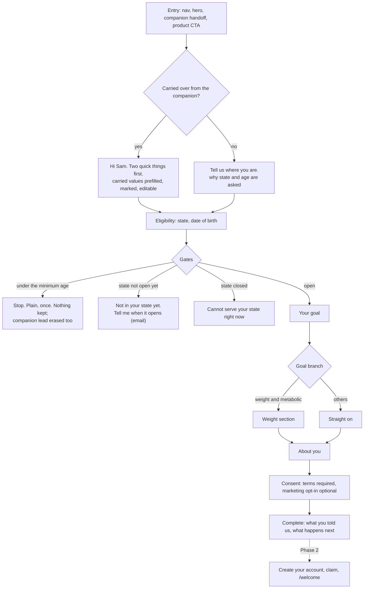

# 01. Overview: what intake is, the journey, the tiers, where things live

The intake flow is the first thing Joice learns about a person on purpose. It
lives on `/get-started`, asks a short set of questions that branch on earlier
answers, builds a profile with provenance, and (Phase 2) ends in an account.
Later it is what protocols match on. The design brief is `00-plan.md`; this page
is the map.

## The journey

Resume: the session is an httpOnly cookie; closing the tab at question six and
coming back shows question six (or seven). A gated session is terminal: Start
over begins a fresh one. Nothing of a minor's is kept: the api purges the
intake session and the runner asks the brain to erase the companion lead.

## The three tiers, and where the flag sits

| Tier | Who | What |
|---|---|---|
| Public | anonymous visitors (after launch; the team gate applies before) | `/get-started` and `/api/onboarding/*`, behind the `onboarding` flag (seeded off) |
| Member (Phase 2) | a signed-in Clerk member | `/sign-up`, `/sign-in`, `/welcome`, `POST /api/onboarding/session/claim`, `/api/me/*` |
| Admin (Phase 3) | Clerk users with the admin role | `/admin/onboarding/*` (editor, simulator, versions, service areas, funnel) and `/api/admin/onboarding/*` |

Two flags: `onboarding` opens the page and the API; `onboarding_health` is one
of the two PHI keys (with `PHI_READY` on the api task) that let a flow version
asking health-tier questions be published.

## What exists today and what comes later

| Built (Phases 0 and 1) | Later |
|---|---|
| Trait registry with sensitivity tiers, the condition language, the engine, the flow definition + validator, the default intake flow (seeded) | Health-tier traits and the PHI unlock (Phase 5) |
| Sessions, observations, the profile fold, service areas, notify-me, events, the flow service (publish/rollback) | Admin editor, simulator, versions page, service-areas page, funnel (Phase 3) |
| `/api/onboarding/*` and the runner on `/get-started`, gates, completion, resume, carry-over | Accounts: Clerk sign-up, claim, `/welcome`, Klaviyo completion on opt-in (Phase 2) |
| The brain erases the companion lead on a minor stop | The brain reads the profile over `/api/internal/*`, member context in chat (Phase 4); protocol rules (Phase 5) |

## File by file

| Concern | Where |
|---|---|
| The page | `apps/web/app/(site)/get-started/page.tsx` |
| The runner and its pieces | `apps/web/components/onboarding/` (`flow.tsx`, `question-shell.tsx`, `steps/`, `progress.tsx`, `gate-screen.tsx`, `complete-screen.tsx`) |
| Hooks | `packages/api-client/src/onboarding.ts`, `companion.ts` (`useEraseCompanion`) |
| Routes | `apps/api/src/onboarding/routes.ts`, cookie `apps/api/src/middleware/onboarding-session.ts`, wiring `apps/api/src/services.ts` |
| The session service | `packages/core/src/onboarding/onboarding-service.ts` (+ `session-store.ts`) |
| The engine and the language | `packages/core/src/onboarding/engine.ts`, `packages/core/src/rules/` (see 02) |
| The definition and its validator | `packages/core/src/onboarding/schemas.ts`, `validate-flow.ts`, `default-flow.ts` |
| Flows, service areas, notify-me, settings, events | `packages/core/src/onboarding/*-service.ts` |
| The registry, derivation, the fold | `packages/core/src/profile/` (see 03) |
| Tables and migrations | `packages/db/src/schema/onboarding.ts`, `packages/db/drizzle/0012..0015` (see 03) |
| Klaviyo | `packages/core/src/onboarding/marketing-port.ts`, `packages/core/src/marketing/onboarding-klaviyo-adapter.ts`, `docs/marketing/01-klaviyo.md` |
| Analytics | `apps/web/lib/analytics.ts` (`onboarding_*`), `onboarding_events` table |
| The brain's one route for intake | `DELETE /api/brain/profile` in `apps/brain/src/app.ts` |

Read next: 02 for how a definition and a rule work, 03 for the tables and the
profile, 07 for the compliance rules, 08 to run it locally.
