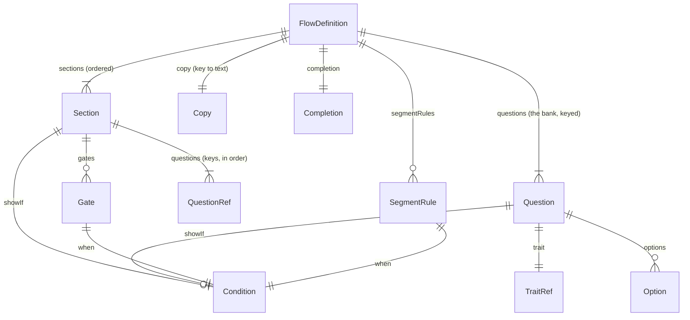
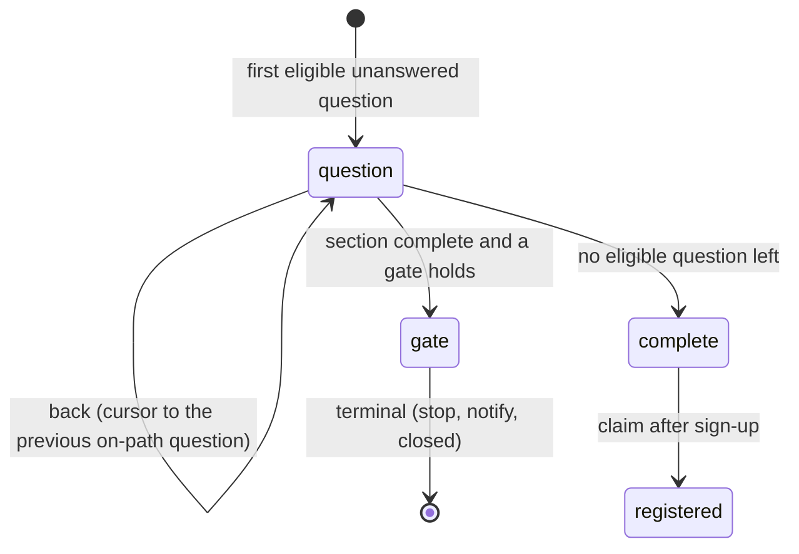
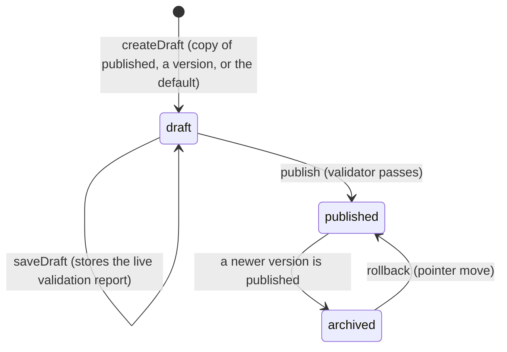

# 02. The flow model: definitions, the condition language, the engine, versions

What the intake flow *is* as data, how a rule is written and evaluated, how the
engine walks a definition, and how versions are published and pinned. Code:
`packages/core/src/onboarding/` (schemas, validate-flow, engine, simulate) and
`packages/core/src/rules/` (the condition language). The registry of traits the
flow binds to is `packages/core/src/profile/traits.ts` (see 03).

## The definition

"Store a bank, show sections." A flow definition is one JSON document, validated
by `flowDefinitionSchema` (`onboarding/schemas.ts`):



| Piece | Fields | Notes |
|---|---|---|
| `schemaVersion` | literal `1` | A build refuses a definition newer than it can read (`FLOW_SCHEMA_VERSION`) |
| `key` | literal `intake` | One flow today; the shape allows more |
| `sections[]` | `key`, `title`, `intro?`, `showIf?`, `questions` (keys, ordered), `gates[]`, `locked` | Sections are shown in order; a `showIf` that is false hides the whole section |
| `questions{}` | `key`, `trait`, `type`, `copy {label, help?, placeholder?}`, `options?`, `constraints?`, `required`, `showIf?`, `locked` | The bank. A question binds to exactly one trait; its `type` must produce the trait's type (`TRAIT_TYPE_FOR_QUESTION`) |
| `gates[]` (per section) | `key`, `when`, `outcome` (`stop`, `notify`, `closed`), `reason` (`age`, `state`, `custom`), `copyKey` | Evaluated when the section has no question left; first match ends the flow |
| `segmentRules[]` | `segment`, `when`, `priority` | Highest priority that holds wins; ties go to the first |
| `copy{}` | key to text | Intro, resume note, gate copy (`<copyKey>.title/.body/.cta/.done`); `{first_name}` and `{state_name}` are substituted |
| `completion` | `title`, `body`, `cta` | The last screen before sign-up |

One section is **locked**: `eligibility` (first; asks `us_state` and
`date_of_birth`; keeps an `age` gate and a `state` gate). The validator
refuses a definition that removes, unlocks or loosens it. The consent section
is ordinary content by decision (2026-08-26): terms acceptance is the flow
author's to place, in the flow or on the Clerk sign-up screen.

Question types: `single_select`, `multi_select`, `number`, `text`, `date`,
`us_state`, `height_weight`, `boolean`, `scale`. A `height_weight` answer is
stored metric (`{ heightCm, weightKg }`, `heightWeightSchema` in
`packages/core/src/profile/traits.ts`); the web runner collects feet, inches
and pounds and converts at the submit boundary, so the wire and the store only
ever see metric. Custom traits (`custom.<slug>`)
take their type from the question that asks them; a `single_select` on a custom
trait is an enum over its own options. A `boolean` question is a checkbox:
`required` means it must be ticked (the consent step); a yes/no question that
may go either way is a `single_select`.

The v1 content is `DEFAULT_INTAKE_FLOW` (`onboarding/default-flow.ts`): it is
frozen with migration 0015 (a test keeps the two equal), and every change after
launch is an admin publish, not an edit.

## The condition language

One small predicate language for everything that decides: section and question
`showIf`, gate `when`, segment rules, and later protocol eligibility. Deliberately
explicit (`trait`, `op`, `value`) so the registry can validate every leaf, the
trace can name every leaf, and the admin builder round-trips the shape.

```jsonc
{ "trait": "goal", "op": "eq", "value": "weight-metabolic" }
{ "all": [ { "trait": "age", "op": "gte", "value": 18 }, { "any": [ ... ] } ] }
{ "not": { "trait": "state_status", "op": "eq", "value": "open" } }
{ "trait": "age", "op": "lt", "value": { "setting": "onboarding.minimumAge" } }
```

| Operator | Allowed on | Meaning |
|---|---|---|
| `eq`, `neq` | everything but `height_weight` | equality (lists compare as sets) |
| `in`, `nin` | string, number, enum, enum_list, us_state | membership in a list; a list-valued trait matches `in` when any item is listed |
| `gt`, `gte`, `lt`, `lte`, `between` | number, date | ordering; numbers as numbers, ISO dates as dates, never coerced |
| `contains` | enum_list, string | list contains the item; string contains the text (case-insensitive) |
| `exists` | everything | present and not empty |

Semantics to remember (`rules/evaluate.ts`): a **missing trait makes every
operator false except `exists`** (use `{ not: { exists } }` for "is missing"),
so a rule never passes by accident on a question that was skipped or not yet
asked. A `{ setting }` value is resolved from the settings map first; an unknown
setting makes the leaf false and says so in the trace.

`evaluateCondition(cond, traits, settings)` returns `{ value, why }`; `why` is a
tree with a node per `all`/`any`/`not` and a leaf per comparison recording
`expected`, `actual`, `present` and a `note` when something was off. The admin
simulator shows it; support reads it.

`validateCondition(cond, { customTypes })` (`rules/validate.ts`) is the static
check the publish validator runs on every rule: unknown trait, operator not
allowed for the trait type, value missing or of the wrong shape, value outside a
vocabulary, setting references only on numbers and dates.

## The engine

`packages/core/src/onboarding/engine.ts` is pure: a definition, a session
snapshot and a context in, the next step out. No database, no clock of its own.



`next(definition, snapshot, ctx)`:

1. Start with derived traits on an empty map.
2. Walk the sections in order. Skip a section whose `showIf` is false on the
   traits so far. Within it, skip a question whose `showIf` is false; if the
   question is answered, project its value onto its trait and **re-derive**
   (`age`, `age_band`, `age_eligible`, `state_status`, `segment`); if it is
   optional and skipped, pass; otherwise it is the step.
3. When a section has no question left, run its gates in order; the first whose
   `when` holds is a terminal `gate` step.
4. Nothing left: `complete`, with a summary of the answered path and the
   derived segment.

Invariants the session service relies on:

- **The minor rule.** `applyAnswer` on `date_of_birth` evaluates the section's
  age gates on a tentative map *before* writing. Under the minimum age the
  answer is not written (`persisted: false`), the gate record is set, and the
  service purges the session's answers and observations.
- **Pruning.** After an answer, eligibility is re-run past any gate; answers to
  questions a rule now hides (their own or their section's `showIf` false) are
  removed and returned as `pruned`. Questions without a `showIf` are never
  pruned. Observations keep the history.
- **Back** is a cursor over the current path; the next answer clears it. A
  gated session is terminal: answers and back are refused (`gated`).
- **Eligibility** is enforced: answering a question that is not on the current
  path is `not_eligible`; values are validated per question type and vocabulary
  from the pinned definition (`answerSchemaFor`).
- **Carry-over** (what the companion knew) is shown as the prefilled value of
  the matching question (`carriedOver: true`) and is only ever applied when the
  visitor confirms it; the accepted answer records `source: companion` when it
  equals the carried value, else `onboarding`.

The test matrix is `engine.test.ts` (24 rows: boundary birthdays, notify and
closed states, back and prune, error codes, carry-over source, hidden-section
estimate, the trace). `simulate.ts` runs a persona through a definition for the
admin simulator and for tests.

## Versions, publishing, pinning



`createFlowService` (`onboarding/flow-service.ts`): `publish` validates with the
PHI keys, then in one transaction freezes the row (status, `logic_hash`,
`published_by/at`), archives the previously published version, moves
`onboarding_flows.published_version_id`, and writes an `onboarding.publish`
audit row. `rollback` moves the pointer and audits `onboarding.rollback`.
`getPublished()` is cached ~30s; a stored definition with a newer
`schema_version` than the build, or one that fails the schema, is **refused**
(`unreadable`), never served: that is what keeps a rolled-back image safe.

Sessions **pin** a version id. A publish that changes only copy produces a
version with the same `logic_hash` (SHA-256 of the definition with every piece
of copy stripped); on its next request an in-progress session on an older
version with the same hash is moved forward silently, so typo fixes reach live
sessions and logic changes never do.

## The publish validator

`validateFlowDefinition(input, { phiEnabled })` (`onboarding/validate-flow.ts`)
returns `{ ok, errors, warnings, definition }`. Errors block publishing;
warnings are shown.

| Code | Level | What it catches |
|---|---|---|
| `schema_version_unsupported` | error | a definition from a newer build |
| `schema` | error | zod shape issues, with the path |
| `question_key_mismatch`, `duplicate_section_key`, `unknown_question`, `question_in_multiple_sections` | error | key and reference integrity |
| `orphan_question` | warning | a bank question no section asks |
| `unknown_trait`, `derived_trait_asked`, `type_mismatch` | error | trait bindings |
| `options_required`, `options_not_allowed`, `option_not_in_vocabulary`, `duplicate_option` | error | select options |
| `trait_asked_twice` | warning | two questions bind the same trait |
| `condition` | error | any rule the registry validator rejects (path points into the rule) |
| `trait_never_asked` | warning | a rule reads a trait nothing in this flow asks |
| `missing_copy` | error | a gate without its copy keys |
| `locked_section_missing`, `locked_section_altered` | error | the eligibility core removed, unlocked or loosened |
| `phi_locked` | error (warning once unlocked) | a health-tier trait asked before both PHI keys are on |
| `duplicate_segment` | warning | a segment with more than one rule |
