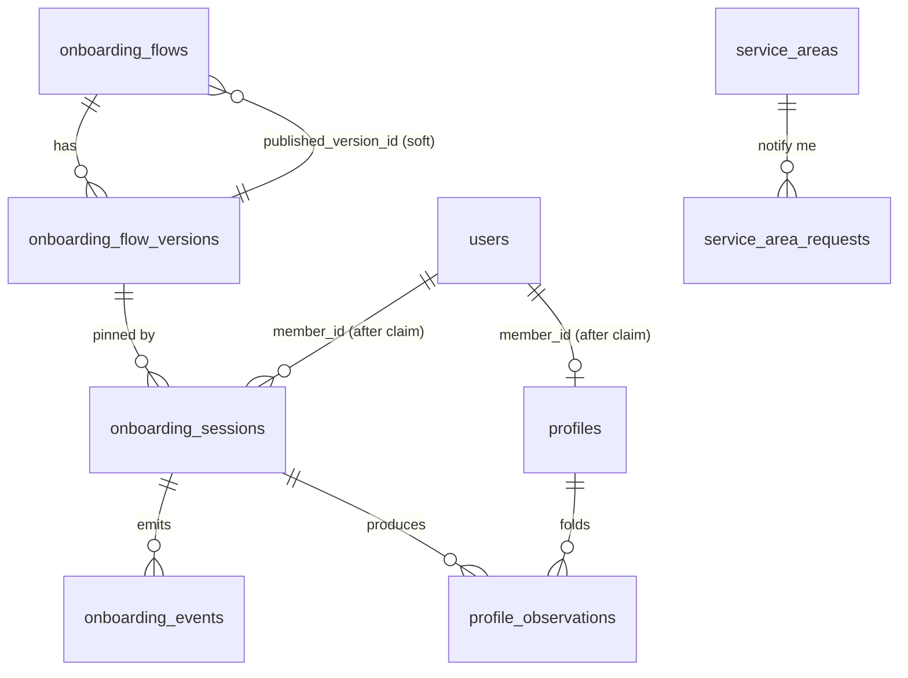
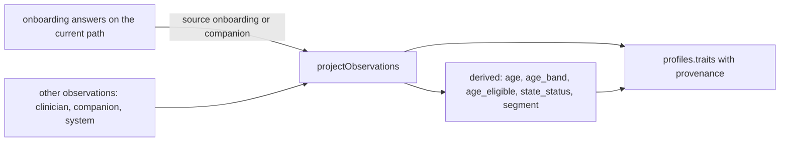

# 03. The data model: tables, the profile fold, the trait registry, migrations

Every onboarding table lives in `packages/db/src/schema/onboarding.ts`, owned by
`@joice/core` and written only by the api service. The brain never touches
them: it reaches the profile over HTTP (`/api/internal/*`, Phase 4) and its
observations are written here on its behalf. The registry of traits the
profile is made of is `packages/core/src/profile/traits.ts`; the fold that
turns observations into a profile is `packages/core/src/profile/projector.ts`.

## The tables

| Table | Row | Writer | Notes |
|---|---|---|---|
| `onboarding_flows` | a flow by `key` (`intake`) with `published_version_id` | flow service | The pointer is a soft reference on purpose: a restored image must never fail on it |
| `onboarding_flow_versions` | `flow_id`, `version`, `status` (draft, published, archived), `schema_version`, `definition` jsonb, `logic_hash`, `notes`, `validation_report`, `created_by`, `published_by`, `published_at` | flow service | Immutable once published; sessions pin the id; `logic_hash` (copy stripped) lets a copy-only publish move sessions forward |
| `onboarding_sessions` | `flow_version_id`, `anonymous_session_id` (the cookie, a bearer, never logged), `member_id` (users.id, at claim), `status`, `answers` jsonb (current path), `skipped`, `cursor_question_key`, `carry_over`, `gate_outcome`, `ip_hash`, `completed_at`, `claimed_at`, `last_activity_at` | session service | The row IS the state (the brain_profiles pattern). Statuses: `in_progress`, `gated_age`, `gated_state`, `completed`, `registered`, `abandoned`. A minor never has a date of birth here |
| `onboarding_events` | `event`, `session_id`, `flow_version_id`, `section_key`, `question_key`, `outcome`, `occurred_at` | events service | Keys and outcomes only, never values, so the admin funnel and GTM carry the same shape without PII |
| `service_areas` | `state_code` (unique), `status` (open, notify, closed), `note`, `updated_by` | service-area service | Platform-owned, read by the flow through the derived `state_status` trait; pharmacy and shipping reuse it later. Seeded all `notify` |
| `service_area_requests` | `email` + `state_code` (unique pair), `first_name`, `onboarding_session_id`, `ip_hash`, `marketing_synced_at` | request service | "Tell me when my state opens." Its own table: not the referral waitlist, not the brain's lead, no join to either |
| `profile_observations` | `trait`, `value` jsonb, `source` (clinician, onboarding, companion, system, derived), `confidence`, `observed_at`, `onboarding_session_id`, `member_id`, `flow_version_id`, `question_key` | profile service (append-only) | Every value a source ever reported for a trait; "what did they say before" is a query |
| `profiles` | `member_id` (unique) or `anonymous_session_id` (unique), `traits` jsonb (value + source + observed_at per trait), `segment`, `projector_version`, `flow_version_id`, `projected_at` | profile service (upsert) | The fold. Keyed by the session while anonymous, by the member after claim. Rebuildable from the observations |

Conventions: `uuid` ids with `gen_random_uuid()`, `text` + zod vocabularies
instead of `pgEnum`, timestamps `withTimezone`, jsonb typed with `.$type<>()`.
Indexes: sessions by cookie and by member and by `(status, last_activity_at)`
for the sweep; events by `(flow_version_id, event, occurred_at)` for the funnel;
observations by `(member_id, trait, observed_at desc)`.

## The trait registry

`TRAITS` in `packages/core/src/profile/traits.ts` is the schema of a person:
key, type, sensitivity tier, label, vocabulary, derived flag. Questions, the
companion and clinicians are *sources* of traits; gates, segments, the brain's
member context and later protocols are *readers*. Nothing downstream ever sees
a question id.

| Tier | Meaning | v1 traits |
|---|---|---|
| `marketing` | the class the waitlist already holds | `us_state`, `goal`, `goal_note`, `goal_timeline`, `peptide_experience`, derived `state_status`, `age_band`, `age_eligible`, `segment` |
| `personal` | identity data that is not health information on its own | `first_name`, `email`, `date_of_birth`, derived `age`, `weight_approaches_tried` (pending counsel), `consent_terms`, `consent_marketing` |
| `health` | PHI the moment it is tied to a person | `height_weight`, derived `bmi`, `medications`, `conditions`, `glp1_history`, `pregnancy` (registered in story 5.2; the publish validator still refuses them until both PHI keys are on) |

Rules: tiers are decided in code, by engineers, never in admin; a question
inherits its trait's tier; the publish validator refuses a `health` trait unless
both PHI keys are on (`PHI_READY` env set by Terraform, plus the
`onboarding_health` flag). Admins can bind a question to a `custom.<slug>` trait
without a deploy; those are always marketing tier and typed by their question.
Derived traits (`age`, `age_band`, `age_eligible`, `state_status`, `bmi`,
`segment`) are computed by `profile/derive.ts` and can never be asked. `bmi`
comes from `height_weight` (703-free metric form, one decimal) and carries the
health tier like its source.

Types: `string`, `number`, `boolean`, `date` (ISO `YYYY-MM-DD`, a real day),
`enum`, `enum_list`, `us_state` (the list in `@joice/utils`), `height_weight`
(metric object). `traitValueSchema(type, values)` is the validator the engine
and the projector share.

## The profile fold

`projectObservations(observations, ctx)` (`profile/projector.ts`) picks one
value per trait: **clinician beats onboarding beats companion beats system**;
within a source the latest `observed_at` wins; confidence breaks exact ties.
Observations for derived traits, and null or empty values, are ignored; derived
traits are always recomputed. The result carries `traits` (value, source,
observed_at per trait), `flat` (the shape rules evaluate over), `segment`,
`trace` and `projector_version`.

The session service projects on **completion** (keyed by the anonymous session)
and again on **claim** (keyed by the member, after `attachToMember` stamps the
member on the session's observations and re-keys or drops the anonymous row).
Inputs are the answers on the session's current path (pruned answers do not
project; their observations remain as history) plus any non-onboarding
observations already recorded for the session or member.

## Migrations and seeds

| Migration | What |
|---|---|
| `0012_abnormal_maelstrom.sql` | the eight tables above (generated; additive only) |
| `0013_seed_onboarding_flags.sql` | flags `onboarding` and `onboarding_health`, both off |
| `0014_seed_service_areas.sql` | the 50 states + DC as `notify` |
| `0015_seed_onboarding_intake_flow.sql` | flow `intake`, version 1 published from `DEFAULT_INTAKE_FLOW` (canonical JSON + logic hash), pointer set only when null |

All three seeds are idempotent (`ON CONFLICT DO NOTHING` / `WHERE NOT EXISTS`),
so an admin's later edits are never stomped. `default-flow.test.ts` keeps the
seed JSON equal to the code definition; a different default for a fresh
environment is a new seed migration, not an edit of 0015.

Expand/contract: a failed rollout restores the previous image while the
database keeps the new schema, so onboarding changes are additive and
nullable-first, pointers are soft references, and a definition a build cannot
read is refused rather than served (02).

## Retention

`ONBOARDING_SESSION_IDLE_DAYS` (30): an `in_progress` session idle that long
becomes `abandoned`. `ONBOARDING_SESSION_TTL_DAYS` (90): an unclaimed session
(any status but `registered`) untouched that long loses its answers,
observations and profile, and the row. `onboarding.sweep()` does both; the
scheduled task arrives with Phase 2 (story 2.7). Counsel confirms the numbers
(brief, section 9).
