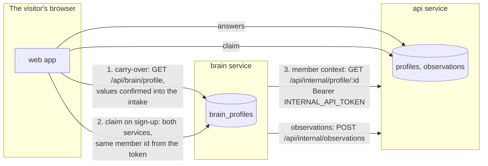

# 06. The brain and the intake: what crosses, and how

Two systems build one picture of a person: the companion (the brain) learns a
name, an email and a goal conversationally; the intake asks the structured
questions. Neither reads the other's tables, ever. This page is the contract.

## The three exchanges

1. **Carry-over (pre-registration)** is client-composed: the web reads the
   companion's capture and sends it as `carryOver` when the intake starts. The
   values arrive as prefills marked "carried over" and become answers only
   when the visitor confirms them (`source: companion`). The platform never
   reads `brain_profiles` for this; the one documented read of that table
   remains the admin leads list.
2. **Claim (at sign-up)**: the web calls both services with the new Clerk
   session. Both read the member id from the token's `metadata.memberId`
   claim, which the api stamped on the member's first call (see 04). The
   brain verifies tokens networklessly with the instance's public JWT key
   (`CLERK_JWT_KEY`); the Clerk secret never lives on the brain task.
3. **Member context (post-registration)**: the brain's `MemberContextPort`
   and `ObservationSinkPort` are HTTP adapters
   (`apps/brain/src/ports/platform-client.ts`) to `/api/internal/*` on the
   api, presented with the shared bearer (`INTERNAL_API_TOKEN`, a Terraform
   `random_password` on both tasks). This is the promised port evolution:
   "the stubs become HTTP clients to the api service and nothing in the
   domain changes" (docs/rag/10-architecture.md).
4. **The write path (story 5.5)**: when a signed-in member sets their goal in
   chat, the companion records one observation through `ObservationSinkPort`
   (source `companion`, confidence 0.6): the vocabulary token only, never the
   free-text note, per the port contract. Anonymous visitors record nothing.
   The call is fire-and-forget with the same tolerance as the reads: a dead
   api never fails a capture turn. In the fold, onboarding answers outrank
   companion observations (`packages/core/src/profile/projector.ts`), so chat
   can never overwrite what the intake asked properly.

## What may cross, and what never does

- The internal profile read returns first name, goal, segment and
  **marketing and personal tier traits only**, the same rule the member
  themselves gets; health-tier traits stay out until both PHI keys are on.
- It also carries `subscribed`, the platform's answer to "active
  subscription?" (CarePortals via the api's `SubscriptionPort`,
  `apps/api/src/commerce/careportals-subscriptions.ts`). It exists solely to
  lift a user to the subscriber audience tier in the brain, and it is
  fail-closed: no credentials, no user row, no email, or an unreachable
  commerce API all read as `false`.
- The adapter filters further before the prompt: identity fields, derived
  internals and the raw date of birth never reach the model; `Age: 43` does.
- The suffix (`buildMemberSuffix`) opens with "personalisation only, not
  medical assessment" and rides **after the prompt-cache point**
  (`systemSuffix` in providers/bedrock.ts), server-side only: it never
  round-trips the browser.
- Observations the brain hands back are vocabulary tokens with provenance
  (`source: companion`), never free text.
- The minor stop erases across the boundary: the api purges the intake, the
  web calls `DELETE /api/brain/profile`, and the companion lead goes too.

## Failure is anonymous, not broken

Every adapter call has a 1.5s timeout and degrades: an unreachable api means
the member chats exactly like an anonymous visitor, with one warning in the
brain's log (`platform profile read failed`). A chat answer never waits on,
or fails because of, the platform.

## The trust boundary (Service Connect, story 4.7)

Brain-to-api traffic is VPC-private: ECS Service Connect
(`infra/service-connect.tf`) gives the brain the name `http://api:4000`
inside the `joice.local` namespace, with a security-group rule admitting the
brain tasks into the api's group. With `INTERNAL_EDGE_BLOCKED=true` on the
api task (flipped by the same apply), `requireInternalToken` refuses any
request that carries CloudFront's `X-Origin-Verify` header, token or no
token, so `/api/internal/*` is unreachable from the internet. The bearer
token remains the second lock on the private path: constant-time compare,
503 when unset, never logged, outside the typed RPC chain. Dev compose keeps
direct http between containers with the edge block off, and the rollback is
one apply (the old public URL plus the flag off).

## Who asks what

On `/get-started`, the intake engine owns "what is next". In chat, the
companion's deterministic capture machine owns its three fields (name,
email, goal). They never both ask the same person the same thing: capture
pre-fills the intake through carry-over, and a member's context flows into
chat through the port.
