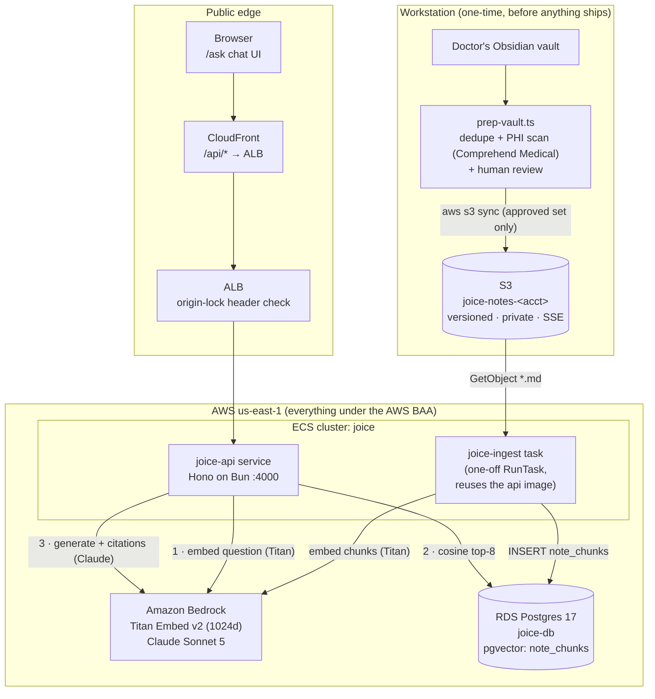

# 01 — Overview & Architecture

## What this is

**"Ask Joice"** is a retrieval-augmented generation (RAG) chatbot. Members ask
peptide questions; answers are generated by Claude **strictly from the clinical
team's reference notes** (a doctor's Obsidian vault), with every claim citing
the exact source file and heading it came from. When the notes don't cover a
question, the bot says so instead of improvising — that honesty is a design
requirement for a health product, not a nice-to-have.

Two halves:

1. **Ingestion (one-off, offline)** — the vault is PHI-reviewed locally,
   uploaded once to S3, then a one-shot ECS task chunks each markdown file by
   heading, embeds each chunk with Bedrock Titan, and writes rows to Postgres
   (pgvector).
2. **Serving (online)** — the existing API embeds the member's question, finds
   the nearest chunks by cosine similarity, and asks Claude (on Bedrock) to
   answer from those chunks only, with native citations. The answer streams to
   the browser over SSE.

## System architecture

Key properties of this shape:

- **No new always-on infrastructure.** The chat routes live on the existing API
  service; ingestion is a `RunTask` that exits; the only new stateful thing is
  an S3 bucket and a Postgres table.
- **No new secrets.** Bedrock and S3 authenticate with SigV4 from the ECS task
  roles. There is no Voyage key, no Anthropic key, nothing added to Secrets
  Manager.
- **No third-party AI vendors.** Note content and member questions only ever
  reach AWS services (all HIPAA-eligible under the AWS BAA). See
  [07 — Compliance](07-compliance.md) for why this was decisive.

## Component map

| Layer | File | Responsibility |
|---|---|---|
| DB | `packages/db/src/schema.ts` → `noteChunks` | The vector table: chunk text + `vector(1024)` embedding + source metadata |
| DB | `packages/db/drizzle/0003_clear_shadowcat.sql` | Hand-edited migration: `CREATE EXTENSION vector` + HNSW index (drizzle-kit emits neither) |
| Core | `packages/core/src/bedrock.ts` | `createEmbeddingClient` (Titan) + `createGenerationClient` (model-agnostic Converse API) behind stub-friendly interfaces |
| Core | `packages/core/src/chunker.ts` | Pure markdown → chunks: frontmatter, heading breadcrumbs, wikilinks, size caps |
| Core | `packages/core/src/recommendation-service.ts` | The RAG brain: retrieve → floor-check → prompt → generate → citation annotation |
| Core | `packages/core/src/schemas.ts` | Wire contracts: `chatRequestSchema`, `Citation`, `PeptideRecommendation` (browser-safe via `@joice/core/schemas`) |
| API | `apps/api/src/app.ts` | `POST /api/brain/chat` (JSON) + `/stream` (SSE), rate-limited, in the AppType chain |
| API | `apps/api/src/env.ts` | `RAG_MODEL`, `BEDROCK_REGION` (Zod-validated at boot) |
| API | `apps/api/src/services.ts` | Wires the recommendation service over the shared DB client |
| Scripts | `apps/brain/scripts/prep-vault.ts` | **Local-only** vault prep: dedupe + optional Comprehend Medical PHI scan + review report |
| Scripts | `apps/brain/scripts/ingest.ts` | The ingestion entrypoint the ECS task runs: S3 → chunk → embed → upsert |
| Client | `packages/api-client/src/chat.ts` | `usePeptideRecommendation` (typed JSON hook) + `streamPeptideRecommendation` (SSE reader) |
| Web | `apps/web/app/(site)/ask/page.tsx` | The `/ask` page (team-gated pre-launch by the site middleware) |
| Web | `apps/web/components/chat/peptide-chat.tsx` | Streaming chat UI: deltas → final annotated answer → citation chips; mic button + speak-back |
| Voice | `packages/core/src/voice.ts` | `createTranscribeClient` (Transcribe streaming) + `createSpeechClient` (Polly neural) — same BAA/IAM story as Bedrock |
| Voice | `apps/web/components/chat/use-recorder.ts` | Mic capture: AudioWorklet → PCM16 16kHz, VAD auto-stop on ~1.5s silence |
| Voice | `apps/web/components/chat/use-speaker.ts` | Polly playback through an AnalyserNode (drives the visualizer) |
| Voice | `apps/web/components/chat/voice-visualizer.tsx` | Canvas bars animated from the real audio signal (mic or playback) |
| Infra | `infra/s3.tf` | Notes bucket (versioned, private, encrypted) |
| Infra | `infra/iam.tf` | Bedrock invoke policy on the api task role; `joice-ingestion-task` role (S3 read + Titan only) |
| Infra | `infra/ingest.tf` | The `joice-ingest` task definition + `/ecs/joice-ingest` log group |
| Infra | `infra/variables.tf` → `rag_model` | Bedrock model ID, changeable without a rebuild (`terraform apply`) |

## Request lifecycle in one paragraph

The browser posts `{ messages: [...] }` (the visible conversation, ≤ 20 turns)
to `/api/brain/chat/stream`. The API embeds the **last user
message** with Titan (1024-dim vector), runs a cosine-similarity `ORDER BY …
LIMIT 8` against `note_chunks`, and drops anything below a 0.4 similarity
floor. Zero survivors → an honest "not covered in our notes" answer is returned
**without calling Claude** (no token spend on off-corpus questions). Otherwise
the chunks are attached to the Claude request as citable document blocks, Claude
answers under a system prompt that forbids outside knowledge, text deltas
stream to the browser as SSE events, and a final `complete` event carries the
citation-annotated answer (`[1]`, `[2]` footnotes) plus the citation list
mapping each footnote to its source file + heading.

Full detail with sequence diagrams: [04 — Query Flow](04-query-flow.md).

## Design decisions and why

| Decision | Choice | Why |
|---|---|---|
| LLM access | **Bedrock Converse API** (`@aws-sdk/client-bedrock-runtime`, model-agnostic). Prod default `us.anthropic.claude-sonnet-5`; dev runs `us.amazon.nova-pro-v1:0` until the account's Anthropic use-case form is approved | HIPAA-eligible under the free self-service AWS BAA; traffic never reaches Anthropic; IAM auth means zero API-key secrets. Converse works with **any** Bedrock chat model, so the Anthropic-access blocker doesn't block development. (The Anthropic SDK's Bedrock clients were tried first — the Mantle endpoint 404s on this account and InvokeModel is gated on the same use-case form.) |
| Citations | **Prompt-based `[n]` markers**: documents are numbered in the prompt, the model cites inline, `parseCitations()` maps markers back to source file + heading | Works identically across models (Nova today, Claude later). Anthropic-native citation spans are a possible upgrade once Claude access lands, but the seam is one function |
| Embeddings | **Titan Text Embeddings V2**, 1024 dims, normalized | Serverless on Bedrock under the same BAA, ~$0.02 per 1M input tokens. Voyage is higher quality but only runs inside AWS as an always-on SageMaker endpoint (cost + ops). Upgrade path exists without schema changes at 1024 dims. |
| Model | Claude Sonnet 5, via `RAG_MODEL` env | Near-Opus quality on grounded Q&A at $3/$15 per MTok. Swappable with a `terraform apply` (runtime env, no rebuild). |
| Grounding | Similarity floor (0.4) **before** the LLM call + a restrictive system prompt | Off-corpus questions cost zero generation tokens and can't hallucinate; the prompt handles partial coverage. |
| Vector store | pgvector on the existing RDS instance | No new database, no new vendor; corpus is small (one vault); HNSW index built up front while the table is empty. |
| Ingestion | One-off ECS `RunTask` reusing the **api image** | The image already contains the whole monorepo — only the command differs. No third image, no CI changes, no scheduler (the vault is a one-time upload; re-run manually if it ever changes). |
| Service placement | Routes on the existing API service | A separate internal service adds an always-on task + service discovery and improves neither compliance nor performance at current traffic. The logic lives in `@joice/core` behind injected clients, so extracting later is mechanical. |
| Chat state | **Stateless** — client sends visible history each turn | Conversation persistence belongs with member accounts (launch scope). The schema caps history at 20 messages / 2000 chars each. |
| Response transport | SSE stream for the chat UI, plain JSON twin endpoint for everything else | Chat UX needs streaming; the typed `hc`/TanStack flow can't consume SSE, so the JSON endpoint keeps end-to-end types for non-chat surfaces. |
| Endpoint auth | Public + 5 req/min/IP rate limit (pre-launch) | Matches the `/api/waitlist` posture. Revisit (member gate, Redis-backed limits) at launch — the in-memory limiter is per-task. |

## Cost envelope (rough)

Per answered question: ~8 chunks × ~400 tokens + system prompt ≈ 4–5K input
tokens (≈ $0.015) + ≤ 1K output tokens (≈ $0.015) → **≈ 2–3¢ per answer** on
Sonnet 5 (Nova Pro, the dev model, is roughly 4× cheaper). Embedding a
question is ~50 tokens on Titan — effectively free. Ingesting an entire vault
of a few hundred notes costs cents. The rate limit (5/min/IP) bounds
worst-case abuse at trivial spend.
