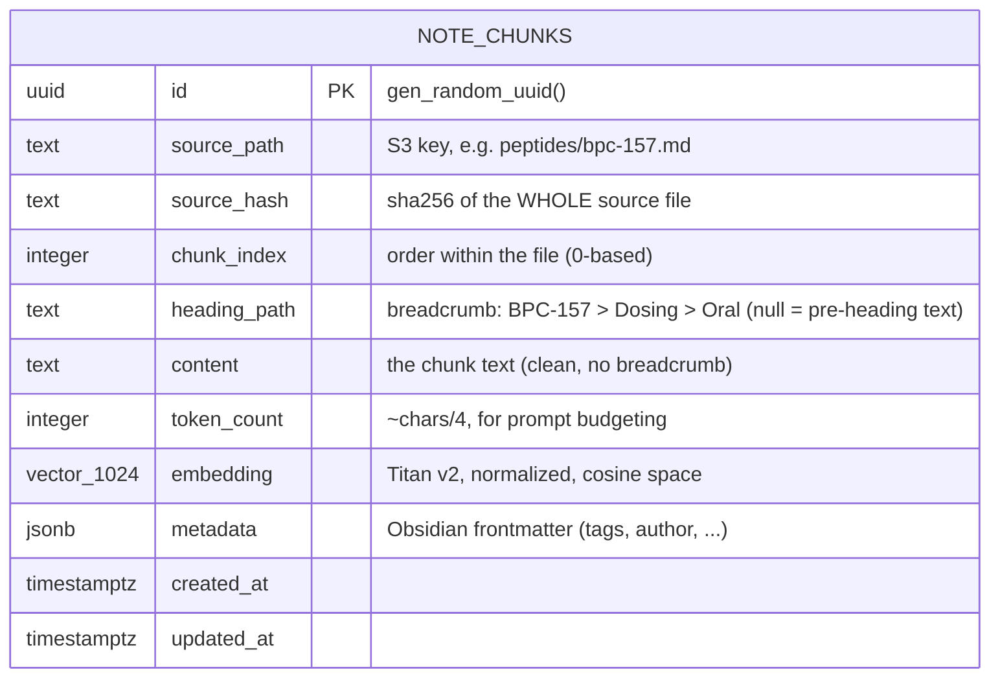
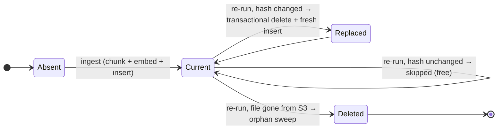

# 02 — Data Model & Embeddings

## The `note_chunks` table

One row per chunk of the doctor's notes. Defined in
`packages/db/src/schema.ts` (`noteChunks`), created by migration
`packages/db/drizzle/0003_clear_shadowcat.sql`.



| Column | Type | Purpose |
|---|---|---|
| `id` | `uuid` PK | House-style `gen_random_uuid()` |
| `source_path` | `text` NOT NULL | The S3 object key. Doubles as the citation's file reference and the replace-scope for re-ingestion |
| `source_hash` | `text` NOT NULL | sha256 of the **entire source file**. If unchanged on a re-run, the whole file is skipped (no embedding cost). Stored on every chunk of the file |
| `chunk_index` | `integer` NOT NULL | Stable ordering within a file; part of the unique key |
| `heading_path` | `text` | Heading breadcrumb (`H1 > H2 > H3`). `NULL` for text before the first heading. Shown in citation chips |
| `content` | `text` NOT NULL | The chunk body. Stored **clean** — the breadcrumb is prepended only at embed time (see below) |
| `token_count` | `integer` | `ceil(chars / 4)` estimate; lets future prompt-budget logic trim the retrieved set |
| `embedding` | `vector(1024)` NOT NULL | Titan Text Embeddings V2, `normalize: true` |
| `metadata` | `jsonb` | Parsed Obsidian frontmatter (flat keys; `[a, b]` values become arrays) |

### Indexes

| Index | Type | Why |
|---|---|---|
| `note_chunks_source_path_chunk_index_unique` | unique btree `(source_path, chunk_index)` | Structural integrity — a file's chunks can't collide; makes the delete-then-insert replace safe |
| `note_chunks_source_path_idx` | btree `(source_path)` | Fast per-file delete/skip lookups during ingestion |
| `note_chunks_embedding_hnsw_idx` | **HNSW** `(embedding vector_cosine_ops)` `m=16, ef_construction=64` | Approximate nearest-neighbor for the similarity query. Built in the initial migration while the table is empty (instant) — avoids a later locking build and any seq-scan cliff as the corpus grows |

At the current corpus size a sequential scan would also be fine — the index is
future-proofing, not a present necessity. `m=16 / ef_construction=64` are
pgvector's defaults and appropriate for < 1M rows.

## Embeddings

- **Model:** `amazon.titan-embed-text-v2:0` on Bedrock (serverless,
  pay-per-token, HIPAA-eligible under the AWS BAA).
- **Dimensions:** 1024 — Titan v2 supports 256/512/1024; 1024 is its maximum
  quality. This number is **baked into the schema** (`vector(1024)`) and into
  `EMBEDDING_DIMENSIONS` in `packages/core/src/bedrock.ts`. Changing it means a
  schema migration **and re-embedding every chunk** (and any change of
  embedding model, even at the same dimensions, also requires re-embedding —
  vectors from different models are not comparable).
- **Normalization:** `normalize: true`, so cosine distance behaves well.
- **Asymmetry handled by prefixing, not by model flags:** Titan has no
  document/query input-type switch (Voyage does). Instead, at **ingest time**
  each chunk is embedded as `"{heading_path}\n\n{content}"` — the breadcrumb
  gives the vector its topical context ("BPC-157 > Dosing" retrieves dosing
  questions even when the chunk body never repeats the peptide's name). The
  stored `content` stays clean so prompts and citations aren't polluted.
- **Distance:** cosine, via drizzle's `cosineDistance()` (the pgvector `<=>`
  operator). The service computes `similarity = 1 - distance` and applies a
  floor of **0.4** — below that a chunk is treated as noise (see
  [04 — Query Flow](04-query-flow.md#retrieval)).

## Migration mechanics (read before touching the schema)

drizzle-kit generates the table and btree indexes but **cannot emit** either of
these — they were added to `0003_clear_shadowcat.sql` by hand and the same will
apply to any future vector work:

```sql
CREATE EXTENSION IF NOT EXISTS vector;          -- prepended
...
CREATE INDEX "note_chunks_embedding_hnsw_idx"   -- appended
  ON "note_chunks" USING hnsw ("embedding" vector_cosine_ops)
  WITH (m = 16, ef_construction = 64);
```

- Migrations run **at API container boot** (`bun packages/db/src/migrate.ts &&
  bun apps/api/src/index.ts` in `apps/api/Dockerfile`). A failing migration
  blocks startup by design; the ECS deployment circuit breaker then rolls the
  service back.
- `CREATE EXTENSION` needs the RDS **master user** — which is exactly what the
  `joice/database-url` secret holds, so no privilege work was needed.
- Prod RDS is Postgres **17** (`engine_version = "17"` in `infra/rds.tf`);
  pgvector ships with RDS PG17 (verified 0.8.5 locally).
- Local dev must use the **pgvector image** — `docker-compose.yml` was switched
  from `postgres:17-alpine` to `pgvector/pgvector:pg17`. On the plain image the
  migration fails at `CREATE EXTENSION` and the API never boots. The data
  format is identical, so an existing `postgres_data` volume carries over.

## Data lifecycle

`note_chunks` is **derived data**. The source of truth is the S3 bucket; the
table can be truncated and rebuilt at any time by re-running the ingest task.
There is no down-migration and none is needed.



The per-file replace runs inside a single transaction (`db.transaction`) — a
crash mid-file can never leave a file half-ingested; re-running the task
finishes the job because the old hash no longer matches.
