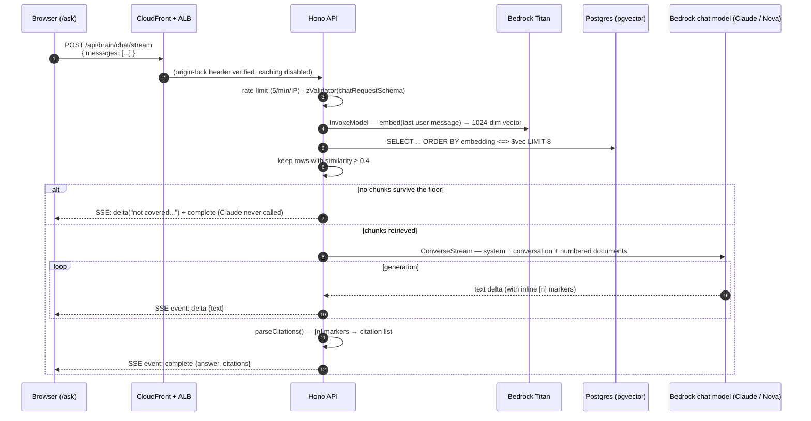

# 04 — Query Flow & API

## The full request lifecycle



## Endpoints

Both live in the single route chain in `apps/api/src/app.ts` (the AppType
contract), both rate-limited **5 requests/min/IP** (each route has its own
in-memory window), both validated against `chatRequestSchema` from
`@joice/core`.

### Request body (both endpoints)

```jsonc
{
  "messages": [
    { "role": "user",      "content": "Tell me about BPC-157" },
    { "role": "assistant", "content": "BPC-157 is a peptide..." },
    { "role": "user",      "content": "How is it dosed?" }        // last MUST be user
  ]
}
```

Validation rules (`chatRequestSchema`): 1–20 messages; each `content` trimmed,
1–2,000 chars; `role` ∈ `user | assistant`; the **last message must be from the
user**. Violations → `400` from zValidator. The conversation is stateless —
the client resends the visible history each turn (the web component caps it at
20 client-side too).

**Follow-up understanding (condense-question step):** on follow-ups
(`messages.length > 1`, and when the admin toggle is on), the last user
message is first rewritten into a standalone search query by a small fast
model (default Nova Lite) using the recent conversation — "is there a
protocol for **that**?" becomes "tirzepatide dosing protocol" before it's
embedded. First questions skip this entirely (zero added latency), any rewrite
failure falls back to the raw question, and **generation always receives the
original conversation verbatim** — only the retrieval query is rewritten.
Controlled from `/admin/brain` (`queryRewriting`, `rewriteModel`).

### `POST /api/brain/chat` — JSON (typed-client path)

Waits for the full generation, returns:

```jsonc
{
  "answer": "Typical protocols use 250-500mcg daily.[1] Take with food.[1][2]",
  "citations": [
    {
      "index": 1,                                  // the [1] in the answer
      "sourcePath": "peptides/bpc-157.md",         // S3 key of the source note
      "headingPath": "BPC-157 > Dosing > Oral",    // null for pre-heading text
      "citedText": "250-500mcg daily"              // the exact span Claude cited
    },
    { "index": 2, "sourcePath": "peptides/absorption.md", "headingPath": "Absorption", "citedText": "with food" }
  ]
}
```

Consumed via the typed hook `usePeptideRecommendation()` from
`@joice/api-client` — full end-to-end types from the Hono AppType.

### `POST /api/brain/chat/stream` — SSE (chat-UI path)

Same request, `text/event-stream` response:

| SSE `event:` | `data:` payload | Meaning |
|---|---|---|
| `delta` | `{ "text": "..." }` | A raw text fragment as the model generates — `[n]` markers stream inline |
| `complete` | the full JSON object above | Authoritative final answer + the parsed citations list. **The UI replaces the accumulated deltas with this** |
| `error` | `{ "error": "..." }` | Generation failed mid-stream; show the message, keep the conversation usable |

Client-side, `streamPeptideRecommendation(client, messages)` in
`packages/api-client/src/chat.ts` calls the endpoint through the same typed
`hc` client (inheriting base URL + headers), reads `res.body` with a
`ReadableStream` reader, parses SSE frames (split on blank lines), and yields
the events as an async generator. This is the one sanctioned exception to
"never fetch the API by hand" — SSE can't flow through TanStack hooks.

## Retrieval

Implemented in `createRecommendationService().retrieve()`
(`packages/core/src/recommendation-service.ts`):

```ts
const similarity = sql<number>`1 - (${cosineDistance(noteChunks.embedding, queryVector)})`;
rows = await db.select({ sourcePath, headingPath, content, similarity })
  .from(noteChunks)
  .orderBy(sql`${similarity} desc`)   // pgvector <=> under the hood → HNSW index
  .limit(TOP_K);                      // 8
return rows.filter(r => r.similarity >= SIMILARITY_FLOOR);  // 0.4
```

Two tunables, both constants in the service:

| Constant | Value | Effect of raising | Effect of lowering |
|---|---|---|---|
| `TOP_K` | 8 | More context per answer (more input tokens, better recall on broad questions) | Cheaper, tighter answers |
| `SIMILARITY_FLOOR` | 0.4 | More "not covered" refusals (higher precision) | More marginal chunks reach Claude (risk of tangential answers) |

**0.4 is a starting point** — cosine similarity distributions vary by embedding
model and corpus. After the real vault is ingested, sanity-check with a handful
of on-corpus and off-corpus questions and adjust. Symptom of it being too high:
questions the notes clearly cover come back "not covered". Too low: answers
citing barely-related notes.

**Zero survivors → the not-covered path.** The service returns a fixed honest
answer (see the constant `NOT_COVERED_ANSWER`) **without calling Claude** —
off-corpus questions cost one Titan embed (~free) and no generation tokens, and
structurally cannot hallucinate.

## Prompt construction

Built in `buildRequest()` (`recommendation-service.ts`) and sent through the
**model-agnostic Bedrock Converse API** (`createGenerationClient` in
`bedrock.ts`) — so `RAG_MODEL` can be any Bedrock chat model (Claude in prod,
Nova in dev; see [05](05-local-development.md)). The retrieved chunks are
numbered and inlined into the final user turn:

```
system: <the stable SYSTEM_PROMPT>

...prior conversation turns, verbatim...

user (final turn):
<documents>
[1] peptides/bpc-157.md — BPC-157 > Dosing
Sample research protocols describe 250–500 mcg once or twice daily. ...

[2] peptides/bpc-157.md — BPC-157 > Dosing > Cycling
The sample notes describe 4–8 week cycles followed by an equal break, ...
</documents>

How is it dosed?
```

Why this shape:

- **Prompt-based `[n]` citations** — the system prompt instructs the model to
  cite each claim with the source document's number in brackets; the service
  parses the markers back out. This works identically on every Bedrock model.
  (Anthropic-native citation spans were the original design, but they require
  Anthropic model access, which is gated on the account's use-case form —
  and prompt-based markers proved accurate in practice.)
- **The system prompt** (constant `SYSTEM_PROMPT` in the service) enforces:
  answer only from the documents; cite with `[n]`; say plainly when the
  documents don't cover it (or only partially); educational information,
  **not medical advice** — no diagnosing, prescribing, or individual dosing
  (defer to the clinical team); never invent sources or numbers.
- `maxTokens: 1024` bounds cost and keeps answers chat-sized. No sampling
  params.

## Citation parsing

`parseCitations()` (exported from the service, unit-tested) maps the model's
markers to structured citations:

1. Scan the answer for `[n]` markers, in first-appearance order, deduped.
2. Each `n` maps to retrieved chunk `n − 1`; markers pointing at documents
   that weren't provided are dropped defensively.
3. Build the `citations` array: footnote number, the chunk's `sourcePath` +
   `headingPath`, and a ≤200-char snippet of the chunk as `citedText`.

The markers stay inline in the answer text (they stream live, which reads
naturally in the chat UI); the chat UI renders the `citations` list as chips
under the answer (`[1] BPC-157 > Dosing`, hover shows the snippet).

## The chat UI (`apps/web/components/chat/peptide-chat.tsx`)

- Optimistically appends the user message + an empty assistant message, then
  consumes `streamPeptideRecommendation`.
- `delta` events append to the assistant bubble ("Thinking…" until the first
  one).
- `complete` **replaces** the streamed text with the annotated answer and
  attaches the citation chips.
- `error` events / thrown fetch errors render an inline error bubble; errored
  turns are excluded from the history sent on the next question.
- History is capped at 20 messages (mirror of the schema cap); a persistent
  "not medical advice" line sits under the input.
- The page (`/ask`) is inside the `(site)` route group, so pre-launch it sits
  behind the team-password gate automatically; at launch it's public site
  chrome like every other page.

## Voice mode

Voice rides on the same pipeline — the mic produces a transcript that flows
through the SSE chat flow above, and the finished answer is synthesized back.
All audio stays on AWS (Transcribe + Polly, both HIPAA-eligible under the BAA)
and is processed **in memory only** — never persisted, never logged. See
[07 — Compliance](07-compliance.md#voice) for why the browser's Web Speech API
was rejected.

```mermaid
sequenceDiagram
    autonumber
    participant B as Browser (/ask)
    participant API as Hono API
    participant T as Amazon Transcribe
    participant P as Amazon Polly

    B->>B: tap mic → getUserMedia → AudioWorklet captures PCM<br/>(live mic visualizer; VAD stops after ~1.5s silence)
    B->>B: downsample to 16kHz mono PCM16
    B->>API: POST /api/brain/voice/transcribe (raw bytes, ≤2MB)
    API->>T: StartStreamTranscription (streamed chunks)
    T-->>API: transcript
    API-->>B: { transcript }
    B->>B: transcript auto-sends through the normal SSE chat flow
    Note over B,API: …text answer streams exactly as in the diagram above…
    B->>API: POST /api/brain/voice/speak { text } ([n] markers stripped server-side)
    API->>P: SynthesizeSpeech (neural, POLLY_VOICE_ID)
    P-->>API: mp3
    API-->>B: audio/mpeg
    B->>B: Web Audio decode → AnalyserNode → speakers<br/>visualizer bars animate from the real signal
```

### Voice endpoints

| Endpoint | In | Out | Notes |
|---|---|---|---|
| `GET /api/brain/voice/stream` (WebSocket) | binary frames of 16kHz mono PCM16 as it's captured, then `{"type":"end"}` | `{"type":"partial"\|"final","text":…}` as the member speaks, then `{"type":"done"}` | **The live path.** 20 upgrades/min/IP, plus the bounds below. Deliberately outside the typed route chain — never called through the RPC client |

The socket is the one endpoint CORS can't protect (the browser sends no preflight
for a WebSocket upgrade), and every second of audio on it is billed to Transcribe.
Three bounds, all in `apps/api/src/app.ts`:

| Bound | Value | Why |
|---|---|---|
| `Origin` allowlist | `WEB_ORIGIN` | Without it any third-party page could open sockets and bill this account against *their* visitors. A request with no `Origin` at all is allowed — that's a native client, not a browser, and the rate limit still applies |
| Byte ceiling | 3 MB (~90s of 16kHz PCM16) | A client that ignores the UI's 60s stop |
| Wall clock | 90s | Audio keeps the socket non-idle, so no idle timeout would ever fire on a slow trickle |

Hitting either cap sends `{"type":"error","reason":"max-audio"\|"max-duration"}`
and closes with code 1009. The `TranscribeStreamingClient` is released in
`onClose` too, so a dropped connection can't leave a billed session running.
| `POST /api/brain/voice/transcribe` | raw 16kHz mono PCM16 body (`application/octet-stream`, ≤2MB ≈ 60s) | `{ "transcript": "..." }` (empty string = nothing recognized) | Fallback for when the socket can't open. 10 req/min/IP |
| `POST /api/brain/voice/speak` | `{ "text": "..." }` (≤3000 chars; `[n]` markers stripped server-side) | mp3 bytes (`audio/mpeg`) | 10 req/min/IP. `POLLY_VOICE_ID` env picks the neural voice (default **Ruth**) |

### Client behavior (`use-recorder.ts`, `use-speaker.ts`, `voice-visualizer.tsx`)

- **Capture is raw PCM via AudioWorklet** (ScriptProcessor fallback), *not*
  MediaRecorder — Safari's MediaRecorder emits AAC, which Transcribe rejects.
  Recording is downsampled to 16kHz mono PCM16 in the browser before upload.
- **Transcription is live.** Audio streams up over a WebSocket in ~200ms chunks
  while the member speaks, and Transcribe's partial results stream back, so the
  words appear as they're said rather than after a pause. Measured locally:
  first words on screen at **0.7s**, final transcript **0.4s after** the audio
  ends. The browser-side downsampler is *stateful* (it carries the fractional
  read position across chunks) — resampling each chunk independently would put a
  discontinuity into the audio several times a second.
- **It degrades cleanly**: if the socket can't open, `finish()` returns null and
  the whole recording is POSTed to the batch endpoint instead. Prod needs no
  infra change — CloudFront's `/api/*` behavior already uses the `AllViewer`
  origin request policy (which forwards `Upgrade`/`Sec-WebSocket-*`) with
  caching disabled, and ALB carries WebSockets natively.
- **VAD auto-stop**: after speech is first heard (RMS ≥ 0.012 — low on purpose,
  Chrome's auto-gain ramps up from silence), ~1.5s below the silence threshold
  (0.008) ends the recording; tap-stop always works; 60s hard cap. A recording
  with no detected speech never uploads ("didn't catch that").
- **Warm mic**: after a recording the stream is kept alive for 60s so repeat
  questions start instantly with gain already adapted (the browser's mic
  indicator stays lit during that window — audio is only captured while the
  "Listening" UI shows). Released after 60s idle, on tab hide, or on unmount.
  Only the **first** tap pays device acquisition (worst on Bluetooth headsets,
  which must switch into their mic profile — physics, not code).
- **Speak-back policy**: voice-asked questions get a spoken answer
  automatically; typed questions stay silent; every assistant message has a
  play/stop button.
- **Speech starts while the answer is still being written.** Text deltas are
  cut into sentences as they stream in, each is synthesized the moment it's
  complete, and the clips are scheduled back-to-back on the audio clock
  (gapless). Measured on a 1,560-character answer: speech begins at **1.8s**
  instead of 3.8s, and the gap grows with answer length. Polly synthesis
  itself is ~0.4s regardless of chunk size — the old delay was almost entirely
  waiting for generation to finish. Sentence detection requires whitespace
  after the `.`, which is what keeps "2.5 mg" from being split mid-dose, and
  markdown is stripped before anything is read aloud so asterisks aren't
  spoken.
- **The visualizer is real**: a canvas fed by `AnalyserNode.getByteFrequencyData`
  on the actual audio graph — mic input while recording, Polly playback while
  the AI talks. Color inherits `currentColor` (design tokens); honors
  `prefers-reduced-motion` with a static render.
- Failure degrades to text: mic denied / empty transcript / synth failure all
  surface a small hint and leave typing fully functional.

## Error handling summary

| Failure | Surface | Behavior |
|---|---|---|
| Invalid body | Both endpoints | `400` with zod details (zValidator) |
| Rate limited | Both | `429` + `Retry-After` (per-IP fixed window, per task instance) |
| Bedrock error before generation (creds/access/throttle) | JSON endpoint | `500 {"error": "Something went wrong..."}` via the global `onError` |
| Bedrock error mid-stream | SSE endpoint | `error` SSE event (the try/catch inside `streamSSE`), connection then closes |
| Empty corpus / off-corpus question | Both | Honest `NOT_COVERED_ANSWER`, `citations: []`, HTTP 200 |
