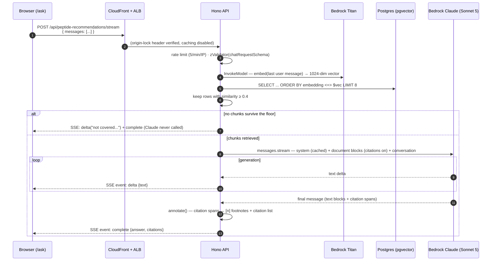

# 04 — Query Flow & API

## The full request lifecycle



## Endpoints

Both live in the single route chain in `apps/api/src/app.ts` (the AppType
contract), both rate-limited **5 requests/min/IP** (each route has its own
in-memory window), both validated against `chatRequestSchema` from
`@joice/core`.

### Request body (both endpoints)

```jsonc
{
  "messages": [
    { "role": "user",      "content": "Tell me about BPC-157" },
    { "role": "assistant", "content": "BPC-157 is a peptide..." },
    { "role": "user",      "content": "How is it dosed?" }        // last MUST be user
  ]
}
```

Validation rules (`chatRequestSchema`): 1–20 messages; each `content` trimmed,
1–2,000 chars; `role` ∈ `user | assistant`; the **last message must be from the
user**. Violations → `400` from zValidator. The conversation is stateless —
the client resends the visible history each turn (the web component caps it at
20 client-side too).

Retrieval uses **only the last user message** as the query; the earlier turns
are still sent to Claude for conversational context. (Query rewriting from
history — e.g. resolving "how is *it* dosed?" into "how is BPC-157 dosed?"
before embedding — is a known future improvement; the breadcrumb-prefixed
embeddings soften the problem meanwhile.)

### `POST /api/peptide-recommendations` — JSON (typed-client path)

Waits for the full generation, returns:

```jsonc
{
  "answer": "Typical protocols use 250-500mcg daily.[1] Take with food.[1][2]",
  "citations": [
    {
      "index": 1,                                  // the [1] in the answer
      "sourcePath": "peptides/bpc-157.md",         // S3 key of the source note
      "headingPath": "BPC-157 > Dosing > Oral",    // null for pre-heading text
      "citedText": "250-500mcg daily"              // the exact span Claude cited
    },
    { "index": 2, "sourcePath": "peptides/absorption.md", "headingPath": "Absorption", "citedText": "with food" }
  ]
}
```

Consumed via the typed hook `usePeptideRecommendation()` from
`@joice/api-client` — full end-to-end types from the Hono AppType.

### `POST /api/peptide-recommendations/stream` — SSE (chat-UI path)

Same request, `text/event-stream` response:

| SSE `event:` | `data:` payload | Meaning |
|---|---|---|
| `delta` | `{ "text": "..." }` | A raw text fragment as Claude generates. **No `[n]` markers** — those are computed at the end |
| `complete` | the full JSON object above | Authoritative final answer (with footnotes) + citations. **The UI replaces the accumulated deltas with this** |
| `error` | `{ "error": "..." }` | Generation failed mid-stream; show the message, keep the conversation usable |

Client-side, `streamPeptideRecommendation(client, messages)` in
`packages/api-client/src/chat.ts` calls the endpoint through the same typed
`hc` client (inheriting base URL + headers), reads `res.body` with a
`ReadableStream` reader, parses SSE frames (split on blank lines), and yields
the events as an async generator. This is the one sanctioned exception to
"never fetch the API by hand" — SSE can't flow through TanStack hooks.

## Retrieval

Implemented in `createRecommendationService().retrieve()`
(`packages/core/src/recommendation-service.ts`):

```ts
const similarity = sql<number>`1 - (${cosineDistance(noteChunks.embedding, queryVector)})`;
rows = await db.select({ sourcePath, headingPath, content, similarity })
  .from(noteChunks)
  .orderBy(sql`${similarity} desc`)   // pgvector <=> under the hood → HNSW index
  .limit(TOP_K);                      // 8
return rows.filter(r => r.similarity >= SIMILARITY_FLOOR);  // 0.4
```

Two tunables, both constants in the service:

| Constant | Value | Effect of raising | Effect of lowering |
|---|---|---|---|
| `TOP_K` | 8 | More context per answer (more input tokens, better recall on broad questions) | Cheaper, tighter answers |
| `SIMILARITY_FLOOR` | 0.4 | More "not covered" refusals (higher precision) | More marginal chunks reach Claude (risk of tangential answers) |

**0.4 is a starting point** — cosine similarity distributions vary by embedding
model and corpus. After the real vault is ingested, sanity-check with a handful
of on-corpus and off-corpus questions and adjust. Symptom of it being too high:
questions the notes clearly cover come back "not covered". Too low: answers
citing barely-related notes.

**Zero survivors → the not-covered path.** The service returns a fixed honest
answer (see the constant `NOT_COVERED_ANSWER`) **without calling Claude** —
off-corpus questions cost one Titan embed (~free) and no generation tokens, and
structurally cannot hallucinate.

## Prompt construction

Built in `buildRequest()` + `toParams()` (`packages/core/src/bedrock.ts`). The
Claude request is shaped for **grounding, citations, and prompt-cache reuse**:

```jsonc
{
  "model": "us.anthropic.claude-sonnet-5",
  "max_tokens": 1024,
  "system": [
    {
      "type": "text",
      "text": "<the stable system prompt>",
      "cache_control": { "type": "ephemeral" }     // ← cached prefix: every request reuses it
    }
  ],
  "messages": [
    // prior conversation turns, verbatim...
    { "role": "user", "content": "Tell me about BPC-157" },
    { "role": "assistant", "content": "BPC-157 is a peptide..." },
    // the final user turn carries the retrieved chunks as CITABLE DOCUMENTS:
    {
      "role": "user",
      "content": [
        {
          "type": "document",
          "source": { "type": "text", "media_type": "text/plain", "data": "<chunk content>" },
          "title": "peptides/bpc-157.md — BPC-157 > Dosing > Oral",
          "citations": { "enabled": true }          // ← native citations
        },
        // ...one block per retrieved chunk (≤ 8)...
        { "type": "text", "text": "How is it dosed?" }
      ]
    }
  ]
}
```

Why this shape:

- **System prompt first with `cache_control`** — it never changes, so every
  request after the first reads it from Bedrock's prompt cache (~0.1× input
  price for that span). Volatile content (chunks + question) comes after the
  breakpoint.
- **Native citations, not prompt-engineered markers** — with
  `citations: {enabled: true}`, Claude's response text blocks carry structured
  `citations` arrays (`document_index`, `cited_text`, char offsets). No
  "please add [1] markers" prompting, no regex parsing, no marker
  hallucination.
- **The system prompt** (constant `SYSTEM_PROMPT` in the service) enforces:
  answer only from the documents; say plainly when they don't cover it (or only
  partially); educational information, **not medical advice** — no diagnosing,
  prescribing, or individual dosing (defer to the clinical team); never invent
  sources or numbers.
- `max_tokens: 1024` bounds cost and keeps answers chat-sized. No
  `temperature` — Sonnet 5 rejects sampling params.

## Citation annotation

`annotate()` (exported from the service, unit-tested) converts Claude's spans
into user-facing footnotes:

1. Walk the response text blocks in order, concatenating `text`.
2. Each cited `document_index` gets a footnote number in **first-use order**
   (document 3 cited first → it is `[1]`).
3. After each block's text, append its markers (`[1]`, `[2]`…), deduped within
   the block.
4. Build the `citations` array mapping footnote → the retrieved chunk's
   `sourcePath` + `headingPath`, plus the first `cited_text` for that document.
5. Citations pointing at unknown document indexes are dropped defensively.

The chat UI renders the `citations` list as chips under the answer
(`[1] BPC-157 > Dosing`, hover shows the cited text).

## The chat UI (`apps/web/components/chat/peptide-chat.tsx`)

- Optimistically appends the user message + an empty assistant message, then
  consumes `streamPeptideRecommendation`.
- `delta` events append to the assistant bubble ("Thinking…" until the first
  one).
- `complete` **replaces** the streamed text with the annotated answer and
  attaches the citation chips.
- `error` events / thrown fetch errors render an inline error bubble; errored
  turns are excluded from the history sent on the next question.
- History is capped at 20 messages (mirror of the schema cap); a persistent
  "not medical advice" line sits under the input.
- The page (`/ask`) is inside the `(site)` route group, so pre-launch it sits
  behind the team-password gate automatically; at launch it's public site
  chrome like every other page.

## Error handling summary

| Failure | Surface | Behavior |
|---|---|---|
| Invalid body | Both endpoints | `400` with zod details (zValidator) |
| Rate limited | Both | `429` + `Retry-After` (per-IP fixed window, per task instance) |
| Bedrock error before generation (creds/access/throttle) | JSON endpoint | `500 {"error": "Something went wrong..."}` via the global `onError` |
| Bedrock error mid-stream | SSE endpoint | `error` SSE event (the try/catch inside `streamSSE`), connection then closes |
| Empty corpus / off-corpus question | Both | Honest `NOT_COVERED_ANSWER`, `citations: []`, HTTP 200 |
