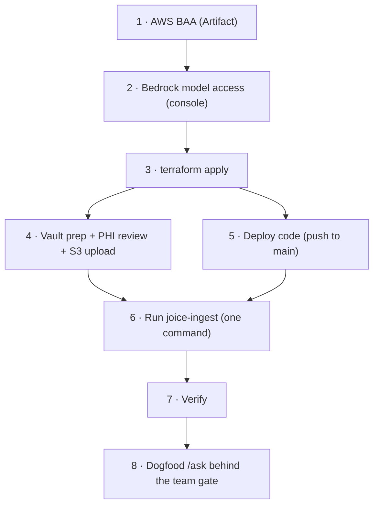

# 06 — Deployment Runbook

Ordered, end-to-end. Steps 1–2 are one-time account setup that **cannot be
Terraformed**; everything after is repeatable.



## 1. Sign the AWS BAA (one-time, blocking for any PHI-adjacent content)

AWS Console → **AWS Artifact → Agreements** → accept the AWS Business
Associate Addendum at the account (or org) level. Free, self-service,
immediate. This is the legal foundation for the whole design — do it before
any note content is uploaded. Details: [07 — Compliance](07-compliance.md).

## 2. Enable Bedrock model access (one-time)

AWS Console, region **us-east-1** → **Amazon Bedrock → Model access** →
request/enable:

- **Anthropic** Claude models (Sonnet family at minimum)
- **Amazon Titan Text Embeddings V2**

Anthropic models usually require a short use-case form; approval is typically
quick. Until this is done, every invoke returns `AccessDeniedException`
regardless of IAM.

**Smoke-test from a workstation** (optional but recommended before deploying):

```bash
aws bedrock-runtime invoke-model \
  --region us-east-1 \
  --model-id amazon.titan-embed-text-v2:0 \
  --body "$(echo '{"inputText":"hello","dimensions":1024,"normalize":true}' | base64)" \
  /tmp/titan-out.json && jq '.embedding | length' /tmp/titan-out.json   # → 1024
```

## 3. Terraform

What this apply creates/changes (all in `infra/`):

| Resource | File | Kind |
|---|---|---|
| `aws_s3_bucket.notes` + versioning/encryption/public-access-block | `s3.tf` | **new** — `joice-notes-<account-id>` |
| `aws_iam_role_policy.brain_bedrock` on the **brain** task role (`joice-brain-task` — the api role has no Bedrock permissions) | `iam.tf` | **new** — Claude (incl. inference profiles) + Titan invoke |
| `aws_iam_role.ingestion_task` + policy | `iam.tf` | **new** — S3 read + Titan only (no Claude) |
| `aws_ecs_task_definition.ingest` + `/ecs/joice-ingest` log group | `ingest.tf` | **new** — one-off task, reuses the **brain** image with a command override |
| api task definition env: `RAG_MODEL`, `BEDROCK_REGION` | `ecs.tf` | **in-place update** (new task def revision) |
| `rag_model` variable | `variables.tf` | default `us.anthropic.claude-sonnet-4-5-20250929-v1:0` (inference-profile ids are dated — verify with `aws bedrock list-inference-profiles`) |
| Outputs: `notes_bucket`, `ingest_run_task_command` | `outputs.tf` | convenience |

```bash
cd infra
terraform plan    # expect: adds + in-place task-def/role updates. NOTHING should be destroyed.
terraform apply
```

No new tfvars entries are needed — the design has **no new secrets** (Bedrock
and S3 use the task roles). The api service picks up the new task-def revision
on its next deployment (step 5 forces one).

## 4. Content prep + upload

Follow [03 — Ingestion, stages 1–2](03-ingestion.md) end to end:
`prep-vault.ts` → doctor reviews `<output-dir>-phi-report.md` (written beside
the upload folder, never in it — keep it on the workstation) → fix/remove
flagged files →

```bash
aws s3 sync ./approved/ "s3://$(cd infra && terraform output -raw notes_bucket)/" \
  --exclude "*" --include "*.md" --include "*.pdf"
```

> ⛔ **Do not upload before the PHI review is signed off.** The upload is the
> compliance boundary.

## 5. Deploy the code

Normal flow — push/merge to `main`. `.github/workflows/deploy.yml` builds the
images, pushes to ECR, forces new ECS deployments. The brain image contains
`apps/brain/scripts/`, and the ingest task pulls `:latest` at invocation time.

Migrations run as the one-shot **`joice-migrate`** ECS task: CI runs it to
completion and checks its exit code **before** updating either service
(migration `0003` is the extension + table + HNSW index — idempotent
`IF NOT EXISTS` on the extension). A failed migration fails the deploy and
leaves the old code serving — check the migrate task's logs if the workflow
stops there.

```bash
aws logs tail /ecs/joice-migrate --since 10m | grep -i -E "migration|error"
```

## 6. Run the ingestion (one command)

```bash
cd infra && $(terraform output -raw ingest_run_task_command)

aws logs tail /ecs/joice-ingest --follow
```

Expected log shape: `Found N ingestable files (.md/.pdf)…`, one
`✓ (i/N) path: k chunks [source_type]` per file, then `✅ Ingest complete:
N files scanned, 0 unchanged, N (re)ingested, M chunks written`. The task
then exits 0.

Failed mid-run? Just run it again — completed files are skipped by hash.

## 7. Verify

```bash
# Row counts per file (run from any api task, or a psql with the DATABASE_URL secret)
# SELECT source_path, count(*) FROM note_chunks GROUP BY 1 ORDER BY 1;

# Off-corpus question → honest fallback, no citations
curl -s https://joicehealth.com/api/brain/chat \
  -H 'content-type: application/json' \
  -d '{"messages":[{"role":"user","content":"What is the capital of France?"}]}' | jq

# On-corpus question → answer with non-empty citations[]
curl -s https://joicehealth.com/api/brain/chat \
  -H 'content-type: application/json' \
  -d '{"messages":[{"role":"user","content":"<something the notes cover>"}]}' | jq '.citations'

# Rate limit: 6 rapid requests → the 6th is 429
for i in $(seq 6); do curl -s -o /dev/null -w "%{http_code}\n" \
  https://joicehealth.com/api/brain/chat \
  -H 'content-type: application/json' \
  -d '{"messages":[{"role":"user","content":"test question about peptides"}]}'; done
```

Idempotency proof: re-run step 6 — the summary should read
`N files scanned, N unchanged, 0 (re)ingested`.

## 8. Dogfood

`https://joicehealth.com/team` → team password → `/ask`. Check: streaming
works through CloudFront, citation chips resolve to real notes, the disclaimer
renders, and answers refuse questions the notes don't cover.

---

## Updating things later

| Change | How | Rebuild needed? |
|---|---|---|
| Notes content | Re-run prep → `s3 sync` → step 6 again (hash-skip makes it cheap; orphan sweep removes deleted files) | No |
| Model (e.g. new Claude version) | The **Model** field on `/admin/brain` (live in ~30s); or change the env default: edit `rag_model` in tfvars or `variables.tf` → `terraform apply` → force new deployment | No |
| Retrieval tuning (topK, match threshold) | **Admin form fields** on `/admin/brain` (Notes per answer, Match threshold) — live in ~30s | No |
| System prompt (persona/tone/instructions) / disclaimer copy | **Admin form fields** on `/admin/brain` — live in ~30s (**counsel review gate applies to the disclaimer** — see 07). The safety floor stays a code constant | No |
| Embedding model or dimensions | Schema migration + full re-embed (delete rows, update `vector(N)` + `EMBEDDING_DIMENSIONS`, re-run ingest) — see [02](02-data-model.md) | Code deploy + re-ingest |

## Rollback

- **Tool mode off**: the `toolsEnabled` toggle on `/admin/brain` — a settings
  change, not a deploy; off runs the classic pipeline byte-for-byte.
- **Feature off**: the chat routes live on the **brain service**
  (`apps/brain/src/app.ts`) — remove them there (or gate them behind a feature
  flag) and deploy. Everything else is inert without them.
- **Bad ingest**: `TRUNCATE note_chunks;` and re-run the task — the table is
  derived data. Bucket versioning lets you restore a previous note version
  first if the source itself was bad.
- **Bad migration**: the `joice-migrate` task exits non-zero, CI fails the
  deploy, and the old code keeps serving. Fix forward (new migration) — `0003`
  itself has no destructive statements.

## Before member launch (deferred, tracked)

Not blocking the team-gated rollout, required before real members chat:
remaining Before-PHI checklist items (private subnets + VPC endpoints incl.
Bedrock, RDS Multi-AZ, KMS CMKs, ALB HTTPS origin, CloudTrail/flow logs),
member auth gate on the chat routes (replacing public+rate-limit), Redis-backed
rate limiting, and counsel review of the disclaimer copy. Details in
[07 — Compliance](07-compliance.md).
