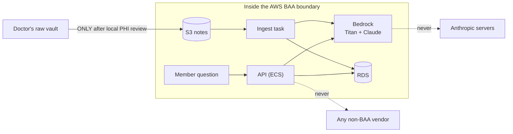

# 07 — Compliance (HIPAA / BAA)

## Why compliance drives this architecture

Two distinct PHI exposures, one of which exists **even with a perfectly clean
vault**:

1. **The corpus** — the doctor's notes *may* contain patient-identifying
   content (anecdotes, names, dates). Mitigated by the mandatory pre-upload
   review ([03 — Ingestion, stage 1](03-ingestion.md)).
2. **The questions** — once members use the chatbot, what they type is health
   information tied to an identifiable person. This is the durable PHI surface
   and the reason the *serving* path needs BAA coverage, not just the
   ingestion path.

HIPAA's rule of thumb: any third party that creates, receives, maintains, or
transmits PHI on Joice's behalf must be under a **Business Associate
Agreement** (45 CFR § 164.504(e)).

## The vendor decision

| Option | BAA status | Verdict |
|---|---|---|
| **Voyage AI** (embeddings, the original plan) | No publicly documented BAA | ❌ Dealbreaker — note content and member questions would flow to a vendor with no HIPAA commitment |
| **Anthropic direct API** | BAA available, but it's a **sales-negotiated enterprise agreement** (Messages API covered; several features excluded) | ⚠️ Viable later, disproportionate now |
| **AWS Bedrock** (Claude + Titan) | HIPAA-eligible under the **standard AWS BAA** — free, self-service in AWS Artifact. Claude-on-Bedrock traffic never reaches Anthropic (AWS runs the model; no Anthropic logging/training) | ✅ Chosen |

Everything the feature touches is a HIPAA-eligible AWS service under that one
BAA: **Bedrock** (Claude + Titan), **S3** (notes), **RDS** (vectors + chunks),
**ECS/Fargate** (compute), **CloudWatch Logs**, **Comprehend Medical** (PHI
scan). Side benefits that fell out of the choice: zero new vendors, zero
API-key secrets (SigV4 via task roles), and IAM/CloudTrail as the audit
surface.

## The hard rules

1. **No note content or member chat traffic may ever be routed to a non-BAA
   endpoint.** Concretely: don't swap `createClaudeClient`/
   `createEmbeddingClient` (in `packages/core/src/bedrock.ts`) for a direct
   Anthropic/OpenAI/Voyage client without a BAA in hand. Those two factories
   are the deliberate seam — the check happens there.
2. **Nothing leaves the workstation before PHI review.** `aws s3 sync` *is*
   transmission. `prep-vault.ts` + the doctor's review of the report it writes
   (`<output-dir>-phi-report.md`, a sibling of the upload folder — never inside
   it, because it quotes the original un-redacted text) are the blocking gate —
   and the automated Comprehend Medical scan is a helper, not a sign-off; a
   human decides. The report stays on the workstation: never uploaded, never
   ingested (`ingest.ts` refuses to run if it finds one in the source).
3. **Never store or log raw member identifiers with questions.** The existing
   house rules apply (salted IP hashes only). Note that `logger()` logs
   request paths, not bodies — keep it that way; don't add body logging to
   the chat routes.
4. **Chat copy is legal-gated.** The system prompt's not-medical-advice stance
   and the UI disclaimer line follow the same counsel-review gate as the
   referral copy (root CLAUDE.md).

## Voice

Voice mode raises the stakes: **spoken questions are health information in the
member's own voice** (biometric-adjacent). The same BAA logic applies, which is
why:

- **STT is Amazon Transcribe, TTS is Amazon Polly** — both HIPAA-eligible under
  the AWS BAA, IAM-authenticated, no new vendors or secrets.
- **The browser's Web Speech API was rejected**: Chrome's `SpeechRecognition`
  sends the audio to Google's servers (no BAA). Third-party voice vendors
  (ElevenLabs, OpenAI) were rejected for the same no-BAA reason as Voyage.
- **Audio is ephemeral by design**: processed in memory only — never written to
  disk or S3, never logged, no recordings stored anywhere. The transcript
  becomes an ordinary chat message and follows the existing rules.
- **Before real members**: add the AWS **AI-services opt-out policy**
  (Organizations) so Transcribe/Polly content is excluded from AWS
  service-improvement use — tracked with the Before-PHI checklist below.

## Current posture vs. launch posture

Already true today (inherited from the existing stack + this feature):

- RDS storage encrypted, TLS forced (`rds.force_ssl=1`)
- S3 notes bucket: private (full public-access block), versioned, SSE
- Least-privilege IAM: **only the brain task role** can invoke Bedrock,
  Transcribe and Polly — those permissions were removed from the api role when
  the brain became its own service; the ingestion role can read one bucket and
  invoke Titan only
- No raw IPs stored; team gate keeps `/ask` non-public
- **Chat threads are not persisted.** The tables exist and the code path is
  built and tested, but `BRAIN_PERSIST_CONVERSATIONS` is `false` everywhere —
  see the gate below

**Required before real members use the chat** (the "Before PHI" checklist in
`infra/README.md`, plus feature-specific items):

| Item | Why it matters here |
|---|---|
| Private subnets + NAT / VPC endpoints (incl. a Bedrock VPC endpoint) | Today tasks sit in public subnets with public IPs; Bedrock/S3 calls traverse the public internet (TLS, but still) |
| RDS Multi-AZ, longer backups, KMS CMKs | Member questions may eventually be persisted (conversation history) |
| CloudTrail, VPC flow logs, ALB/CloudFront access logs | Audit trail for PHI access |
| ALB HTTPS origin (CloudFront → ALB is currently plaintext HTTP) | Encrypt the last hop |
| Member auth on the chat routes | Replace public+rate-limit with Clerk member sessions; enables per-member accountability |
| Redis-backed rate limiting | The in-memory limiter is per-task and resets on deploy |
| App-level audit logging for chat | Who asked what, when — required once questions are PHI |

## The conversation-persistence gate

`conversations` and `messages` (`packages/db/src/schema/brain.ts`) exist, and
`createConversationService` writes to them, but **the flag that enables writing
is off by default in every environment**. This is deliberate and is the single
most important line in this document to not cross casually.

**Why it's gated.** Phase 0's posture is "marketing data only — treated as not
PHI". A stored chat thread breaks that in a way a waitlist email does not: "is
tirzepatide safe with my thyroid condition?" is health information about an
identifiable person the moment it's attached to a session, let alone a member
id. Storing it makes this a system that holds PHI, with everything that follows.

**What has to be settled before switching it on for real members:**

| Question | Why it blocks |
|---|---|
| Retention period, and what deletes the data | Indefinite retention of health questions is not defensible; there is no deletion job today |
| Member deletion / right-to-erasure path | `ON DELETE CASCADE` covers messages, but nothing yet erases a member's threads on request |
| AWS AI-services opt-out policy applied at the org | Keeps prompts out of AWS service-improvement pipelines |
| The Before-PHI checklist items below | Private subnets, KMS CMKs, CloudTrail, encrypted last hop — all of them become required, not recommended |
| Member auth on the chat routes | An anonymous session cookie is not an accountability boundary |

**What is safe about it as built:** reads are always scoped to the requester
(a conversation id alone returns 404 to anyone else), question and answer are
written in one transaction, and turning the flag off stops all writing while
leaving existing history readable. Nothing is logged — the request logger
records paths and status only, never bodies.

Turning it on is a config change, not a project. That was the point of building
it now: the decision stays a compliance decision rather than becoming an
engineering one.

## If the vault turns out to contain irreducible PHI

If some notes genuinely can't be de-identified (e.g. case studies the doctor
wants searchable), the pipeline as designed still holds **because everything is
already under the AWS BAA** — but the launch-posture items above stop being
deferrable and app-level access controls on `/ask` become mandatory first.
Prefer de-identification: HIPAA's Safe Harbor method (strip the 18 identifier
types — names, dates more specific than year, contact info, IDs…) is usually
achievable for clinical reference notes.
