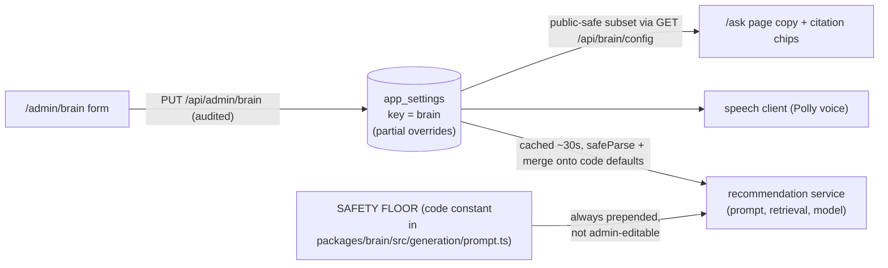

# 09 — Admin Brain Settings

Everything that shapes how the chatbot behaves is managed from **`/admin/brain`**
(Clerk admin required). Changes go live within **~30 seconds** — no deploy, no
restart — and **every save is recorded in the audit log** (`/admin/audit`, with
before/after diffs).

## How it works

- **Storage**: one `app_settings` row (`key = brain`) holding only the fields
  you've changed; everything else falls through to code defaults (and env for
  model/voice). **Reset to defaults** deletes the row.
- **Resilience**: the stored row is validated and merged onto defaults — a
  corrupt or stale row can never break chat; bad fields silently fall back.
- **The safety floor cannot be changed here**: answer only from the retrieved
  notes; educational information, not medical advice; no diagnosing,
  prescribing, or individual dosing; never invent sources. It is a code
  constant (`SAFETY_FLOOR` in `packages/brain/src/generation/prompt.ts`)
  always prepended to the prompt, and shown read-only at the bottom of the
  admin page. When **Tool calling** is on, that panel shows the tool-mode
  floor (`TOOL_SAFETY_FLOOR` — "MUST call search_notes first") instead.

## What each control does

| Control | Effect |
|---|---|
| **Name / who it is** | Fills "You are {name} — {description}" at the top of the system prompt |
| **Tone instructions** | Free-text style directive (e.g. "warm and encouraging, short sentences") |
| **How it refers to its knowledge** | **Talks like a person** = never mentions notes/documents/sources — the knowledge is simply its own. **References the clinical notes** = may say "our clinical notes describe…" |
| **Show citations** | On: answers carry `[n]` markers + source chips under them. Off: markers are suppressed (and defensively stripped) and chips hidden |
| **Not-covered message** | Returned verbatim when no note clears the match threshold (the model is never called) |
| **Clinician handoff** | What it says when a question needs individual medical judgment |
| **Chat intro / placeholder / disclaimer** | The `/ask` page copy (served publicly via `GET /api/brain`). ⚠ Disclaimer changes require counsel review |
| **Restricted topics** | Hard refuse-and-redirect list — the bot declines these even if the notes cover them |
| **Additional instructions** | Free text appended to the prompt after everything else — the ultimate knob (4000 chars) |
| **Notes per answer (topK)** | How many note excerpts are retrieved for each question (1–20) |
| **Match threshold** | Cosine-similarity floor (0–1). Higher = stricter grounding, more "not covered"; lower = more marginal notes reach the model |
| **Max answer length** | Output token cap (128–4096) |
| **Tool calling (toolsEnabled)** | **Default off — this is the kill switch.** On: the model holds a toolbelt (search_notes, search_catalogue, clinician handoff) and decides when to search; grounding shifts from the structural chunks==0 gate to `TOOL_SAFETY_FLOOR` + the provenance registry. Off runs the classic pipeline byte-for-byte — rollback is this toggle, not a deploy |
| **Max tool rounds** | Tool-execution rounds per answer (1–5) — each round is an extra model call |
| **Prompt caching (promptCache)** | Bedrock prompt caching of the static prefix (system prompt + tool definitions). **Off by default** — it only pays once the prefix crosses the model's minimum cacheable size, and support varies by model (unsupported models degrade to uncached). Verify it's actually working via `cacheReadInputTokens` in the usage counts |
| **Follow-up understanding** | Rewrites context-dependent follow-ups ("is there a protocol for *that*?") into standalone search queries using the conversation, via a small fast model. Off = follow-ups embed as-typed |
| **Rewrite model** | The Bedrock model doing that rewrite (default Nova Lite — it only writes search queries, small and fast is right) |
| **Model** | Bedrock model at runtime — Nova Pro today; Claude Sonnet 4.6/5 once the account's Anthropic use-case form is approved; or any custom Bedrock id |
| **Voice** | The Polly voice for spoken answers — generative-engine voices only (Ruth, Danielle, Joanna, Salli, Tiffany, Matthew, Stephen for en-US) |

## Tuning tips

- **"Talks like a person" + citations on** is the sweet spot: prose sounds
  human, the `[n]` chips keep the trust signal.
- If real questions come back "not covered" too often, lower the **match
  threshold** in 0.05 steps; if answers cite barely-related notes, raise it or
  lower **topK**.
- Test every persona/tone change with one on-corpus question, one off-corpus
  question, and one restricted topic — the floor should hold in all three.
- **The eval console is the gate for `toolsEnabled` in prod**: tool-mode
  grounding is behavioral, so run the golden set from `/admin/eval` (the
  refusal cases measure the residual off-corpus risk) before flipping the
  toggle anywhere real. The "Last eval" line beside the toggle links to the
  latest run; the full story is `12-eval-console.md`. The CLI form,
  `apps/brain/scripts/eval.ts`, grades identically and reads the same
  question set.
- **Tuning workflow**: start a run from `/admin/eval` with the change as a
  run-only override (model, topK, threshold, tool mode), compare against the
  previous run on the detail page, and promote the overrides with "Apply
  these settings" only when the numbers hold. Promotions land in the audit
  log as ordinary settings changes.
- The full config surface is `brainSettingsSchema` in
  `packages/brain/src/config/schemas.ts`; prompt assembly is
  `buildSystemPrompt()` in `packages/brain/src/generation/prompt.ts`
  (unit-tested).

## API surface

| Endpoint | Auth | Purpose |
|---|---|---|
| `GET /api/admin/brain` | admin | `{ settings (stored overrides), resolved (what chat uses now), defaults, safetyFloor }` |
| `PUT /api/admin/brain` | admin | Merge a partial patch (validated); audited as `brain.update` |
| `DELETE /api/admin/brain` | admin | Reset to defaults; audited as `brain.reset` |
| `GET /api/brain/config` | public | Safe subset only: chat copy + `showCitations` — never the prompt or guardrails |
