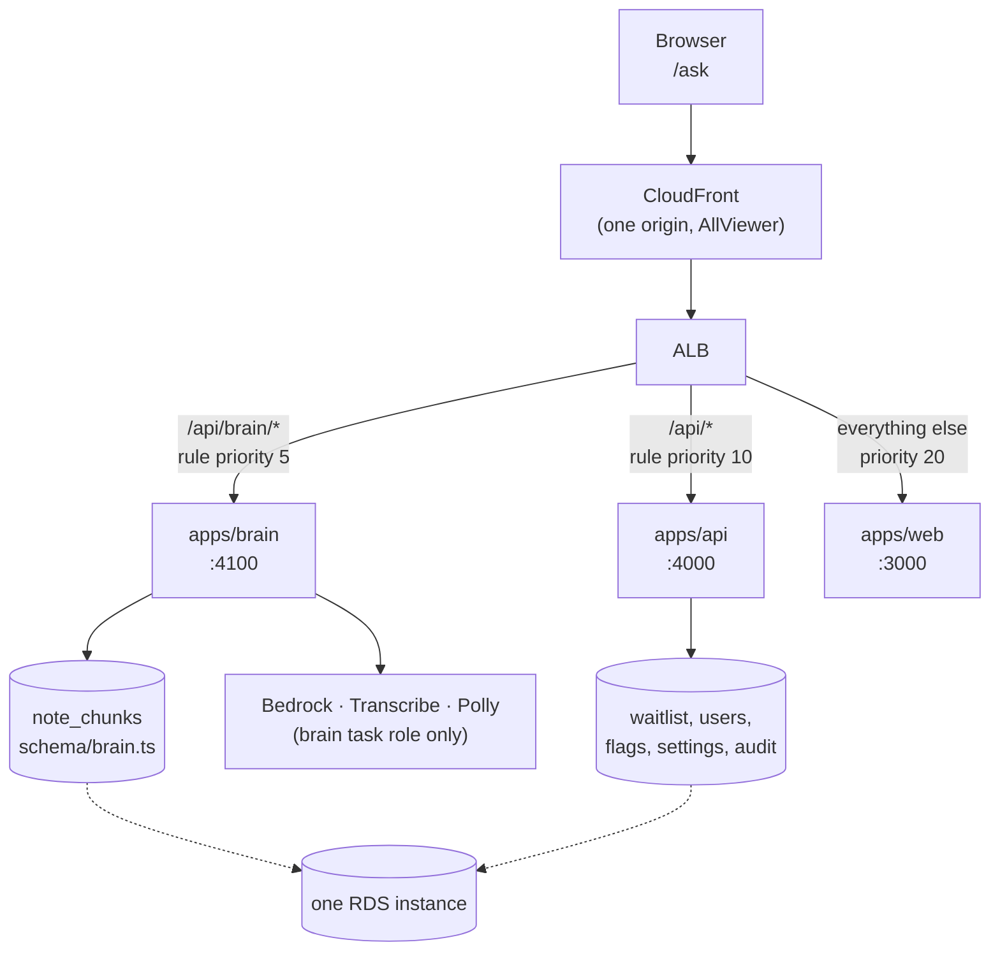

# 10 — The brain as its own service

The chatbot started inside `apps/api`. It's now `apps/brain`, a separate
deployable with its own domain package, task role, and place in the URL space.
This document is why, what moved, and what the boundaries are.

## Why separate

The brain is the product's differentiator and the piece expected to grow most:
member context, order history, protocols, journeys, eventually adding items to a
cart. Three concrete reasons it isn't a folder inside the api service:

1. **Least privilege.** Bedrock, Transcribe and Polly permissions used to hang
   off the api task role, alongside Clerk secrets and the waitlist. They're now
   on a role only the brain assumes. A bug in the admin console can't reach a
   model; a bug in the brain can't read a Clerk secret.
2. **Independent failure and scale.** A question costs seconds of model time and
   holds a connection. A waitlist signup costs milliseconds. They shouldn't
   share a thread pool, an autoscaling policy, or an outage.
3. **The boundary is cheap now and expensive later.** Renaming endpoints and
   defining ports costs an afternoon today. It costs a migration once members
   depend on those URLs and the code has grown into the platform's tables.

## Shape



**Rule priority is load-bearing.** ALB rules evaluate in priority order, and
`/api/*` matches `/api/brain/*`. The brain rule is priority 5, ahead of the api
rule at 10 — reverse them and every chat request lands on the wrong service.

CloudFront needs no change: `/api/*` already forwards to the ALB with the
`AllViewer` origin request policy, which is also what makes the voice WebSocket
work. Don't replace it with a cache policy that drops `Upgrade`.

## URL namespace

Everything the brain serves lives under `/api/brain/*`, which is what makes the
split one routing rule instead of a list that grows with every endpoint.

| Before | Now |
|---|---|
| `POST /api/peptide-recommendations` | `POST /api/brain/chat` |
| `POST /api/peptide-recommendations/stream` | `POST /api/brain/chat/stream` |
| `GET /api/brain` | `GET /api/brain/config` |
| `POST /api/voice/transcribe` | `POST /api/brain/voice/transcribe` |
| `POST /api/voice/speak` | `POST /api/brain/voice/speak` |
| `GET /api/voice/stream` (WS) | `GET /api/brain/voice/stream` (WS) |
| `GET/PUT /api/admin/brain` | unchanged — stays on the api service |

The admin endpoints stay put deliberately: the admin console owns *writes* to
the brain's settings, and the write path needs the Clerk actor and the audit
trail, both of which live on the api side. It writes one `app_settings` row and
never touches the brain's own tables.

## Packages

```
packages/brain/          the domain — testable without a server
  config/       admin-managed behavior (persona, guardrails, model) + schemas
  knowledge/    the notes: chunking and retrieval
  conversation/ history assembly, citation handling, wire schemas
  generation/   prompt construction and answering
  voice/        speech in and out
  providers/    Bedrock clients — the swap seam for model vendors
  ports/        what the brain needs from the rest of the platform

apps/brain/              the service — Hono on Bun, mirrors apps/api
  src/{index,app,env,services,health,ws}.ts
  scripts/{ingest,prep-vault}.ts
  Dockerfile
```

Same two-entry-point rule as `@joice/core`: the browser imports
`@joice/brain/schemas`, never the barrel, because the barrel pulls in the
Postgres driver and the AWS SDK.

## Ports — the discipline that keeps this a service

The brain must never import another domain's tables. It declares interfaces for
what it needs; adapters are injected at the edge (`packages/brain/src/ports`).

```ts
interface MemberContextPort { forMember(memberId): Promise<MemberContext> }  // identity, orders, protocols
interface CatalogPort       { search(q, limit); byId(id) }                   // products
interface CartPort          { addItem({ …, confirmedByMember: true }) }      // the only write path
interface AuditPort         { record(entry, tx?) }                           // used today
```

Every implementation except the audit one is a stub returning empty, because
orders, protocols and a catalogue don't exist yet. When they do, the stubs
become HTTP clients to the api service and **nothing in the domain changes** —
that's the whole point of paying for the interface now.

`CartPort.addItem` takes a literal `confirmedByMember: true`. A model deciding
to put something in someone's basket is a different risk class from a model
answering a question, so the type system refuses to let inferred intent reach
the write path.

## Database

One Postgres, one migration stream. `packages/db/src/schema/` is split by owner:

| File | Owner | Tables |
|---|---|---|
| `waitlist.ts` | `@joice/core` | `waitlist_entries` |
| `identity.ts` | `@joice/core` | `users` |
| `platform.ts` | `@joice/core` | `feature_flags`, `app_settings`, `audit_logs` |
| `brain.ts` | `@joice/brain` | `note_chunks`, `conversations`, `messages` |

The rule: a service writes only the tables in its own file. This is enforced by
convention and review, not by separate credentials — both services connect with
the same role. Worth revisiting if the brain ever handles data the api service
must not see.

## Conversation persistence

`conversations` and `messages` are brain-owned. `member_id` is **nullable** and
sits alongside `anonymous_session_id`, which is what makes this work before
member accounts exist: a thread started by someone who has never signed in is
kept against an opaque session cookie, and `conversationService.claim()` turns
it into theirs on sign-up with an UPDATE rather than a migration.

```
identifyRequester middleware  →  Requester { memberId: null, sessionId }
                                      │
POST /api/brain/chat  ────────────────┤
                                      ├─► findOrCreate(requester, question)
                                      └─► recordExchange(id, q, a, {citations, model})
                                              (one transaction — see below)

GET /api/brain/conversations       list, scoped to the requester
GET /api/brain/conversations/:id   replay, scoped to the requester
```

Two properties worth keeping:

- **The exchange is written in one transaction.** A question stored without its
  answer replays as history with two adjacent user turns — the exact shape
  `buildChatHistory` exists to make unrepresentable, reintroduced through the
  database.
- **Reads are scoped to the requester, not just the id.** A conversation id is a
  UUID in a URL; without the requester in the `WHERE`, knowing one would be
  enough to read the thread. Verified: a different session gets `[]` and a 404.

Recording never fails a request — the member already has their answer, and
losing a history row isn't worth turning a good answer into an error. Failures
are logged with the request id.

⚠️ **Writing is off by default** (`BRAIN_PERSIST_CONVERSATIONS=false`,
`persist_conversations = false` in Terraform). Storing member questions crosses
the Phase-0 compliance line; read the gate in
[07 — Compliance](07-compliance.md#the-conversation-persistence-gate) before
enabling. Read paths stay available either way.

## Migrations no longer run at boot

They used to run in each container's `CMD`. That already raced whenever
`desired_count` went above 1, with no lock; with two services booting against
one database it stopped being survivable.

Now `joice-migrate` is a one-off ECS task (`infra/migrate.tf`). CI runs it,
waits for it to stop, and **checks its exit code before updating any service**.
A failed migration fails the deploy and leaves the old code serving, which is
the correct outcome — better than new code against an unmigrated schema.

Locally, `docker compose` does the same thing with a `migrate` service that runs
once; `api` and `brain` both declare
`depends_on: { migrate: { condition: service_completed_successfully } }`.

## What Shaun needs to do to deploy this

Terraform adds an ECR repo, a task definition, a service, a target group, a
listener rule, a log group, a security group, and two IAM roles — plus it
**removes** the Bedrock/Transcribe/Polly policies from the api task role.

```bash
cd infra
terraform plan -out=brain.plan     # expect additions + the api-role policy REMOVAL
terraform apply brain.plan
terraform output github_repo_variables   # set the new ones in GitHub
```

New GitHub repo Variables the workflow needs: `ECR_BRAIN`,
`ECS_SERVICE_BRAIN`, `ECS_TASK_MIGRATE`, `SUBNET_IDS`, `BRAIN_SG_ID`.

⚠️ **Order matters on the first deploy.** The service can't start until an image
exists in the new ECR repo. Either apply Terraform with `desired_count = 0` for
the brain and raise it after the first successful build, or accept that the
first apply leaves the brain service unhealthy until CI pushes an image.

If chat starts returning 500s with `AccessDenied` on Bedrock after this applies,
the task is running under the old api role — that permission removal is
deliberate, not a mistake.
