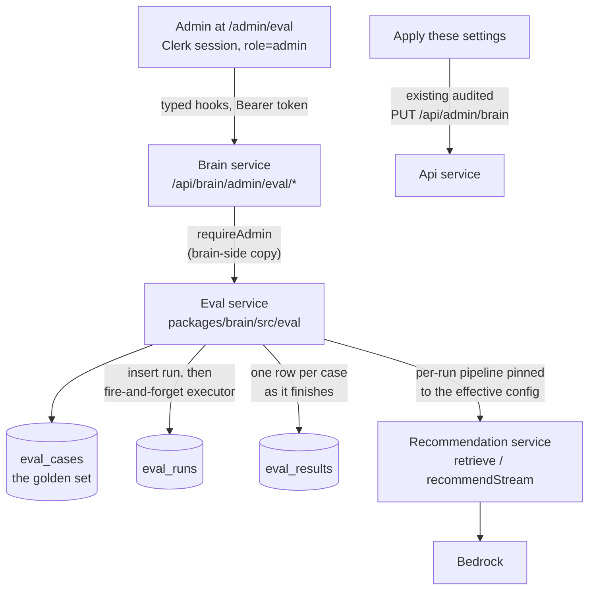
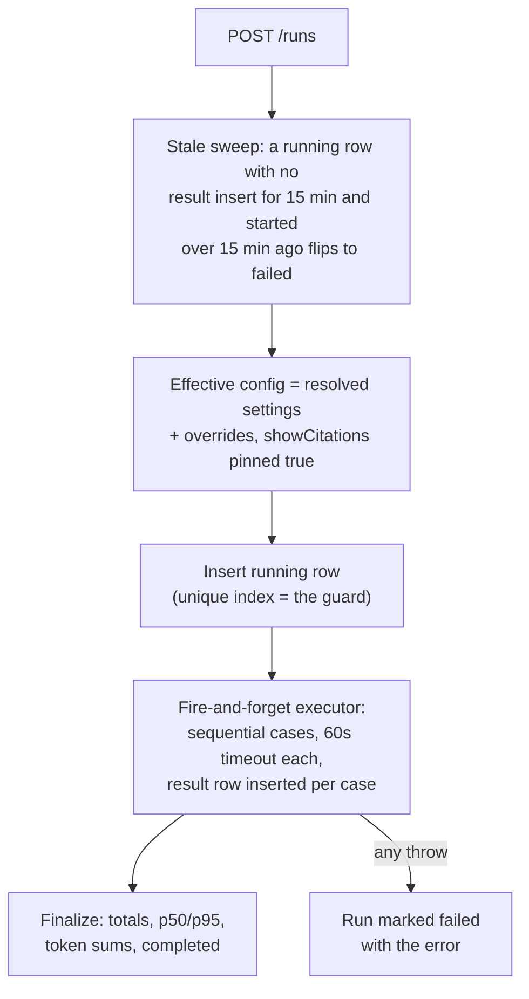

<!--
  Approved: 2026-08-26 (plan reviewed and accepted by Shaun in session).
  Epic: Brain: admin eval console - https://app.shortcut.com/joice-health/epic/200
  Stories: sc-201 to sc-206
  Keep the decisions log at the bottom current as implementation lands.
-->

# 12: The eval console

> Since epic 244 a run also picks the lifecycle stage it simulates (Run as:
> visitor / lead / user / subscriber, default subscriber = the full belt).
> The stage rides the run row and the detail page, and the fixed/regressed
> summary flags cross-stage comparisons. The CLI mirror is `--audience`.

An admin surface for tuning the AI with numbers. Runs the golden question set
against the live pipeline from `/admin/eval`, records every run, compares runs
over time, and can promote a winning experiment's settings to the live config
in one click. This replaces "run a CLI script and read terminal output" as the
way the brain gets tuned, and it is the brain's first admin surface of its own.

Read `09-admin-brain.md` (the settings this tunes) and `11-brain-audit.md`
(why the eval is the gate for tool mode) first.

## Why this exists

Every knob on `/admin/brain` (model, topK, similarity floor, tool mode,
prompts) changes answer quality invisibly. The CLI eval measures those changes
but lives in a terminal with AWS credentials, which means in practice it does
not get run. Putting the same instrument behind the admin console, with
history and comparison, makes "did that change make answers worse?" a
thirty-second check instead of an infrastructure task.

## What an admin can do

1. Open `/admin/eval`, see past runs with scores, latency, and token spend.
2. Start a run: pick retrieval-only (cheap recall check) or full (real
   answers), optionally override tuning knobs (model, topK, floor, tool mode)
   without touching live settings. A cost hint shows before the run starts.
3. Watch results land case by case while the run executes.
4. Open a run: per-case pass/fail with the answer, citations, tools called,
   and timings; automatic comparison against the previous run of the same mode
   (fixed and regressed markers).
5. Apply a winning run's overrides to the live settings in one click (goes
   through the audited settings endpoint on the api).
6. Manage the golden question set: add, edit, tag, enable or disable cases.

## Architecture

Why the surface lives on the brain: the api service has no Bedrock
permissions (removed deliberately when the services split), so execution can
only happen here, and `packages/core/src/admin/leads-service.ts` already
marked this moment: "when the brain grows its own admin surface". Admin
authorization is a brain-side copy of the api's `requireAdmin`
(`sessionClaims.metadata.role === 'admin'`); the brain already verifies Clerk
tokens networkless via `CLERK_JWT_KEY`, so no new secrets are involved.

## Data model

Three brain-owned tables in `packages/db/src/schema/brain.ts`:

| Table | What it holds | Written by |
|---|---|---|
| `eval_cases` | The golden set: question (unique, the case's identity), expectations (sources, refusal, tool, mustCite), enabled flag, tags, notes | Admin CRUD via the eval routes; seeded from `golden.jsonl` by migration |
| `eval_runs` | One row per run: status, mode, the full effective config snapshot, the overrides applied, denormalized model and tools flag, who triggered it, totals, latency percentiles, token sums, error | The eval service only |
| `eval_results` | One row per case per run: pass, detail, answer, citations, tools called, timings, tokens. `case_id` is set null on case deletion so history never rewrites | The run executor only |

Why the one-active-run guard is a partial unique index
(`eval_runs_one_running_unique` on status where status = 'running'): the
executor is fire-and-forget inside one ECS task, and tasks scale out. Any
in-memory lock multiplies per task; the database admitting at most one running
row is race-free everywhere, and a second start attempt maps the unique
violation to a 409.

## Run lifecycle

Why staleness keys on the last result insert and not the start time: an
honest 100-case tools run can legitimately exceed any fixed wall clock while
still producing rows. A run is only declared lost when it has produced
nothing recent AND is old. The sweep also runs on reads (runs list, run
detail), so a mid-run deploy can never wedge the guard: the next admin page
load heals it.

Cost rails: one run at a time, 60 seconds per case, at most 100 enabled
cases, sequential execution (no Bedrock throttle spikes), token usage
recorded when the pipeline reports it (tools mode today; classic mode is a
known gap until the provider's done event carries usage).

## Scoring

Deterministic, extracted verbatim from the CLI script into
`packages/brain/src/eval/scoring.ts` so console and script cannot drift:
retrieval recall (expected sources in the top-k), citation honesty (cited
sources include the expected ones; refusals cite nothing), refusal shape
(zero citations AND the text reads as a decline), tool choice (expected tool
among those called, only judged when tool mode is on), latency percentiles.
No AI judge in v1: a judge doubles run cost and needs its own calibration;
the stored answers are there for human review. Decision logged below.

## The CLI script

`apps/brain/scripts/eval.ts` keeps its flags and exit codes (the terraform
`eval_*` run-task outputs point at it). It now reads enabled cases from
`eval_cases`, falling back to `fixtures/golden.jsonl` when the table is
empty, and imports the shared scoring. One question set, two front ends.

One semantic difference to know: the script's `--tools` flag pins tool mode
for the run (`--full` alone always runs the classic pipeline), while the
console's full mode inherits the STORED tools setting unless the admin
overrides it in the run panel. The console's tool switch in "experiment with
settings" is the equivalent of `--tools`. The run row's `tools_enabled`
column records what actually ran, either way.

## Auditing decision

The brain writes no `audit_logs` rows (platform-owned table; the brain never
touches other domains' tables). Run rows carry who triggered them and are
their own immutable history; case rows carry timestamps. The one settings
write in this feature, promoting a run's overrides, deliberately goes through
the existing api endpoint and lands in the audit log as `brain.update` like
any other settings change.

## Decisions log

| Date | Decision | Why |
|---|---|---|
| 2026-08-26 | Eval surface on the brain, not the api | Only the brain has Bedrock permissions; leads-service comment anticipated the move |
| 2026-08-26 | Deterministic scoring only in v1, no AI judge | Judge doubles cost and adds calibration burden; answers are stored for human review |
| 2026-08-26 | One-click promote included in v1 | Completes the tuning loop through the already-audited settings endpoint |
| 2026-08-26 | One-active-run guard as a partial unique index | Race-free across ECS tasks; in-memory locks multiply per task |
| 2026-08-26 | Staleness keyed on last result insert, not start time | Long honest runs must not be falsely failed; wedged runs must self-heal on page load |
| 2026-08-26 | No audit_logs writes from the brain | Table ownership rule; run rows are their own history; promotions audit on the api |
