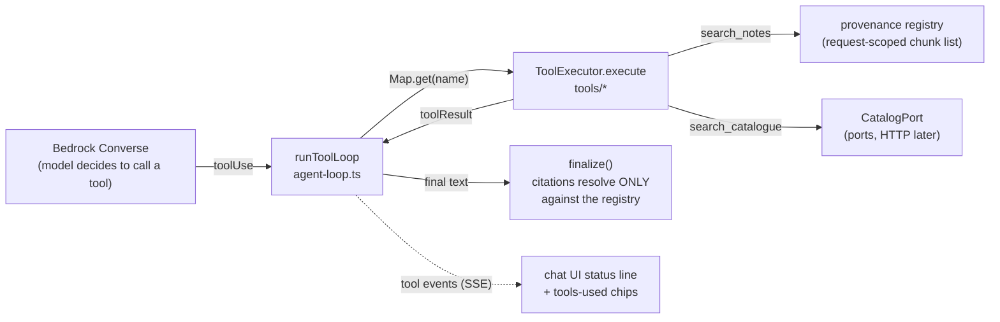

<!--
  Approved 2026-08-27. Epic: "Brain: toolbelt and boundaries"
  https://app.shortcut.com/joice-health/epic/237 (stories sc-238 to sc-240, shipped).
  Extended 2026-08-31 by "Brain: audience tiers"
  https://app.shortcut.com/joice-health/epic/244 (stories sc-245 to sc-249):
  the access model section below is that epic's design brief until it lands.
  Keep the decisions log at the bottom current as decisions are made.
-->

# 13 — The toolbelt

How the companion's abilities are built, organized, surfaced, and grown. This
doc exists because the toolset will grow (member context, orders, protocols,
cart) and adding ability number five should be a routine afternoon.

## Where tools live

One file per tool in `packages/brain/src/tools/` (`search-notes.ts`,
`search-catalogue.ts`, `clinician-handoff.ts`, `flag-intent.ts`), each
exporting a `BrainTool` (`types.ts`): the Bedrock spec, the zod input schema
kept beside it, the visitor-facing label, and the per-request executor
factory. `index.ts` is the registry: the `TOOLS` list, the derived
`toolLabels` map, and `buildToolExecutors(deps)`. The generic loop in
`packages/brain/src/generation/agent-loop.ts` knows nothing about any
specific tool:

The four tools: `search_notes` (retrieval into the provenance registry),
`search_catalogue` (via `CatalogPort`, stub until commerce), 
`request_clinician_handoff` (emits a handoff action), `flag_intent`
(emits a buying-signal action, deliberately invisible to the visitor).

Two rules keep this safe as it grows:

- **Provenance**: only chunks that passed through the registry can be cited.
  A citation marker pointing at anything else is silently dropped
  (`parseCitations`). A new tool that surfaces quotable content must append
  to the registry; a tool that must never be quoted must not.
- **Boundaries**: a tool that needs another domain's data goes through a port
  (`packages/brain/src/ports`), never a table import. The db-boundary tests
  (story sc-238) enforce the table half of this on every `bun run check`.

## The plan (phases match the epic)

1. **Boundary check** (sc-238): `packages/db/src/ownership.ts` derives the
   table lists from the schema modules at runtime and a small scanner checks
   every consuming package's imports; four per-package tests fail the build on
   a cross-domain table import. Allowlist = the two documented exceptions
   (brain reads `app_settings`; api reads `brain_profiles` for leads).
2. **Toolbelt reorganization** (sc-239): one file per tool exporting a
   `ToolDefinition` (Bedrock spec + zod input + UI label + executor factory);
   `index.ts` assembles the registry with an unchanged `buildToolExecutors`
   signature. The UI labels move out of `answer-service.ts` into the
   definitions so a new tool cannot forget its label. This doc gains the
   full adding-a-tool checklist as-built.
3. **Tool visibility** (sc-240): the `showToolActivity` brain setting
   (default on, managed on `/admin/brain` next to Show citations). The gate
   lives in `answer-service.ts`'s stream re-yield, so when it is off tool
   names never reach the wire at all; when on, the finished answer also
   carries a deduped `toolsUsed` trace (name + label, silent tools excluded)
   in the recommendation payload, rendered as chips beside the citation
   chips on `/ask`. The public config slice exposes the toggle so an
   already-open tab honors a flip within its next answer.

## The access model (audience tiers)

Everyone talking to the companion is at one of four lifecycle stages, the
universal vocabulary defined once in `packages/utils/src/audience.ts`:

| Tier | Meaning | Resolved from |
|---|---|---|
| `visitor` | anonymous, nothing known | neither of the below |
| `lead` | shared an email | `brain_profiles.email` for the session (pure `peek`, no insert) |
| `user` | signed-in account | verified `memberId` on the request |
| `subscriber` | active subscription | `subscribed` on the member context, sourced from CarePortals via the api's SubscriptionPort over `/api/internal/profile` |

Tiers are ordered; `tierAtLeast(a, b)` is the one comparison helper. Resolution
happens per chat request in the answer service and degrades gracefully: a
failed lookup lowers the tier, never the answer.

Each tool carries a `settingKey` mapping to one flat brain setting whose value
is `'off'` or the minimum tier (`toolSearchNotes`, `toolSearchCatalogue`,
`toolClinicianHandoff`, `toolFlagIntent`; flat because the settings row merges
shallowly). `buildToolExecutors` filters the belt by setting and audience
before the model ever sees it: an out-of-tier tool is invisible, not refused.
Two special rules:

- If `search_notes` itself does not clear the gate, the request runs the
  classic pipeline; tool mode without retrieval has no grounding.
- The tools-mode system prompt reflects the advertised belt, so it never
  demands a tool that is not there.

Variants live in each tool's code keyed on `deps.audience` (admin controls
availability, code controls behavior): the first is `search_catalogue`, which
mentions ordering only from `user` up. The eval console records which tier a
run simulated (default `subscriber`, the full belt).

## Adding a tool (the checklist)

1. New file in `packages/brain/src/tools/` exporting a `ToolDefinition`:
   Bedrock JSON schema + zod input schema (kept together, they move together),
   the visitor-facing label (empty string = deliberately silent), and the
   executor factory over `ToolDeps`.
2. Register it in `tools/index.ts`.
3. Decide provenance: registry append (quotable) or not (never cited).
4. Cross-domain data only through a port; wire the adapter in
   `apps/brain/src/services.ts`.
5. At least one eval case with `expectTool` in `/admin/eval` so the benchmark
   notices if the model stops (or starts wrongly) choosing it.
6. Reread `TOOL_SAFETY_FLOOR` (`packages/brain/src/generation/prompt.ts`);
   extend it if the tool changes what the model may promise or refuse.
7. A row in this doc's tool table.

## Decisions

| Date | Decision | Why |
|---|---|---|
| 2026-08-27 | The brain keeps writing its own tables directly; API-driven stays the rule for cross-domain data only | Proxying the brain's own writes through the api would couple deploys, double write latency, and hand the api data it has no business with, reversing the least-privilege reason for the service split. The real boundary (cross-domain) is already HTTP-only via ports. Recorded in 10-architecture.md |
| 2026-08-27 | Ownership enforced by per-package boundary tests, not per-service Postgres roles (yet) | The CI check is free and catches the failure where it starts (a PR). Role separation is designed (NOLOGIN roles by migration, terraform-held passwords synced by the migrate task) and parked on the pre-PHI hardening list |
| 2026-08-27 | Tool visibility is a brain setting, not a feature flag | All chat-behavior knobs live in the audited brain settings row with the ~30s cache; the flags table is platform-owned and gates site surfaces. A flag would need a new cross-service read for one boolean |
| 2026-08-27 | Visibility = live status + tools-used chips, gated server-side | Showing the work builds trust, but when the switch is off the tool names must not reach the wire at all, not merely be hidden by the client |
| 2026-08-27 | The eval harness pins showToolActivity on, like showCitations | expectTool scoring reads the tool events this toggle gates at the source; a visitor-facing presentation switch must never blind the quality gate (caught in review before it shipped) |
| 2026-08-27 | Trace chips record successful completions only, and are not persisted | A 'started' event fires before the loop decides to execute, so a chip could otherwise claim a check that never ran. Stored history restores citations but not the trace; revisit if conversation persistence turns on |
