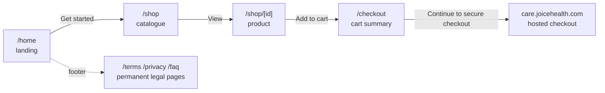

<!-- Design brief for the certification storefront. Approved by Shaun on 2026-08-28.
     Tracked in Shortcut: epic 218 "Shop: certification storefront"
     (https://app.shortcut.com/joice-health/epic/218), stories sc-219 to sc-224,
     one per row in section 5. Keep the decisions log (section 6) current when a
     decision changes. -->

# Joice shop: the CarePortals certification storefront

Design brief (approved 2026-08-28) for a bare-bones, fully public shopping flow backed by
the CarePortals Public API. It exists so a certification audit can walk Landing → Catalogue
→ Product → Add to cart → Checkout end to end. It is deliberately minimal: the full
commerce build comes later, and everything here is disposable except the CarePortals
integration knowledge it encodes.

---

## 1. Context

**Why now.** CarePortals (portals.care) is becoming the commerce and patient-portal backend.
The certification requires auditors to see a working public shopping experience on
joicehealth.com. Nothing else on the main site is public yet (the team gate in
[middleware.ts](../../apps/web/middleware.ts) holds everything except the waitlist), and the
existing gated catalogue and product pages are explicitly "no cart, no checkout" by design,
so this flow is built as its own small, flagged, public surface rather than by un-gating or
reshaping the main site.

**Why a separate route group.** The gated `(site)` pages carry a shipped product position
("no cart on this site", [explore/page.tsx](../../apps/web/app/(site)/explore/page.tsx)) and
a nav full of gated links. A parallel `(shop)` route group with its own trimmed nav and
footer keeps the audit surface self-contained: no link on it leads to a login bounce, and
removing or reworking it later touches nothing shared. The two positions coexist until the
commerce IA is reconciled after certification.

## 2. The flow

The visitor never authenticates on our side. Payment, patient account creation and
prescription requirements all live on CarePortals' hosted checkout at
`care.joicehealth.com`; our `/checkout` page is a cart summary that hands off.

## 3. CarePortals integration

All calls hit the CarePortals Public API: base `https://public-api.portals.care`, header
`organization: joicehealth_com`, no API key (it is a public, CORS-open storefront API;
verified live 2026-08-28). Because there is no secret, product reads happen server side in
the pages and cart mutations go browser-direct; no proxy, no new service, no new package.

| Call | Used by | Why |
|---|---|---|
| `GET /v2/products` | catalogue (server) | one fetch, filtered to a curated id list |
| `GET /v2/products/{id}` | product page (server) | detail render, 404 → not-found |
| `POST /public/v2/carts` | add-to-cart (browser) | creates the cart on first add |
| `POST /public/v2/carts/{cartId}/items` | add-to-cart (browser) | later adds |
| `GET /v2/carts/{id}` | checkout (browser) | cart re-read on page load |
| `PUT/DELETE /public/v2/carts/{cartId}/items/{itemId}` | checkout (browser) | quantity edit, remove |
| `GET /v2/carts/checkout-url` | checkout (browser) | returns `https://care.joicehealth.com/checkouts/:cartId`; we substitute the cart id |

**Why hand-written types.** The repo's "no hand-written DTOs" rule is about the internal
Hono RPC chain. For third-party APIs the house precedent is a typed client with hand-written
interfaces ([klaviyo.ts](../../packages/marketing/src/klaviyo.ts)); the CarePortals client
follows it, scoped to `apps/web/lib/careportals/` since nothing outside the web app calls it
yet. When the real commerce build starts, the brain's `CartPort`/`CatalogPort` seam
([ports/index.ts](../../packages/brain/src/ports/index.ts)) is where CarePortals adapters
plug in; this client is not that seam and should not grow toward it.

**Why the cart lives client side.** The cart id sits in `localStorage`
(`joice.shop.cartId`); every mutation returns the full cart and the UI re-renders from the
response (CarePortals' own guidance: the most recent response is the source of truth). A
stale or consumed cart id answers 400/404, is cleared, and a fresh cart is created on the
next add. An emptied cart survives with `lineItems: []` (verified live).

**Why Remove and no quantity stepper.** CarePortals pins line quantity to 1 for
subscription products: a PUT echoes the new quantity but a re-read shows it reverted, and a
cart created with quantity 2 comes back as 1 (verified live 2026-08-28). Every product we
sell is a subscription, so a stepper would lie; the checkout offers Remove per line only.

## 4. Gating

Two independent gates, both existing mechanisms:

- **Middleware allowlist**: the shop and legal paths join `PUBLIC_PATHS` in
  [middleware.ts](../../apps/web/middleware.ts), so anonymous visitors reach them with no
  team cookie. `/products` stays gated; the public product page uses `/shop/[id]` precisely
  so the existing gated PDP is untouched.
- **The `shop` feature flag** (seeded ON by migration, toggled in `/admin/flags`): every
  shop page opens with `requireShopEnabled()` and redirects to `/waitlist` when the flag is
  off. This is the kill switch for after the audit. The legal pages are permanent and do NOT
  check the flag.

**Why seeded ON.** The waitlist flag was seeded on to preserve live behaviour; this flag is
seeded on because the audit is the entire point of the build. One admin toggle closes the
shop afterwards without a deploy.

All shop and legal pages carry `robots: noindex` while the site is pre-launch; auditors get
URLs directly.

## 5. Slices

| # | Story | Slice | Surface |
|---|---|---|---|
| 1.1 | sc-219 | Flag, gate helper, middleware allowlist | kill switch works before anything is visible |
| 1.2 | sc-220 | CarePortals client + curated catalogue list | `lib/careportals/*`, `lib/shop-products.ts` |
| 1.3 | sc-221 | Shop chrome + landing `/home` | `(shop)` layout, nav, footer, hero |
| 1.4 | sc-222 | Catalogue `/shop` + product `/shop/[id]` | live products, add to cart |
| 1.5 | sc-223 | Checkout `/checkout` + hosted hand-off | cart edit, totals, hand-off button |
| 1.6 | sc-224 | Permanent `/terms` `/privacy` `/faq` | `(legal)` group, placeholder copy |

## 6. Decisions log

| Date | Decision | Why |
|---|---|---|
| 2026-08-28 | Hand off to CarePortals hosted checkout instead of building payment | payment submission needs a patient JWT (Patient API); hosted checkout carries auth, payment and prescription requirements without us storing anything |
| 2026-08-28 | Curated product id list (one editable const) instead of the full org catalogue | the org catalogue holds 29 rows including disabled, $0 and follow-up variants that would confuse an auditor |
| 2026-08-28 | `shop` feature flag seeded ON | the audit is the point; toggling off in `/admin/flags` is the post-audit kill switch |
| 2026-08-28 | Legal pages in their own `(legal)` group, not the shop | they are permanent, must survive the shop flag going off, and adopt the main-site chrome at launch |
| 2026-08-28 | Browser-direct cart calls, no proxy | no secret exists to protect; the API is CORS-open by design for custom storefronts |
| 2026-08-28 | Checkout lines offer Remove, no quantity stepper | CarePortals pins subscription quantities to 1 server-side; a stepper would echo a change the backend then reverts |
| 2026-08-28 | The shelf narrows to Glutathione only | the certification runs on one product; the curated const makes widening back a one-file change |
| 2026-08-28 | Glutathione gets a bespoke page at /shop/glutathione (static segment beats /shop/[id]) | the approved four-module spec (hero, molecule, process, safety) is copy of record, not a template render; the generic PDP stays underneath untouched |
| 2026-08-28 | The Glutathione hero's Get Started adds to our CarePortals cart and lands on /checkout, with live pricing beside it | the spec's hosted `/buy/<id>` link pointed at a product CarePortals labels Tirzepatide/B12 at $0; Shaun chose the in-house cart path with the real Glutathione id, keeping the audit's add-to-cart step visible |
| 2026-08-28 | The Glutathione hero action reads Add to cart +, the storefront default, instead of the spec's Get Started | Shaun's call: on the main site Get Started is the intake's verb; in the shop the button literally adds to cart, and one label now serves both product pages (sc-228) |
| 2026-08-28 | A one-product shelf renders a featured spread (large field, live name and price, Protocol 01, the ordering steps) instead of a single list row | a list is the idiom for many; one thin row under the big Shop title read as an emptied catalogue, and the spread plus the ordering strip fill the page with true content, not decoration |
| 2026-08-28 | Legal pages wear the storefront chrome | one look across the audit surface; they keep their own flag-free group so the kill switch never touches them |
| 2026-08-28 | Every storefront page exports dynamic = 'force-dynamic' | the CI image build has no API to ask, so a static prerender baked the flag-off redirect into /home, /shop and /shop/glutathione as permanent 307s to /waitlist; production served them even with the shop flag on. Per-request rendering evaluates the gate live, and the CarePortals data cache keeps its own revalidate window (sc-232) |
