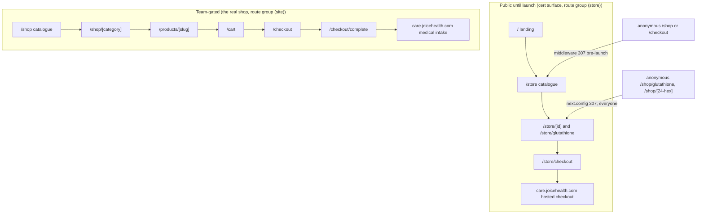
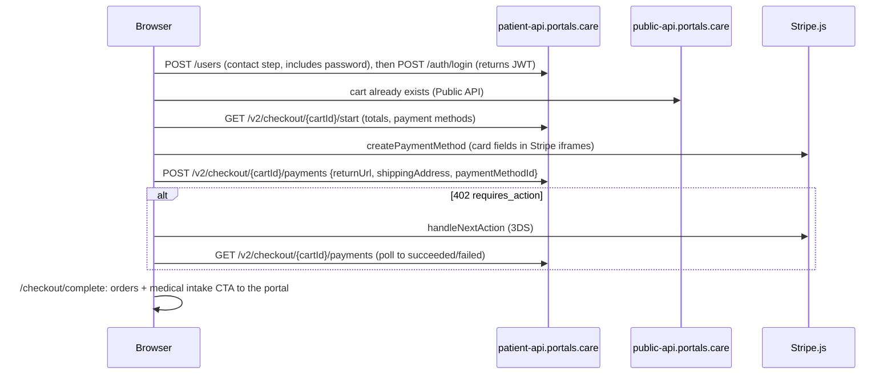

<!-- Design brief for the production shopping experience. Approved by Shaun on 2026-09-01.
     Tracked in Shortcut: epic 261 "Shop: the production shopping experience"
     (https://app.shortcut.com/joice-health/epic/261), stories sc-262 to sc-274,
     one per row in section 8. Keep the decisions log (section 9) and the
     verified-live log (section 10) current when anything changes. -->

# Joice shop: the production shopping experience

Design brief (approved 2026-09-01) for the real shop: a catalogue with clickable care-area
categories, slugged product pages with live prices, a persistent cart, and a custom on-site
checkout that takes payment through Stripe Elements against CarePortals' Patient API. It is
team-gated until launch and becomes the storefront the public sees when `SITE_LAUNCHED`
flips.

---

## 1. Context

**Why now.** The certification storefront ([00-plan.md](00-plan.md)) proved the CarePortals
integration but is deliberately disposable: one product, no cart state, and checkout is a
hand-off to the hosted portal. The business needs the real thing: browse by care area, an
on-site cart, and payment that never leaves joicehealth.com.

**Why the two storefronts coexist.** The audit is still running, and auditors hold direct
URLs. So the cert surface stays public and byte-identical in behavior; only its URLs move to
a neutral `/store/*` prefix (nothing in the URL may signal a temporary site). The clean
routes (`/shop`, `/products/[slug]`, `/cart`, `/checkout`) go to the new experience behind
the team gate. After the audit passes, the cert tree is deleted wholesale (flag off, then
remove the route group); nothing in the new shop depends on it. Duplicated components
between the two are deliberate: cert components are never refactored to share.

## 2. The two surfaces and their routes



Legacy URL handling splits by collision risk. `/shop/glutathione` and `/shop/:id([0-9a-f]{24})`
can never collide with `/shop/[category]` (care-area slugs are neither), so they are
unconditional 307s in `next.config.ts` for every visitor, forever. Exact `/shop` and
`/checkout` ARE the new shop, so they get a cookie-aware 307 inside `teamGate()` in
[middleware.ts](../../apps/web/middleware.ts): anonymous pre-launch visitors forward to
`/store` and `/store/checkout` (query preserved); team cookies fall through the gate to the
new experience; `siteLaunched()` disables the forward at launch with no further change.
`PUBLIC_PATHS` swaps `/shop` and `/checkout` for `/store`. The redirects stay
`permanent: false`: a 308 would freeze the `/shop` namespace in browser caches.

**Why the new pages join `(site)`.** The shop is the site at launch: it needs the real nav
(where the cart link lives), the announcement bar, and the footer. The cert group renames
`(shop)` to `(store)`; group names never appear in URLs.

## 3. Gating

Two mechanisms, both existing patterns:

- **Team gate** (middleware): the new routes are simply absent from `PUBLIC_PATHS`, so the
  HMAC cookie rule covers them until `SITE_LAUNCHED=true`.
- **A new `commerce` flag** (seeded ON, toggled in `/admin/flags`), independent of `shop`.
  The lifecycles are asymmetric: `shop` off is the post-audit retirement switch for the cert
  surface, `commerce` off is the production kill switch. Shared, one decision would force
  the other. Every new page opens with `requireCommerceEnabled()`
  (`apps/web/lib/commerce-gate.ts`, mirroring [shop-gate.ts](../../apps/web/lib/shop-gate.ts))
  AND exports `dynamic = 'force-dynamic'`. That pairing is load-bearing: the CI image build
  has no API, so a static prerender bakes the flag-off redirect into the artifact
  permanently (the 8db5395 incident, 00-plan.md section 6).

## 4. Catalogue and merchandising

**Why a local map.** CarePortals' category surface is unusable (verified live 2026-09-01:
`GET /v2/products/categories` answers 400; products carry `categories: []` except one test
artifact) and the org catalogue holds 29 noisy rows. So `apps/web/lib/shop-catalog.ts` owns
WHICH products we sell, under which slug, in which of the five `CARE_AREAS`
([care-areas.ts](../../packages/utils/src/care-areas.ts)), with what editorial copy. Live
CarePortals data supplies name, price and availability per render; nothing local duplicates
a price.

```ts
interface CatalogEntry {
  slug: string;                                  // /products/[slug], never a Mongo id
  careportalsId: string;                         // the exact sellable variant
  areas: readonly [CareAreaSlug, ...CareAreaSlug[]];  // first is primary
  name?: string;                                 // override for mislabeled upstream rows
  tagline: string;
  copy: { whatItIs: string; science?: string; dosing?: string };
  hue?: number;                                  // ImageSlot field rotation
  rank?: number;                                 // shelf order
}
```

`apps/web/lib/shop-catalog.server.ts` merges the map with one `GET /v2/products` per
5-minute window (`getActiveProducts()` beside
[products.server.ts](../../apps/web/lib/careportals/products.server.ts)) using the same
tri-state as `getProduct`: entry missing or disabled upstream drops from shelves and 404s
its PDP; upstream unreachable renders the quiet unavailable state.

**Approved curation (Shaun, 2026-09-01):** Tirzepatide/B12, Naltrexone and Lipo-B under
weight-metabolic; NAD+ under energy; Sermorelin and Tesamorelin under body-comp-recovery;
GHK-CU and Glutathione under beauty-skin. PT-141 is parked until a category decision;
stress-sleep renders a quiet coming state and hides from the landing tiles. Exact variant
ids per family are picked at a checkpoint with Shaun before the merchandising slice merges.

## 5. Cart

TanStack Query wrapping the existing browser client
([cart.client.ts](../../apps/web/lib/careportals/cart.client.ts)): CarePortals declares the
latest response the source of truth and every mutation returns the full cart, so hooks in
`apps/web/lib/careportals/use-cart.ts` write mutation results straight into the cache
(`setQueryData`, no optimistic updates). The cart id stays in localStorage
(`joice.shop.cartId`); the query never runs during SSR, which keeps the nav's `Cart (n)`
link hydration-safe (it renders plain `Cart` until loaded). Adding to cart navigates to
`/cart` (Shaun's call: no drawer). Subscription lines render Remove only, never a stepper:
CarePortals pins their quantity to 1 server-side (00-plan.md section 3).

## 6. Checkout

CarePortals documents a custom checkout (https://dev.portals.care/docs/build-a-custom-checkout;
every doc page has a `.md` twin). Payment needs a patient JWT, so checkout creates the
account inline.



- **Steps**: contact (the six required patient fields plus a password, since login is the
  only path to the JWT; duplicate email flips the step into sign-in mode),
  shipping (address block over the new Field/Select primitives, `US_STATES`), payment
  (Stripe split card elements inside our pill wrappers, optional coupon disclosure,
  `Pay $X +`). An order summary rail stays visible; there is no separate review step.
- **Why Stripe Elements and not a card form**: the API only accepts a payment method token
  "generated by stripe element"; raw card numbers are never accepted. Card data stays in
  Stripe iframes (SAQ A-EP). The split elements (number/expiry/cvc) are used instead of the
  Payment Element because CarePortals owns the intent lifecycle.
- **Why the machine is pure**: `components/checkout/checkout-machine.ts` holds the
  orchestration (double-submit latch, 402 to handleNextAction to poll, 1.5s polling with
  backoff and a 45s budget, poll-first on ambiguous network failure) with injected ports and
  zero React or network imports. This is the code that moves money; it is unit-tested before
  any screen exists. Poll-first on ambiguity is the double-charge guardrail.
- **Rx intake: portal handoff (Shaun's call).** Prescription orders land in
  `awaiting_requirements`/`awaiting_script` after payment; the confirmation page sends the
  buyer to care.joicehealth.com with `Complete your medical intake +`. Rebuilding the
  consultation flow on our side is explicitly out of scope for v1.

**Compliance guardrails.** Checkout PII (name, phone, DOB, gender, address) goes
browser-direct to CarePortals and never transits or persists on our servers; a thin no-log
proxy in `apps/api` is strictly the fallback if the Patient API's CORS is closed. The
patient JWT lives in sessionStorage (`joice.checkout.patientJwt`, in-memory fallback),
cleared after completion; never localStorage, never logged, never sent to our APIs or
analytics. Analytics events (`cart_*`, `checkout_*`) carry keys and outcomes only, the
onboarding convention. The client zod schema refuses a date of birth under 18. New form
errors use the `danger` token.

## 7. Stripe key plumbing

`NEXT_PUBLIC_STRIPE_PUBLISHABLE_KEY` is build-time inlined like every `NEXT_PUBLIC_*` value:
`apps/web/lib/env.ts`, a web `Dockerfile` ARG+ENV pair, a `deploy.yml` build-arg from repo
Variable `STRIPE_PUBLISHABLE_KEY`, and a manual scope=all deploy after the Variable lands
(task env changes do nothing for these). `apps/web/lib/stripe.ts` memoizes `loadStripe` and
returns null on an empty key so the payment step degrades to an unavailable notice. If the
Connect smoke test shows tokenization must target the connected account, the fix is the
`stripeAccount` option in that one file.

## 8. Slices

| # | Story | Slice | Surface |
|---|---|---|---|
| 0.1 | sc-262 | Spikes: CORS, path prefix, /users shape, checkout start, quantity, support email | section 10 log |
| 1.1 | sc-263 | Cert URL move to /store + middleware forwards | behavior-preserving |
| 1.2 | sc-264 | `commerce` flag, seed migration, gate helper | kill switch |
| 2.1 | sc-265 | shop-catalog map + server merge + curation checkpoint | merchandising |
| 2.2 | sc-266 | /shop + /shop/[category] + nav link | browse |
| 2.3 | sc-267 | /products/[slug] live PDP, static layer retired | product pages |
| 2.4 | sc-268 | "no cart" copy reconciliation | positioning |
| 3.1 | sc-269 | use-cart hooks, Cart (n) nav link, /cart | cart |
| 3.2 | sc-270 | Field/Select/Checkbox primitives + checkout schemas | form kit |
| 3.3 | sc-271 | patient + checkout clients, checkout machine, tests | logic first |
| 3.4 | sc-272 | Stripe wiring + key plumbing | card entry |
| 3.5 | sc-273 | Checkout assembly + /checkout/complete | end to end |
| 3.6 | sc-274 | Hardening, analytics, as-built docs | polish |

Tracks A (2.x) and B (3.x) run in parallel after 1.2. Branches `shop/<phase>-<story>-<slug>`.

## 9. Decisions log

| Date | Decision | Why |
|---|---|---|
| 2026-09-01 | The two storefronts coexist; cert moves to `/store/*`, byte-identical | the audit is live and auditors hold URLs; the real shop needs the clean routes; duplication is cheaper than risking the audit surface |
| 2026-09-01 | `/store`, not `/certification`, as the moved prefix | Shaun's call: a URL that says certification tells auditors the site is temporary |
| 2026-09-01 | Separate `commerce` flag instead of sharing `shop` | the cert retirement switch and the production kill switch must move independently |
| 2026-09-01 | Local catalogue map owns categories | `GET /v2/products/categories` is broken upstream (400, verified live) and products carry no usable category data |
| 2026-09-01 | Map 7 families, park PT-141, stress-sleep shows a coming state | Shaun's call: no sexual-health care area exists yet and adding one ripples into the intake taxonomy |
| 2026-09-01 | Add to cart navigates to /cart; no drawer | Shaun's call: matches the linear flow; the design system has no sheet primitive and the nav count covers keep-browsing |
| 2026-09-01 | Rx intake hands off to the hosted portal after payment | Shaun's call: bounded scope; the consultation flow stays with CarePortals where auth, forms and prescriptions already live |
| 2026-09-01 | Stripe split card elements, not the Payment Element | CarePortals owns the intent lifecycle and wants a client-created payment method token |
| 2026-09-01 | Patient JWT in sessionStorage, not memory-only | a redirect-mode 3DS hop or a refresh mid-payment must not lose the session at the moment money moved |
| 2026-09-01 | Payment e2e verification waits for CarePortals' sandbox answer | Shaun's call: no live charges without an explicit go-ahead |
| 2026-09-01 | Cart state is TanStack Query over the existing client | mutations already return the authoritative cart; Query shares the cache between badge, cart and checkout and is SSR-safe by construction |
| 2026-09-01 | The contact step collects a password; checkout is create-then-login | verified live: `POST /users` returns no token for this org, so a password is the only path to the JWT, and the buyer leaves checkout holding working portal credentials for the medical-intake handoff |
| 2026-09-01 | Non-subscription lines get a quantity stepper; subscription lines stay Remove-only | verified live: quantity persists for non-subscription products (the Tirzepatide tiers among them), and the update body needs productId alongside quantity |

## 10. Verified live (spike log)

Filled by sc-262. Answers dated. The spike patient is `tecshaun+checkout-spike-1@gmail.com`
(delete from the CRM after the build).

| Question | Answer | Date |
|---|---|---|
| `GET /v2/products/categories` shape | Broken: 400 "Cannot read properties of undefined (reading 'name')" with or without params | 2026-09-01 |
| Product `categories` field | Present on `GET /v2/products` rows, empty for all but one test artifact ("Beluga" on a Tirzepatide row) | 2026-09-01 |
| Patient API CORS posture | OPEN with credentials: `access-control-allow-origin` echoes both `https://joicehealth.com` and `http://localhost:3000`, allows `content-type,organization,authorization` and all methods. Browser-direct checkout confirmed; no proxy | 2026-09-01 |
| `/patient` path prefix required? | Both `/users` and `/patient/users` route to the same handler (identical responses). We use the unprefixed reference paths | 2026-09-01 |
| Does `POST /users` return a JWT? | NO for this org (contradicts the reference schema; the guide's create-then-login flow is authoritative). 201 returns the user object without `token`. Therefore the contact step MUST collect a password: create with password, then `POST /auth/login` `{username, password}` returns the JWT. Login works without the documented Authorization header (doc error). Bonus: the buyer leaves checkout holding working portal credentials for the medical-intake handoff | 2026-09-01 |
| Duplicate email status | 409 `{"message":"Account Exists Already"}`; empty/invalid body answers 406 "Failed to create account" | 2026-09-01 |
| Gender / phone / dob formats | `gender: "female"` accepted as a string; phone accepted as E.164 (`+1...`); dob `YYYY-MM-DD`. `NewCustomerDTO` required: email, firstName, lastName, gender, phone, dob (password optional upstream, required by our flow) | 2026-09-01 |
| Patient JWT TTL | 720 hours (30 days). The JWT payload carries PII (dob, email, phone): never log it | 2026-09-01 |
| Checkout start base URL and auth | `GET https://patient-api.portals.care/v2/checkout/{cartId}/start` with Bearer answers 200; without, 401. The call binds the cart to the patient (`cart.customer`). Response: `{ cart, totalAmountAfterCredit, availableCreditAmount, delayedCaptureAmount, giftCardUsedAmount, error, couponError, transferOut, paymentMethods, currency }`. Line items expose `subscriptionPhases[].requirements` (facesheet, govId, qnr questionnaires): the Rx requirements the portal handoff covers | 2026-09-01 |
| 3DS mechanics | The 402 intent carries `client_secret` and `next_action.type: use_stripe_sdk`. After `stripe.handleNextAction`, RE-POST `/v2/checkout/{cartId}/payments`: the cart stores `paymentIntentId` and the server verifies and creates orders. `GET .../payments` is the read-only poll (`paymentStatus: succeeded|failed` + orders) for ambiguity recovery | 2026-09-01 |
| `shippingAddress` shape | `{ address1, city, provinceCode, postalCode, countryCode }` per the guide example (US: countryCode "US"; confirm address2 support during build) | 2026-09-01 |
| Quantity on non-subscription products | PERSISTS. Create with quantity 2 sticks; `PUT /public/v2/carts/{id}/items/{itemId}` needs BOTH `{ productId, quantity }` in the body (quantity alone answers 400 "Failed to update item to cart"); re-read confirms. So: stepper for non-subscription lines, Remove-only for subscription lines. Note the Tirzepatide/B12 tiers are all `isSubscription: false` (one-time supply purchases) | 2026-09-01 |
| Stripe Connect tokenization direction | pending (needs publishable key from Shaun) | |
| Sandbox org / test mode | pending (support email, Shaun sends) | |
| Cart reusable after declined payment | pending (needs a payment attempt) | |
| Rate limits | pending (support email; 429 documented, no numbers) | |
