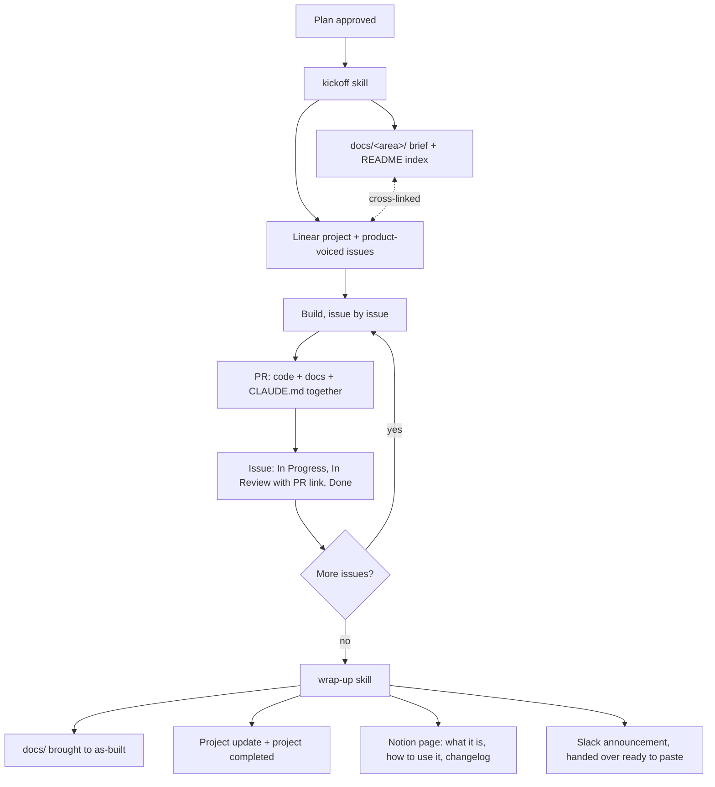

# The team visibility workflow

How a piece of Joice work stays visible to the whole team, from approved plan to shipped
feature. The rules live in the root `CLAUDE.md` ("Team visibility workflow") and are executed
by two Claude Code skills checked into this repo: `.claude/skills/kickoff/SKILL.md` and
`.claude/skills/wrap-up/SKILL.md`.

**Why:** the engineering detail, the product plan, and the "how do I use this" guide have
three different audiences, and any one artifact written for all three serves none of them.
So the same facts live on three surfaces in three voices, and the workflow makes writing and
updating them a step of the work itself rather than an afterthought.

## The three surfaces

| Surface | Audience | Voice | Written | Kept current by |
|---|---|---|---|---|
| `docs/` (this directory) | engineers | technical: Mermaid flows, file:line refs, "why" paragraphs | at kickoff | every PR (docs in the same PR as code) |
| Linear (Engineering team) | PMs and stakeholders | product: outcomes, plain words, no code identifiers | at kickoff | issue states move with the code via the GitHub integration; project updates at wrap-up |
| Notion ([Documentation page](https://app.notion.com/p/Documentation-3587e3a92b3980328d06cf9a71b0f7d7), Joice Health workspace) | the whole team | instructional: what it is, how to use it | at wrap-up | changelog rows on later wrap-ups |

## The lifecycle

The issue-state moves are driven by Linear's GitHub integration: the branch name and PR
title carry the issue id (`eng-NNN`), and Linear does the rest. The Linear MCP is the
fallback for anything the integration misses, and the skills' sweeps are the safety net,
not the mechanism.

Wrap-up also drafts a Slack announcement in the same product voice, formatted for Slack, and
hands it over for a person to post. **Why not a fourth surface:** Slack is where the team
hears the news, not where it lives; the message stays short and links to the Notion page and
the Linear project instead of duplicating them, so there is nothing in Slack to go stale.

Small fixes skip the project: one issue on the feature's project (or the standing
"Maintenance" project), docs updated in the same PR, and a Notion changelog row at the next
wrap-up if the fix changed something the team can see.

## Voice, by example

The same fact on each surface:

- `docs/`: "The engine is pure and lives in core (`packages/core/src/onboarding/engine.ts`);
  the server computes the next step and the browser only renders it, so gates cannot be
  bypassed."
- Linear issue: "Visitors can't skip past the age and state checks, even with browser
  tricks. How you'll know it's done: open the intake, try to jump ahead via the URL, and
  watch it hold the line."
- Notion: "The intake decides what to ask next on the server, so every visitor sees the right
  questions for their situation and the safety checks always apply."

## Conventions the surfaces share

- Branch `<area>/<issue-id>-<slug>` with the id lowercased (`onboarding/eng-301-member-clerk`);
  PR title `[P<phase>] <phase.issue> <Title> (ENG-NNN)`; commit bodies are prose ending with
  an issue reference line, `Issue ENG-NNN (project <name>).`
- No em dashes anywhere. Mermaid for anything with more than two boxes (GitHub and Notion
  both render it); project descriptions carry a numbered step list plus a link to the
  GitHub-rendered doc, which reads well in any tool.
- `docs/README.md` indexes every doc; a page that is not in the index does not exist.

## The Shortcut era

Linear replaced Shortcut on 2026-09-16, with every epic imported as a project and every
story as an issue in the same state. Ids of the form `sc-NNN` and links to
`app.shortcut.com` in documents, commits, and PRs dated before then are that era's
references; the docs keep them as the record, each paired with a link to the imported
Linear equivalent.

## Notion access

Product pages live under one page and nowhere else: **Documentation** in the **Joice Health**
workspace (`https://app.notion.com/p/Documentation-3587e3a92b3980328d06cf9a71b0f7d7`).
A Notion authorization is granted per workspace, chosen on the authorization screen, so a
grant to the wrong workspace silently lands pages in the wrong place; wrap-up therefore
fetches the Documentation page by id before writing and stops if it cannot. When the fetch
fails (no auth, or a wrong-workspace token), re-authenticate via `/mcp` in an interactive
Claude Code session and pick Joice Health; until then, wrap-up completes the other surfaces
and leaves a "Notion docs pending" comment on the Linear project rather than failing
silently.
