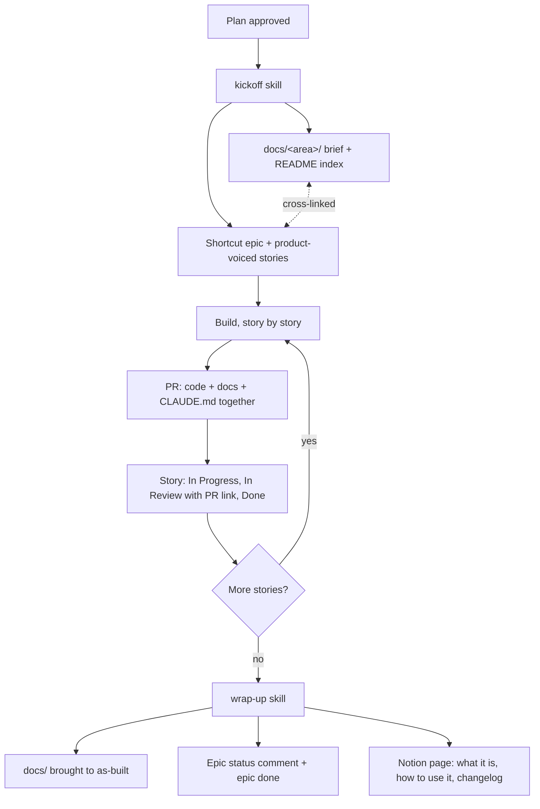

# The team visibility workflow

How a piece of Joice work stays visible to the whole team, from approved plan to shipped
feature. The rules live in the root `CLAUDE.md` ("Team visibility workflow") and are executed
by two Claude Code skills checked into this repo: `.claude/skills/kickoff/SKILL.md` and
`.claude/skills/wrap-up/SKILL.md`.

**Why:** the engineering detail, the product plan, and the "how do I use this" guide have
three different audiences, and any one artifact written for all three serves none of them.
So the same facts live on three surfaces in three voices, and the workflow makes writing and
updating them a step of the work itself rather than an afterthought.

## The three surfaces

| Surface | Audience | Voice | Written | Kept current by |
|---|---|---|---|---|
| `docs/` (this directory) | engineers | technical: Mermaid flows, file:line refs, "why" paragraphs | at kickoff | every PR (docs in the same PR as code) |
| Shortcut (Engineering team) | PMs and stakeholders | product: outcomes, plain words, no code identifiers | at kickoff | story states move with the code; epic comments at wrap-up |
| Notion (Product Docs page, Engineering workspace) | the whole team | instructional: what it is, how to use it | at wrap-up | changelog rows on later wrap-ups |

## The lifecycle

Small fixes skip the epic: one story on the feature's epic (or the standing "Maintenance"
epic), docs updated in the same PR, and a Notion changelog row at the next wrap-up if the fix
changed something the team can see.

## Voice, by example

The same fact on each surface:

- `docs/`: "The engine is pure and lives in core (`packages/core/src/onboarding/engine.ts`);
  the server computes the next step and the browser only renders it, so gates cannot be
  bypassed."
- Shortcut story: "Visitors can't skip past the age and state checks, even with browser
  tricks. How you'll know it's done: open the intake, try to jump ahead via the URL, and
  watch it hold the line."
- Notion: "The intake decides what to ask next on the server, so every visitor sees the right
  questions for their situation and the safety checks always apply."

## Conventions the surfaces share

- Branch `<area>/<phase>-<story>-<slug>`; PR title `[P<phase>] <story#> <Title> (sc-NNN)`;
  commit bodies are prose ending with a story reference line.
- No em dashes anywhere. Mermaid for anything with more than two boxes (GitHub and Notion
  both render it; Shortcut does not, so epics carry a numbered step list plus a link to the
  rendered doc instead).
- `docs/README.md` indexes every doc; a page that is not in the index does not exist.

## Notion access

The Notion MCP server needs a one-time authentication (`/mcp` in an interactive Claude Code
session). Until then, wrap-up completes the other surfaces and leaves a "Notion docs pending"
comment on the epic rather than failing silently.
